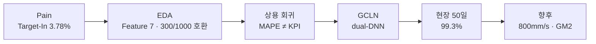

# NND Dryer · 음극 300 mm/s · DX 과제 요약

<div align="center">

**전극 표면온도 AI 제어** · GM1 1호기 · 2024.10 완료  
Target-In **3.78% → 99.3%**

</div>

---

## Executive Summary

| | |
|:--|:--|
| **과제** | NND Dryer 재가동 시 OUT Zone 표면온도(110±10°C) 관리 모형 개발 |
| **대상** | GM1 1호기 **음극 300 mm/s** (1000 mm/s 모형 다음 2순위) |
| **방법** | Case 2 · EDA → 상용 회귀 검토 → **GCLN** (dual-DNN) |
| **성과** | 현장 **50일** 적용 · 목표온도 달성률 **99.3%** |
| **핵심 교훈** | MAPE ↓ ≠ Target-In ↑ → **제어 방향성**을 Loss에 넣어야 KPI와 맞음 |

---

## 스토리 한눈에



---

## 1. 왜 — Pain Point

**상황**  
Dryer **부동 후 재가동** 때 OUT Zone 전극 표면온도가 목표 범위에 안정적으로 들어오지 않음.

**리스크**
- 목표보다 **고온** 건조 → 열주름 등 품질 불량
- **경알람** ±10°C 초과 · **중알람** +20°C → PD 가능

**기존 PLC (Before)**
- 20 s 시점 Target-In **~3.78%**
- 목표온도 도달 **평균 ~38 s**

---

## 2. 무엇을 — 과제·EDA

### Case 2 채택

> 추가 **PLC 수정 없이** 모형만 현장 적용 (ND공정기술팀 요청)

### 300 mm/s vs 1000 mm/s

| 항목 | 1000 mm/s | 300 mm/s |
|:--|:--|:--|
| OUT Zone 도착 | ~7.4 s | **~17.7 s** |
| 타겟 시점 | 7 / 8 / 9 s | **재설정 필요** |
| 자동보정 | 짧음 | MID/OUT **4~5 s 추가** |

### EDA 결론

- 데이터: GM1 음극 ~**50일** (300속 275건 · 1000속 455건)
- **Feature 7개** 선정  
  `NonOP_Time · Prev_OP_Time · Init_Lamp_Temp_OUT · Init_Temp IN/MID/OUT · Temp_OUT`
- 1000속과 **상관·산점도 트렌드 유사** → 동일 DNN 변수 체계로 300속 모형 개발

---

## 3. 어떻게 — 모형 개발

### Phase 1 · 상용 회귀 (한계)

- 후보: Ridge, Lasso, DNN 등 + Standard Scaler
- Train: **1250건** (3~5월, 60/20/20 split)
- 현장 Top2 (~3일/모형) 적용 결과  
  → **MAPE는 낮은데 Target-In은 낮음** (온도↑인데 SCR↓ 사례)

### Phase 2 · GCLN

**Generate Cowork Learning Network**

```
  [초기 조건] ──▶ [출력 예측 DNN] ──▶ SCR (IN/OUT)
                      ▲    │
                      │    ▼
              [온도 예측 DNN] ◀── Temp @ 타겟 시점
```

| 구성 | 내용 |
|:--|:--|
| 구조 | FC **5층 × 100** · ReLU + BatchNorm |
| 학습 | 출력 DNN ⇄ 온도 DNN **교차** · **5단계** multi-loss |
| Loss | 데이터 MSE + **방향성** + **시뮬(기대온도)** |
| 추론 | **출력 예측 모형만** 사용 |
| 선행 검증 | 제어 시뮬 → 방향·기울기 확인 후 현장 투입 |

**개발 아이디어 3줄**
1. 온도 예측 모형으로 출력 **사전 검증**
2. 외삽·**제어 방향성**을 Loss에 명시
3. 시뮬 온도 ↔ 기대온도 **차이**를 Loss에 반영

---

## 4. 결과 — DX 인증

| KPI | Before | After (GCLN) |
|:--|:--:|:--:|
| Target-In @ 재가동 | **3.78%** | **99.3%** |
| 현장 적용 | — | **~50일** (GM1 1호기) |
| 연동 | PLC only | **PLC–PC** · Case 2 |

**Target-In** = (목표온도 110±10°C 구간 진입 비율) / 재가동 횟수

---

## 5. Takeaway · 향후

- **정량:** Target-In **3.78% → 99.3%**
- **방법:** KPI에 맞는 Loss·구조 (GCLN)가 상용 MAPE보다 중요
- **향후:** 800 mm/s → 100 mm/s → **GM2** 확산

---

## 4장 요약 PPT 매핑

| 장 | 제목 | Figure (원본) | 한 줄 |
|:--:|:--|:--|:--|
| **1** | 과제·EDA | slide 11 | 1000속 변수가 300속에도 유효 |
| **2** | GCLN | slide 29 | dual-DNN · 5-step loss |
| **3** | 현장 | slide 19 | 50일 · **99.3%** |
| **4** | Takeaway | slide 16 | 상용 vs GCLN · 확산 로드맵 |

**파일:** `20241021_DX_Anode300_4장요약.pptx`  
**양식:** 외삽 v4 dark · SOURCE · 핵심 박스 · Figure 풀폭

---

## 용어

| 용어 | 설명 |
|:--|:--|
| **Target-In** | 목표온도(110±10°C) 구간 내 비율 |
| **SCR** | MIR Lamp 출력 (%) |
| **Case 2** | 7~9 s 모형 제어 + 이후 자동보정 |
| **GCLN** | 출력·온도 dual-DNN + multi-loss |
| **DX** | Digital Transformation 인증 과제 |

---

## 관련 파일

```
extrapolation-papers/
├── 20241021_DX..._원본백업.pptx      # 원본 (35장)
├── 20241021_DX..._dark.pptx          # dark 변환
├── 20241021_DX_Anode300_4장요약.pptx # 4장 요약
└── 20241021_DX_Anode300_요약.md      # 본 문서
```

```bash
# 4장 PPT 재빌드
python3 extra_study/literec_study/ppt_dx/build_ppt_dx_4slide.py
```

---

*20241021 DX 과제완료보고서 · 빅데이터분석1팀 · 박진서*
