# 외삽 50분 발표 — 장표별 설명 (v5 심화)

**대응 PPT:** `외삽_50분_발표자료_v6.pptx` (27장 · 23p~ 압축)  
**범위:** **회귀 외삽** (연속 y · tabular/시계열) — 분류·DG(OOD)는 본문 **범위 밖**  
**관통 문장:** 밖을 지탱하는 것은 데이터가 아니라 **가정(Assumption)** 이다.

---

## 이 문서 읽는 법

| 구분 | 보면 되는 곳 |
|------|-------------|
| **발표 중 (대본만)** | 각 장 **슬라이드** → **⓪ 발표 흐름** → **① 참조 논문** → **② 발표 대본** |
| **준비·복습 (상세)** | `---` 아래 **③ 장표·논문 상세** |
| **논문 전체 파악** | **Part B · [부록 C](#부록-c)** (23편 — 문제·방법·결과·한계) |

> **구조:** 슬라이드 미리보기 → **⓪ 흐름·연결** → 논문 표 + 대본 / `---` 아래 = 장표 내용 + 논문 요약 / **부록 C** = 논문별 풀 가이드


> 미리보기 PNG: `_assets/slide_previews/S01.png` … (`python3 export_slide_previews.py`로 재생성)


---

## 목차·시간

| 부 | 장 | 시간 | 내용 |

|----|-----|------|------|

| 도입 | S01–S03 | 3분 | 로드맵·용어(가정) |

| 1부 | S04–S08 | 5분 | **외삽 정의** — OOD vs 외삽 · 보간/외삽 · hull |

| 2부 | S08–S14 | 15분 | **실패 원인** — 밖 예측이 깨지는 이유 4가지 |

| 3부 | S14–S25 | ~17분 | **회귀 대응법 + 검증** — 가정 넣기 · hull holdout (23p~ 압축) |

| 엔딩 | S26–S27 | ~2분 | 요약+필독 · Q&A |


---

## 발표 스토리라인

오늘 발표는 **한 문장**을 증명하는 구조입니다: *밖을 지탱하는 것은 데이터가 아니라 가정이다.*

1. **도입 (S01–S03)** — “무엇을 말할지”와 “가정이 뭔지”를 먼저 고정합니다. 여기서 용어가 흔들리면 2·3부 전체가 헷갈립니다.
2. **1부 (S04–S08)** — OOD vs **외삽** 구분 후, 외삽을 **좌표계**로 정의합니다. “입력이 훈련 범위 안/밖인가?”만 보면 됩니다. S08에서 “안은 잘 맞는데 밖은 터진다”는 직관을 만든 뒤, **왜 그런지**를 2부로 넘깁니다.
3. **2부 (S09–S14)** — 실패 원인 네 가지를 **데이터 → 규모 → 불확실성 → 신경망** 순으로 쌓습니다. S09가 심장, S12–S13이 “그럼 어떻게 하지?”로 3부에 연결됩니다.
4. **3부 전반 (S15–S23)** — 가정을 **직접 넣는** 방법 지도. 약한 가정(단조)부터 강한 가정(수식·PDE)까지, 모를 때는 UQ·기권.
5. **3부 후반 (S24–S25)** — 종합 1장 + **검증**(함정 3·체크 4). (OoD-Bench·DomainBed·IRM = **분류 DG** — 본문 제외)
6. **엔딩 (S26–S27)** — 요약+필독 1장 · Q&A — *“외삽 되나?” → “내 가정이 맞고, hull 밖에서 검증했나?”*


---

## 대본만 빠르게 (② 링크)

- [S01 · 타이틀](#s01) → ②
- [S02 · 로드맵](#s02) → ②
- [S03 · 용어 고정 — 가정(Assumption)](#s03) → ②
- [S04 · 1부 표지 · 외삽 정의](#s04) → ②
- [S05 · OOD vs 외삽](#s05) → ②
- [S06 · 보간 vs 외삽](#s06) → ②
- [S07 · convex hull](#s07) → ②
- [S08 · 대표 사례 — 다항식](#s08) → ②
- [S09 · 2부 표지 · 실패 원인 (4)](#s09) → ②
- [S10 · 실패 원인 ① — 함수 못 고름](#s10) → ②
- [S11 · 실패 원인 ② — 훈련 범위](#s11) → ②
- [S12 · 실패 원인 ③ — 불확실성](#s12) → ②
- [S13 · 실패 원인 ④ — Xu Thm.1](#s13) → ②
- [S14 · ReLU 메커니즘 + 2부 정리](#s14) → ②
- [S15 · 3부 표지 · 대응·검증](#s15) → ②
- [S16 · 대응법 지도](#s16) → ②
- [S17 · 입구 — 활성화 매칭](#s17) → ②
- [S18 · 방법 1a — EQL](#s18) → ②
- [S19 · 방법 1b — NALU](#s19) → ②
- [S20 · 방법 2a — 단조 문제](#s20) → ②
- [S21 · 방법 2b — CMNN](#s21) → ②
- [S22 · Physics loss (회귀)](#s22) → ②
- [S23 · UQ + 기권](#s23) → ②
- [S24 · 종합 (통합)](#s24) → ②
- [S25 · 성능 검증 (통합)](#s25) → ②
- [S26 · 요약 + 필독](#s26) → ②
- [S27 · Q&A · 참고문헌](#s27) → ②

---
# Part A# Part A · 장표별 가이드
> 장마다 **⓪ 흐름 → ① 논문 → ② 대본** (`---` 위) · **③ 상세** (`---` 아래).


## S01 · 타이틀 {#s01}

**슬라이드 1/32**

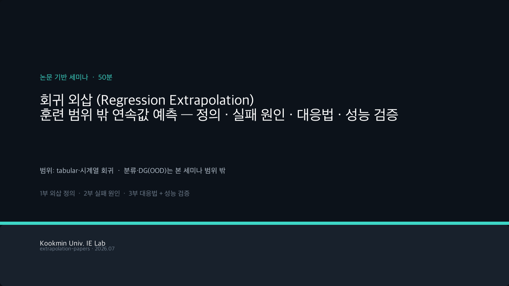

### ⓪ 발표 흐름

**이 장 역할:** 오프닝 — 오늘 50분의 **결론을 미리** 말합니다.

**앞에서:** — (시작)

**다음으로:** “구체적으로 어떻게 풀지” → **S02 로드맵**으로 넘깁니다.

**말로 이어 붙이기:** 청중에게 **네 파트**만 짚어 주고, 끝까지 따라올 **한 문장**을 약속합니다.

### ① 참조 논문

| 논문 | PDF | 부록 |
|------|-----|------|
| Xu et al., ICLR 2021 — How Neural Networks Extrapolate | `Xu2021_How_Neural_Networks_Extrapolate.pdf` | [#C-03](#c-03) |
| Pfister & Bühlmann, 2024 — Extrapolation-Aware Nonparametric Inference | `Pfister2024_Extrapolation-Aware_Nonparametric_Inference.pdf` | [#C-02](#c-02) |
| Bartley et al., 2019 — Characterizing Extrapolation | `Bartley2019_Characterizing_Extrapolation_Multivariate.pdf` | [#C-01](#c-01) |

### ② 발표 대본

```text
[30초]
대본: 오늘 네 파트입니다. 외삽 정의, 왜 밖에서 실패하는지(원인 네 가지), 대응법(가정 넣기), 마지막으로 외삽 성능 주장을 어떻게 검증하는지. 결론을 미리 말씀드리면 — 훈련 데이터 밖에서 모델을 지탱하는 것은 데이터가 아니라 '가정'입니다. 50분 동안 이 한 문장을 채워 가겠습니다.
```

---

### ③ 장표·논문 상세

**장표 제목:** 타이틀 — 외삽 (Extrapolation) — 훈련 데이터 밖에서 모델은 무엇을 하는가
**부제:** 1부 외삽 정의 · 2부 실패 원인 · 3부 대응법 + 성능 검증


**논문 상세 (이 장)**


**Xu et al., ICLR 2021** → [부록 C #C-03](#c-03)
  **Thm.1:** L-layer ReLU MLP, \(x=tv\), \(t\to\infty\) → \(f_\theta(tv)/t \to A_v v+b_v\).
  **메커니즘:** active set 고정 → 마지막 linear piece **연장** = 직선 extrapolation.
  **Fig.1:** sin — train OK, test **tangent**. Appendix affine fit R²>0.99.
  **Fig.5:** sin+cos φ → 주기 extrap; ReLU mismatch → 오차 **10²–10³**.
  **GNN:** linear aggregation; **algorithmic alignment** (Bellman-Ford 등) 시 밖 OK.
  **Q&A:** “NN extrapolation?” → “**어떤 φ·구조 가정**이 타깃에 맞나?”
  _→ 부록 C 10섹션 풀 가이드_


**Pfister & Bühlmann, 2024** → [부록 C #C-02](#c-02)
  **정의:** extrapolation = support **밖**에서 \(m(x)=\mathbb{E}[Y|X=x]\) 또는 quantile 평가.
  **함수 못 정함:** 유한 데이터 + smoothness만 → 밖 \(m(x)\) **무한히 많음** (S10).
  **가정:** directional derivative **극값** on support → band \([m^-,m^+]\).
  **추정:** 안 = NW/RF; 밖 = **partial ID bounds** (band 폭은 데이터만으로 안 좁아짐).
  **UQ:** 모델 softmax ≠ 통계 CI — band 넓으면 **정직한** 불확실성.
  **Q&A:** 가정 넣어도 검증 필요 (Fesser). Pfister = **명시적** bounds.
  _→ 부록 C 10섹션 풀 가이드_


**Gulrajani & Lopez-Paz, NeurIPS 2020** → [부록 C #C-12](#c-12)
  **Motivation:** DG papers — unfair HP, capacity, **test-domain val** → fake gains.
  **7 datasets:** PACS, VLCS, OfficeHome, TerraIncognita, DomainNet, …
  **14 alg:** ERM, IRM, DANN, CORAL, MMD, … — **same 20-trial random search**.
  **숫자:** ERM **66.6%**, IRM **65.4%**, DANN **65.6%**, CORAL **+0.9%p** (avg).
  **Rule:** model selection = **train-domain val only** — test domain HP = cheat.
  **Q&A:** S27 — “ERM + fair budget” 없는 DG claim **의심**.
  _→ 부록 C 10섹션 풀 가이드_

_전문·수식·실험 숫자 → [부록 C · 참조 논문 상세 정리](#부록-c)_


---


## S02 · 로드맵 {#s02}

**슬라이드 2/32**

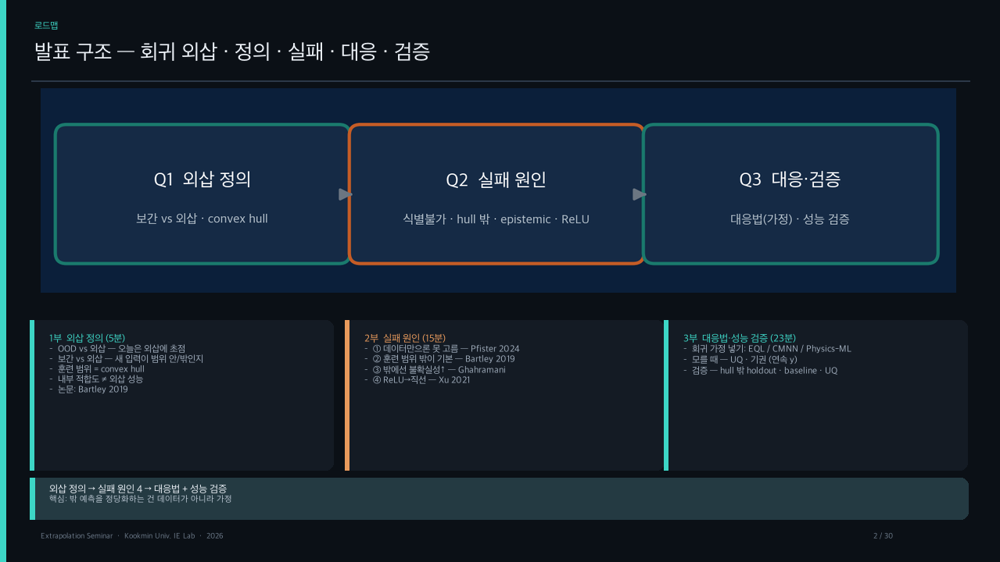

### ⓪ 발표 흐름

**이 장 역할:** 지도 — 1·2·3부가 **왜 이 순서**인지 보여 줍니다.

**앞에서:** S01에서 결론을 들었으니, “그걸 어떻게 채울지” **목차**로 연결.

**다음으로:** 목차 다음엔 용어. **S03 ‘가정’**을 안 고정하면 뒤가 전부 추상적입니다.

**말로 이어 붙이기:** 세 상자를 **정의 → 원인 → 대응·검증** 스토리로 읽어 주세요.

### ① 참조 논문

| 논문 | PDF | 부록 |
|------|-----|------|
| Bartley et al., 2019 — Characterizing Extrapolation in Multivariate Response Data | `Bartley2019_Characterizing_Extrapolation_Multivariate.pdf` | [#C-01](#c-01) |

### ② 발표 대본

```text
[1.5분]
대본: 위 세 상자가 목차입니다. 1부 — **외삽 정의**(보간 vs 외삽, 훈련 범위). 2부 — **외삽 실패 원인** 네 가지(데이터·차원·불확실성·ReLU). 3부 — **외삽 대응법**(가정 넣기)과 **외삽 성능 검증**(주장이 맞는지 확인). 다음 장에서 핵심 용어 '가정'을 정의합니다.
```

---

### ③ 장표·논문 상세

**장표 제목:** 로드맵 — 발표 구조 — 외삽 정의 · 실패 원인 · 대응법 · 성능 검증

**그림**
- `_assets/fig_three_questions.png`

**장표 핵심 (카드)**

*1부  외삽 정의 (5분)*
- 보간 vs 외삽 — 새 입력이 범위 안/밖인지
- 훈련 범위 = convex hull
- 내부 적합도 ≠ 외삽 성능
- 논문: Bartley 2019

*2부  실패 원인 (15분)*
- ① 데이터만으론 못 고름 — Pfister 2024
- ② 훈련 범위 밖이 기본 — Bartley 2019
- ③ 밖에선 불확실성↑ — Ghahramani
- ④ ReLU→직선 — Xu 2021

*3부  대응법·성능 검증 (27분)*
- 대응법 — 가정 넣기: EQL / CMNN / PINN
- 모를 때 — 불확실성(UQ) · 예측 안 함(기권) (Zhu)
- 성능 검증 — 범위 확인 · OoD-Bench · DomainBed

**하단 takeaway**
- **외삽 정의 → 실패 원인 4 → 대응법 + 성능 검증**
- 핵심: 밖 예측을 정당화하는 건 데이터가 아니라 가정


**논문 상세 (이 장)**


**Bartley et al., 2019** → [부록 C #C-01](#c-01)
  **정의:** 훈련 범위 = **Conv(X_train)**. \(x^*
otin\) 훈련 범위 → extrapolation.
  **지표:** multivariate **trace/det** of \(\mathrm{Var}(Y|x)\) + cutoff \(c\).
  **실험:** 훈련 범위 밖 → MSE↑, PI coverage↓ (sim + lake fish).
  **함정:** min–max box는 훈련 범위보다 큼 → extrapolation **과소** 판정.
  **고차원:** p↑ → random test가 훈련 범위 밖일 확률↑ (S11).
  **Q&A:** “범위 안”이 아니라 “**훈련 범위 안**?”이 정확한 질문.
  _→ 부록 C 10섹션 풀 가이드_

_전문·수식·실험 숫자 → [부록 C · 참조 논문 상세 정리](#부록-c)_


---


## S03 · 용어 고정 — 가정(Assumption) {#s03}

**슬라이드 3/32**

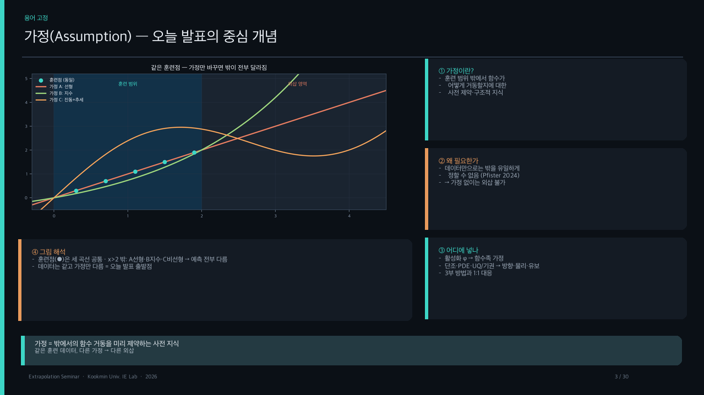

### ⓪ 발표 흐름

**이 장 역할:** ★ 용어 고정 — 오늘 **‘가정’**의 뜻을 하나로 못 박습니다.

**앞에서:** 로드맵에서 3부가 ‘가정 넣기’라고 했으니, **가정이 뭔지** 먼저.

**다음으로:** 용어가 잡혔으니 **1부** — 외삽을 **입력 위치**로 정의합니다 (S04–S08).

**말로 이어 붙이기:** 그림에서 **같은 점·다른 밖**을 천천히. “데이터는 같고 가정만 다르다”를 입에 붙이세요.

### ① 참조 논문

| 논문 | PDF | 부록 |
|------|-----|------|
| Pfister & Bühlmann, 2024 — Extrapolation-Aware Nonparametric Inference | `Pfister2024_Extrapolation-Aware_Nonparametric_Inference.pdf` | [#C-02](#c-02) |
| Xu et al., ICLR 2021 — How Neural Networks Extrapolate | `Xu2021_How_Neural_Networks_Extrapolate.pdf` | [#C-03](#c-03) |
| Runje & Shankaranarayana, ICML 2023 — Constrained Monotonic NN (CMNN) | `Runje2023_Constrained_Monotonic_NN.pdf` | [#C-06](#c-06) |
| Raissi et al., 2019 — Physics-Informed Neural Networks | `Raissi2019_Physics_Informed_Neural_Networks.pdf` | [#C-07](#c-07) |
| Zhu et al., CMAME 2023 — Reliable Extrapolation of Deep Neural Operators | `Zhu2022_Reliable_Extrapolation_DeepONet.pdf` | [#C-09](#c-09) |

### ② 발표 대본

```text
[2분] ★ 용어 장 — 반드시 천천히.
대본: '가정'이 오늘 키워드입니다. 왼쪽 그림 — 훈련점(●)은 전부 같습니다. 가정 A(선형)·B(지수)·C(비선형)만 바꾸면 x>2 밖에서 곡선이 완전히 달라집니다. 오른쪽 ① 정의, ② 왜 필요(Pfister), ③ 주입 위치. 아래 ④ 그림 해석. 이후 '가정을 넣는다'는 이 뜻으로만 쓰겠습니다.
```

---

### ③ 장표·논문 상세

**장표 제목:** 용어 고정 — 가정(Assumption) — 오늘 발표의 중심 개념

**그림**
- `_assets/fig_assumption_defined.png`

**장표 핵심 (카드)**

*① 가정이란?*
- 훈련 범위 밖에서 함수가
- 어떻게 거동할지에 대한
- 사전 제약·구조적 지식

*② 왜 필요한가*
- 데이터만으로는 밖을 유일하게
- 정할 수 없음 (Pfister 2024)
- → 가정 없이는 외삽 불가

*③ 어디에 넣나*
- 활성화 φ → 함수족 가정
- 단조·PDE·UQ/기권 → 방향·물리·유보
- 3부 방법과 1:1 대응

*④ 그림 해석*
- 훈련점(●)은 세 곡선 공통 · x>2 밖: A선형·B지수·C비선형 → 예측 전부 다름
- 데이터는 같고 가정만 다름 = 오늘 발표 출발점

**하단 takeaway**
- **가정 = 밖에서의 함수 거동을 미리 제약하는 사전 지식**
- 같은 훈련 데이터, 다른 가정 → 다른 외삽


**논문 상세 (이 장)**


**Pfister & Bühlmann, 2024** → [부록 C #C-02](#c-02)
  **정의:** extrapolation = support **밖**에서 \(m(x)=\mathbb{E}[Y|X=x]\) 또는 quantile 평가.
  **함수 못 정함:** 유한 데이터 + smoothness만 → 밖 \(m(x)\) **무한히 많음** (S10).
  **가정:** directional derivative **극값** on support → band \([m^-,m^+]\).
  **추정:** 안 = NW/RF; 밖 = **partial ID bounds** (band 폭은 데이터만으로 안 좁아짐).
  **UQ:** 모델 softmax ≠ 통계 CI — band 넓으면 **정직한** 불확실성.
  **Q&A:** 가정 넣어도 검증 필요 (Fesser). Pfister = **명시적** bounds.
  _→ 부록 C 10섹션 풀 가이드_


**Xu et al., ICLR 2021** → [부록 C #C-03](#c-03)
  **Thm.1:** L-layer ReLU MLP, \(x=tv\), \(t\to\infty\) → \(f_\theta(tv)/t \to A_v v+b_v\).
  **메커니즘:** active set 고정 → 마지막 linear piece **연장** = 직선 extrapolation.
  **Fig.1:** sin — train OK, test **tangent**. Appendix affine fit R²>0.99.
  **Fig.5:** sin+cos φ → 주기 extrap; ReLU mismatch → 오차 **10²–10³**.
  **GNN:** linear aggregation; **algorithmic alignment** (Bellman-Ford 등) 시 밖 OK.
  **Q&A:** “NN extrapolation?” → “**어떤 φ·구조 가정**이 타깃에 맞나?”
  _→ 부록 C 10섹션 풀 가이드_


**Runje & Shankaranarayana, ICML 2023** → [부록 C #C-06](#c-06)
  **한계(Fig.1):** \(W\ge0\) clip — monotonic O, **\(x^3\)** 같은 비선형 단조 **X**.
  **CMNN:** input split, dual path, unsaturated φ, \(W\ge0\) → **monotone + nonlinear**.
  **Theorem:** universal approximator for **monotone** functions.
  **실험:** cubic, finance, health — **100%** monotonicity, 훈련 범위 밖 **역전 불가**.
  **vs C-18:** Liu = MILP **certify** 사후; Runje = **by design** 사전.
  **Q&A:** 방법② — “**방향(단조)**만 안다” → 구조에 **내장**.
  _→ 부록 C 10섹션 풀 가이드_


**Raissi et al., 2019** → [부록 C #C-07](#c-07)
  **Loss:** \(\mathcal{L}=L_{\mathrm{data}}+\lambda L_{\mathrm{PDE}}\), \(\mathcal{N}[u_\theta]\)=PDE residual.
  **Continuous:** (x,t) collocation + autograd; **discrete:** RK in network.
  **결과:** Burgers, Schrödinger, NS — **sparse** sensor → field 복원.
  **한계:** λ·collocation 밀도 민감; inverse ill-posed; **시간 밖** → Fesser.
  **Part II:** PDE **discovery** (별도) — 발표는 Part I 위주.
  **Q&A:** physics in loss = **soft 가정**. “참 PDE” ≠ 밖 보증.
  _→ 부록 C 10섹션 풀 가이드_


**Zhu et al., CMAME 2023** → [부록 C #C-09](#c-09)
  **DeepONet:** branch(u) + trunk(y) → \(G(u)(y)\); extrap = **새 input function** u.
  **Complexity:** **2-Wasserstein** \(W_2\) between train/test **function spaces**.
  **5 methods:** std, **PDE fine-tune**, multi-fidelity, **abstention**, ensemble.
  **결과:** FT-Phys 등 PDE-informed; abstain → acc↑ on **accepted**, coverage↓ 명시.
  **trade-off:** capacity↑ → interp↑, extrap **bias-variance** (Fig.).
  **Q&A:** 방법④b — reliability = accuracy **×** known coverage.
  _→ 부록 C 10섹션 풀 가이드_

_전문·수식·실험 숫자 → [부록 C · 참조 논문 상세 정리](#부록-c)_


---


## S04 · 1부 표지 · 외삽 정의 {#s04}

**슬라이드 4/32**

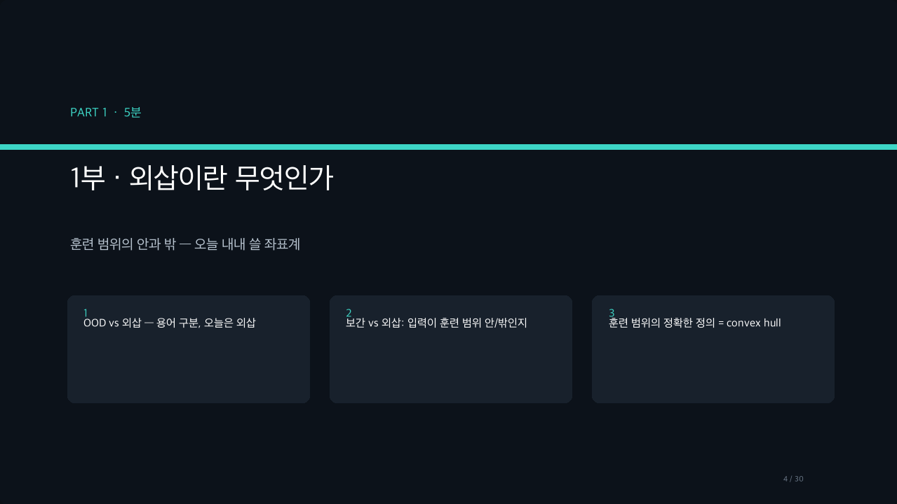

### ⓪ 발표 흐름

**이 장 역할:** 1부 표지 — 오늘 내내 쓸 **좌표계**를 소개합니다.

**앞에서:** S03에서 ‘밖은 가정이 정한다’고 했으니, **‘밖’이 어디인지**부터.

**다음으로:** OOD와 외삽 구분 → **오늘은 외삽** (S05).

**말로 이어 붙이기:** “5분짜리 정의 파트 — 먼저 용어, 그다음 좌표계.”

### ① 참조 논문

| 논문 | PDF | 부록 |
|------|-----|------|
| Bartley et al., 2019 — Characterizing Extrapolation in Multivariate Response Data | `Bartley2019_Characterizing_Extrapolation_Multivariate.pdf` | [#C-01](#c-01) |

### ② 발표 대본

```text
[20초]
대본: 1부입니다. OOD vs 외삽, 보간/외삽, hull, 사례 — 5분. 오늘은 **외삽** 좌표계에 집중합니다.
```

---

### ③ 장표·논문 상세

**장표 제목:**  — 1부 · 외삽이란 무엇인가
**부제:** 훈련 범위의 안과 밖 — 오늘 내내 쓸 좌표계

**이 부 표지 — 다룰 내용**
- OOD vs 외삽 — 오늘은 **외삽**
- 보간 vs 외삽: 입력이 훈련 범위 안/밖인지
- 훈련 범위의 정확한 정의 = convex hull
- 대표 사례: 내부 적합과 외부 발산


**논문 상세 (이 장)**


**Bartley et al., 2019** → [부록 C #C-01](#c-01)
  **정의:** 훈련 범위 = **Conv(X_train)**. \(x^*
otin\) 훈련 범위 → extrapolation.
  **지표:** multivariate **trace/det** of \(\mathrm{Var}(Y|x)\) + cutoff \(c\).
  **실험:** 훈련 범위 밖 → MSE↑, PI coverage↓ (sim + lake fish).
  **함정:** min–max box는 훈련 범위보다 큼 → extrapolation **과소** 판정.
  **고차원:** p↑ → random test가 훈련 범위 밖일 확률↑ (S11).
  **Q&A:** “범위 안”이 아니라 “**훈련 범위 안**?”이 정확한 질문.
  _→ 부록 C 10섹션 풀 가이드_

_전문·수식·실험 숫자 → [부록 C · 참조 논문 상세 정리](#부록-c)_


---


## S05 · OOD vs 외삽 {#s05}

**슬라이드 5/32**

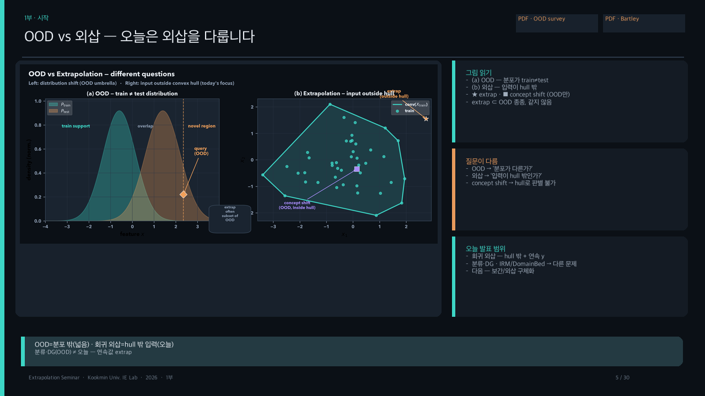

### ⓪ 발표 흐름

**이 장 역할:** 1부 시작 — **OOD vs 외삽** 구분, **오늘은 외삽**.

**앞에서:** S04 1부 표지 — ‘밖’ 좌표계 소개.

**다음으로:** 외삽 **구체화** — 보간/외삽 그림 (S06).

**말로 이어 붙이기:** “OOD 넓음 · 오늘=외삽 hull · S28에서 OOD 다시.”

### ① 참조 논문

| 논문 | PDF | 부록 |
|------|-----|------|
| Liu et al., 2023 — OOD Generalization Survey | `Liu2023_OOD_Generalization_Survey.pdf` | [#C-15](#c-15) |
| Bartley et al., 2019 — Characterizing Extrapolation | `Bartley2019_Characterizing_Extrapolation_Multivariate.pdf` | [#C-01](#c-01) |

### ② 발표 대본

```text
[1.5분]
대본: 왼쪽 **(a)** — OOD. train·test **분포** 다름. 오른쪽 꼬리 query = OOD.
오른쪽 **(b)** — 외삽. convex hull 안/밖. ★ = hull 밖 extrap(오늘 좌표). ■ 보라 = concept shift — hull 안인데 OOD.
extrap ⊂ OOD 종종, 같지 않음. 오늘 **외삽**. OOD는 S28. 다음 — 보간/외삽.
```

---

### ③ 장표·논문 상세

**장표 제목:** 1부 · 시작 — OOD vs 외삽 — 오늘은 **외삽**을 다룹니다

**그림:** `_assets/fig_ood_vs_extrap.png` (2-panel)

| 패널 | 의미 | 발표 포인트 |
|------|------|-------------|
| **(a) OOD** | \(P_{\mathrm{train}} \neq P_{\mathrm{test}}\) — 분포 shift | query가 train support 밖 → **분포** 질문 |
| **(b) Extrapolation** | conv(\(X_{\mathrm{train}}\)) 밖 입력 | ★ hull 밖 = **외삽** · ■ hull 안 concept shift = OOD만 |

**오른쪽 카드 (3개)**
- **그림 읽기** — (a)(b) 기호: ★ extrap, ■ concept shift
- **질문이 다름** — OOD vs hull 밖
- **오늘 발표 범위** — 외삽 + 가정 · OOD는 S28

**하단 takeaway**
- **OOD=분포 밖(넓음) · 외삽=hull 밖(오늘)**
- 그림 (a)(b) 질문 다름 — 오늘은 **(b)**

---


## S06 · 보간 vs 외삽 {#s06}

**슬라이드 6/32**

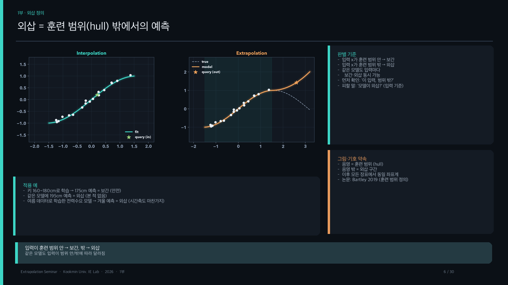

### ⓪ 발표 흐름

**이 장 역할:** 핵심 정의 — **보간 vs 외삽**을 입력 기준으로 고정.

**앞에서:** S05 — OOD vs 외삽, **오늘=외삽** 좌표 확정.

**다음으로:** 입력 기준 잡혔으니 **훈련 범위** 수학적으로 (S07).

**말로 이어 붙이기:** 키·몸무게·겨울 수요 예 — **일상 예** 하나만 짚고 그림 약속(음영=범위)을 걸어 두세요.

### ① 참조 논문

| 논문 | PDF | 부록 |
|------|-----|------|
| Bartley et al., 2019 — Characterizing Extrapolation in Multivariate Response Data | `Bartley2019_Characterizing_Extrapolation_Multivariate.pdf` | [#C-01](#c-01) |
| Xu et al., ICLR 2021 — How Neural Networks Extrapolate | `Xu2021_How_Neural_Networks_Extrapolate.pdf` | [#C-03](#c-03) |

### ② 발표 대본

```text
[1.5분]
대본: 정의부터. 외삽은 '훈련 범위 밖에서의 예측'입니다. 왼쪽 그림 — 같은 모델인데 **예측할 입력**이 훈련 범위 안이면 보간, 밖이면 외삽입니다. 그래서 '모델이 외삽되나?'가 아니라 '**지금 넣는 입력이 범위 밖인가?**'가 먼저입니다. 적용 예 — 키 160~180으로 학습한 몸무게 모델에 175를 물으면 보간, 195를 물으면 외삽입니다. 여름 데이터로 겨울 수요를 예측하는 것도 외삽입니다 — 시간축도 똑같습니다. 약속 하나: 오늘 모든 그림에서 음영이 훈련 범위, 그 밖이 외삽 영역입니다.
```

---

### ③ 장표·논문 상세

**장표 제목:** 1부 · 외삽 정의 — 외삽 = 훈련 범위(hull) 밖에서의 예측

**그림**
- `_assets/fig_interp_extrap.png`

**장표 핵심 (카드)**

*적용 예*
- 키 160~180cm로 학습 → 175cm 예측 = 보간 (안전)
- 같은 모델에 195cm 예측 = 외삽 (본 적 없음)
- 여름 데이터로 학습한 전력수요 모델 → 겨울 예측 = 외삽 (시간축도 마찬가지)

*판별 기준*
- 입력 x가 훈련 범위 안 → 보간
- 입력 x가 훈련 범위 밖 → 외삽
- 같은 모델도 입력마다
- 보간·외삽 동시 가능
- 먼저 확인: '이 입력, 범위 밖?'
- 피할 말: '모델이 외삽?' (입력 기준)

*그림·기호 약속*
- 음영 = 훈련 범위 (hull)
- 음영 밖 = 외삽 구간
- 이후 모든 장표에서 동일 좌표계
- 논문: Bartley 2019 (훈련 범위 정의)

**하단 takeaway**
- **입력이 훈련 범위 안 → 보간, 밖 → 외삽**
- 같은 모델도 **입력이 범위 안/밖**에 따라 달라짐


**논문 상세 (이 장)**


**Bartley et al., 2019** → [부록 C #C-01](#c-01)
  **정의:** 훈련 범위 = **Conv(X_train)**. \(x^*
otin\) 훈련 범위 → extrapolation.
  **지표:** multivariate **trace/det** of \(\mathrm{Var}(Y|x)\) + cutoff \(c\).
  **실험:** 훈련 범위 밖 → MSE↑, PI coverage↓ (sim + lake fish).
  **함정:** min–max box는 훈련 범위보다 큼 → extrapolation **과소** 판정.
  **고차원:** p↑ → random test가 훈련 범위 밖일 확률↑ (S11).
  **Q&A:** “범위 안”이 아니라 “**훈련 범위 안**?”이 정확한 질문.
  _→ 부록 C 10섹션 풀 가이드_


**Xu et al., ICLR 2021** → [부록 C #C-03](#c-03)
  **Thm.1:** L-layer ReLU MLP, \(x=tv\), \(t\to\infty\) → \(f_\theta(tv)/t \to A_v v+b_v\).
  **메커니즘:** active set 고정 → 마지막 linear piece **연장** = 직선 extrapolation.
  **Fig.1:** sin — train OK, test **tangent**. Appendix affine fit R²>0.99.
  **Fig.5:** sin+cos φ → 주기 extrap; ReLU mismatch → 오차 **10²–10³**.
  **GNN:** linear aggregation; **algorithmic alignment** (Bellman-Ford 등) 시 밖 OK.
  **Q&A:** “NN extrapolation?” → “**어떤 φ·구조 가정**이 타깃에 맞나?”
  _→ 부록 C 10섹션 풀 가이드_

_전문·수식·실험 숫자 → [부록 C · 참조 논문 상세 정리](#부록-c)_


---


## S07 · convex hull {#s07}

**슬라이드 7/32**

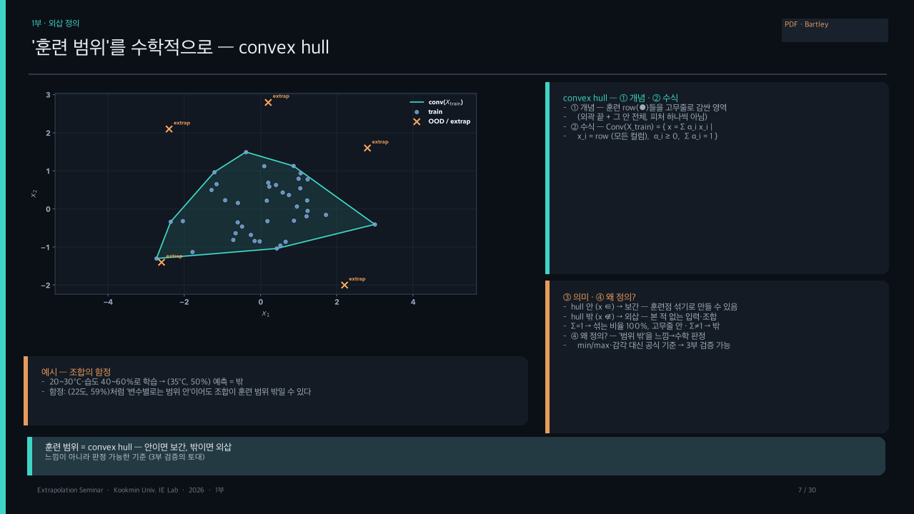

### ⓪ 발표 흐름

**이 장 역할:** 훈련 범위 = **convex hull** — ‘범위’를 정확히.

**앞에서:** S06 — “범위 안/밖” → **범위가 정확히 뭐냐**.

**다음으로:** 정의가 끝났으니 **왜 위험한지** 감각 — 다항식 사례 (S08).

**말로 이어 붙이기:** min–max 상자와 hull 차이는 **한 줄**만. “오늘은 hull 기준”이라고 못 박기.

### ① 참조 논문

| 논문 | PDF | 부록 |
|------|-----|------|
| Bartley et al., 2019 — Characterizing Extrapolation in Multivariate Response Data | `Bartley2019_Characterizing_Extrapolation_Multivariate.pdf` | [#C-01](#c-01) |
| Ye et al., CVPR 2022 — OoD-Bench | `Ye2022_OoD-Bench.pdf` | [#C-11](#c-11) |

### ② 발표 대본

```text
[1.5분]
대본: 오른쪽 네 단계입니다. ① 개념 — 훈련 row(●)들을 고무줄로 감싼 영역, 외곽+안. ② 수식 — Conv(X_train) = Σ α_i x_i, α_i ≥ 0, Σ α_i = 1. ③ 의미 — hull 안=보간, 밖=외삽. Σ=1은 섞기 100%라 고무줄 안만. ④ 왜 정의? — '범위 밖'을 느낌이 아니라 수학으로 판정해야 3부 검증이 됩니다. min/max나 '비슷해 보여'로는 부족합니다. 왼쪽 함정 — 변수별로는 범위 안인데 조합은 hull 밖일 수 있습니다.
```

---

### ③ 장표·논문 상세

**장표 제목:** 1부 · 외삽 정의 — '훈련 범위'를 수학적으로 — convex hull

**그림**
- `_assets/fig_convex_hull.png`

**장표 핵심 (카드)**

*예시 — 조합의 함정*
- 20~30°C·습도 40~60%로 학습 → (35°C, 50%) 예측 = 밖
- 함정: (22도, 59%)처럼 '변수별로는 범위 안'이어도 조합이 훈련 범위 밖일 수 있다

*convex hull — ① 개념 · ② 수식*
- ① 개념 — 훈련 row(●)들을 고무줄로 감싼 영역
- (외곽 끝 + 그 안 전체, 피처 하나씩 아님)
- ② 수식 — Conv(X_train) = { x = Σ α_i x_i |
- x_i = row (모든 컬럼),  α_i ≥ 0,  Σ α_i = 1 }

*③ 의미 · ④ 왜 정의?*
- hull 안 (x ∈) → 보간 — 훈련점 섞기로 만들 수 있음
- hull 밖 (x ∉) → 외삽 — 본 적 없는 입력·조합
- Σ=1 → 섞는 비율 100%, 고무줄 안 · Σ≠1 → 밖
- ④ 왜 정의? — '범위 밖'을 느낌→수학 판정
- min/max·감각 대신 공식 기준 → 3부 검증 가능

**하단 takeaway**
- **훈련 범위 = convex hull — 안이면 보간, 밖이면 외삽**
- 느낌이 아니라 판정 가능한 기준 (3부 검증의 토대)


**논문 상세 (이 장)**


**Bartley et al., 2019** → [부록 C #C-01](#c-01)
  **정의:** 훈련 범위 = **Conv(X_train)**. \(x^*
otin\) 훈련 범위 → extrapolation.
  **지표:** multivariate **trace/det** of \(\mathrm{Var}(Y|x)\) + cutoff \(c\).
  **실험:** 훈련 범위 밖 → MSE↑, PI coverage↓ (sim + lake fish).
  **함정:** min–max box는 훈련 범위보다 큼 → extrapolation **과소** 판정.
  **고차원:** p↑ → random test가 훈련 범위 밖일 확률↑ (S11).
  **Q&A:** “범위 안”이 아니라 “**훈련 범위 안**?”이 정확한 질문.
  _→ 부록 C 10섹션 풀 가이드_


**Ye et al., CVPR 2022** → [부록 C #C-11](#c-11)
  **\(D_{\mathrm{div}}\):** diversity shift — \(P(X)\) **새 영역** (style, domain).
  **\(D_{\mathrm{cor}}\):** correlation shift — \(P(X)\) 유사, **\(P(Y|X)\)** 변경.
  **프로파일:** dataset → 어느 축 dominant? → 방법 선택 근거.
  **14 alg vs ERM:** 대부분 **한 축에서만** 이김 — 범용 OOD silver bullet ✗.
  **가이드:** Colored MNIST = \(D_{\mathrm{cor}}\); PACS style = \(D_{\mathrm{div}}\) 등.
  **Q&A:** S29 — extrapolation **종류** 먼저, 알고리즘 나중.
  _→ 부록 C 10섹션 풀 가이드_

_전문·수식·실험 숫자 → [부록 C · 참조 논문 상세 정리](#부록-c)_


---


## S08 · 대표 사례 — 다항식 {#s08}

**슬라이드 8/32**

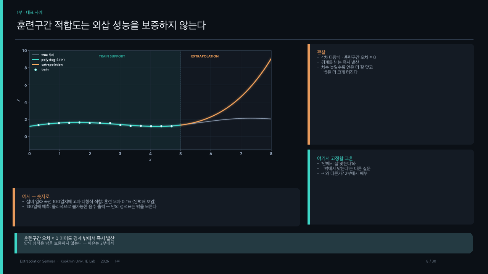

### ⓪ 발표 흐름

**이 장 역할:** 1부 마무리 — **안의 성적 ≠ 밖의 성적**을 눈으로.

**앞에서:** 정의·범위를 잡았으니, “그래서 뭐가 문제?” **직관** 하나.

**다음으로:** “왜 다른 질문일 수밖에 없나?” → **2부 실패 원인** (S09).

**말로 이어 붙이기:** “여기서 교훈 하나만” → **2부로 넘기는 브릿지**. 청중이 S08을 기대하게.

### ① 참조 논문

| 논문 | PDF | 부록 |
|------|-----|------|
| Pfister & Bühlmann, 2024 — Extrapolation-Aware Nonparametric Inference | `Pfister2024_Extrapolation-Aware_Nonparametric_Inference.pdf` | [#C-02](#c-02) |

### ② 발표 대본

```text
[1.5분]
대본: 밖에서 무슨 일이 생기는지 대표 사례입니다. 4차 다항식이 훈련 구간 안에서는 사실상 완벽합니다 — 오차가 0에 가깝습니다. 그런데 경계를 넘는 순간 폭발합니다. 차수를 높이면 안은 더 잘 맞는데 밖은 더 크게 터집니다. 여기서 교훈 하나만 새기고 2부로 갑니다: '안에서 잘 맞는다'와 '밖에서 맞는다'는 서로 다른 질문이다. 왜 다른 질문일 수밖에 없는지 — 그게 2부입니다.
```

---

### ③ 장표·논문 상세

**장표 제목:** 1부 · 대표 사례 — 훈련구간 적합도는 외삽 성능을 보증하지 않는다

**그림**
- `_assets/fig_poly_extrap.png`

**장표 핵심 (카드)**

*예시 — 숫자로*
- 설비 열화 곡선 100일치에 고차 다항식 적합: 훈련 오차 0.1% (완벽해 보임)
- 130일째 예측: 물리적으로 불가능한 음수 출력 — 안의 성적표는 밖을 모른다

*관찰*
- 4차 다항식 · 훈련구간 오차 ≈ 0
- 경계를 넘는 즉시 발산
- 차수 높일수록 안은 더 잘 맞고
- 밖은 더 크게 터진다

*여기서 고정할 교훈*
- '안에서 잘 맞는다'와
- '밖에서 맞는다'는 다른 질문
- → 왜 다른가? 2부에서 해부

**하단 takeaway**
- **훈련구간 오차 ≈ 0 이어도 경계 밖에서 즉시 발산**
- 안의 성적은 밖을 보증하지 않는다 — 이유는 2부에서


**논문 상세 (이 장)**


**Pfister & Bühlmann, 2024** → [부록 C #C-02](#c-02)
  **정의:** extrapolation = support **밖**에서 \(m(x)=\mathbb{E}[Y|X=x]\) 또는 quantile 평가.
  **함수 못 정함:** 유한 데이터 + smoothness만 → 밖 \(m(x)\) **무한히 많음** (S10).
  **가정:** directional derivative **극값** on support → band \([m^-,m^+]\).
  **추정:** 안 = NW/RF; 밖 = **partial ID bounds** (band 폭은 데이터만으로 안 좁아짐).
  **UQ:** 모델 softmax ≠ 통계 CI — band 넓으면 **정직한** 불확실성.
  **Q&A:** 가정 넣어도 검증 필요 (Fesser). Pfister = **명시적** bounds.
  _→ 부록 C 10섹션 풀 가이드_

_전문·수식·실험 숫자 → [부록 C · 참조 논문 상세 정리](#부록-c)_


---


## S09 · 2부 표지 · 실패 원인 (4) {#s09}

**슬라이드 9/32**

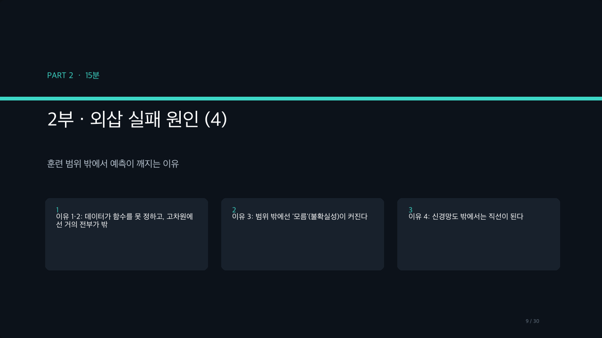

### ⓪ 발표 흐름

**이 장 역할:** 2부 표지 — 실패 **네 가지** 예고.

**앞에서:** S07에서 “안≠밖”을 봤으니, **왜 그런지 이유**를 나열.

**다음으로:** 첫 이유, 오늘 **가장 중요한 장** — 데이터만으론 못 고름 (S10).

**말로 이어 붙이기:** ‘한계’가 아니라 **‘왜 틀리는지’** — 톤을 원인 분석으로.

### ① 참조 논문

_개념·종합 장 — 아래 상세·[부록 C](#부록-c) 참조._

### ② 발표 대본

```text
[20초]
대본: 2부, **외삽 실패 원인**입니다. '한계'가 아니라 — 밖에서 왜 틀리는지 네 가지. 식별 불가(데이터만으론 못 고름), 고차원에서 범위 밖, 밖에서 불확실성 폭발, ReLU 직선. 하나씩 보겠습니다.
```

---

### ③ 장표·논문 상세

**장표 제목:**  — 2부 · 외삽 실패 원인 (4)

**이 부 표지 — 다룰 내용**
- 이유 1·2: 데이터가 함수를 못 정하고, 고차원에선 거의 전부가 밖
- 이유 3: 범위 밖에선 '모름'(불확실성)이 커진다
- 이유 4: 신경망도 밖에서는 직선이 된다


---


## S10 · 실패 원인 ① — 함수 못 고름 {#s10}

**슬라이드 10/32**

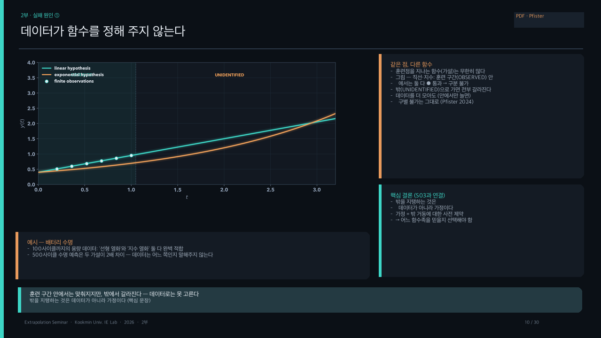

### ⓪ 발표 흐름

**이 장 역할:** ★ 2부 심장 — **식별 불가** = 관통 문장의 증명.

**앞에서:** 2부 첫 카드. S03 그림의 **논문 버전**.

**다음으로:** 함수를 못 고르는 건 **원리** 문제, 다음은 **규모** 문제 (S11).

**말로 이어 붙이기:** 배터리 예 → **“데이터는 말 안 해준다”** → **“그럼 가정”**으로 S03과 닫기.

### ① 참조 논문

| 논문 | PDF | 부록 |
|------|-----|------|
| Pfister & Bühlmann, 2024 — Extrapolation-Aware Nonparametric Inference | `Pfister2024_Extrapolation-Aware_Nonparametric_Inference.pdf` | [#C-02](#c-02) |
| Aykol et al., 2021 — Physics-informed ML for Battery Lifetime | `Aykol2021_Physics_ML_Battery_Lifetime.pdf` | [#C-19](#c-19) |
| Li et al., 2023 — Predicting Battery Lifetime under Varying Conditions | `Li2023_Predicting_Battery_Lifetime_Varying_Conditions.pdf` | [#C-20](#c-20) |

### ② 발표 대본

```text
[2분] ★ 발표 전체에서 가장 중요한 장.
대본: 첫 번째 이유이자 오늘의 심장입니다. 그림 — 직선 가설과 지수 가설, 훈련 구간(OBSERVED) 안에서는 둘 다 ●를 통과합니다. 구분이 안 됩니다. 밖(UNIDENTIFIED)으로 나가는 순간 전부 다른 답을 냅니다. 아무 함수나 맞는 게 아니라, 훈련점을 지나는 가설이 (원칙적으로) 무한히 많다는 뜻입니다. 그럼 데이터를 더 모으면 되지 않나? — 훈련 범위 안에서만 늘어나면 소용없습니다. Pfister 2024: 범위 밖 추론은 추가 가정 없이는 원리적으로 불가능. 배터리 예 — 100사이클까지 선형·지수 열화 둘 다 완벽 적합, 500사이클 수명은 2배 차이. 데이터는 어느 쪽인지 말해주지 않습니다. 밖을 지탱하는 것은 데이터가 아니라 가정입니다.
```

---

### ③ 장표·논문 상세

**장표 제목:** 2부 · 실패 원인 ① — 데이터가 함수를 정해 주지 않는다

**그림**
- `_assets/fig_identifiability.png`

**장표 핵심 (카드)**

*예시 — 배터리 수명*
- 100사이클까지의 용량 데이터: '선형 열화'와 '지수 열화' 둘 다 완벽 적합
- 500사이클 수명 예측은 두 가설이 2배 차이 — 데이터는 어느 쪽인지 말해주지 않는다

*같은 점, 다른 함수*
- 훈련점을 지나는 함수(가설)는 무한히 많다
- 그림 — 직선·지수: 훈련 구간(OBSERVED) 안
- 에서는 둘 다 ● 통과 → 구분 불가
- 밖(UNIDENTIFIED)으로 가면 전부 갈라진다
- 데이터를 더 모아도 (안에서만 늘면)
- 구별 불가는 그대로 (Pfister 2024)

*핵심 결론 (S03과 연결)*
- 밖을 지탱하는 것은
- 데이터가 아니라 가정이다
- 가정 = 밖 거동에 대한 사전 제약
- → 어느 함수족을 믿을지 선택해야 함

**하단 takeaway**
- **훈련 구간 안에서는 맞춰지지만, 밖에서 갈라진다 — 데이터로는 못 고른다**
- 밖을 지탱하는 것은 데이터가 아니라 가정이다 (핵심 문장)


**논문 상세 (이 장)**


**Pfister & Bühlmann, 2024** → [부록 C #C-02](#c-02)
  **정의:** extrapolation = support **밖**에서 \(m(x)=\mathbb{E}[Y|X=x]\) 또는 quantile 평가.
  **함수 못 정함:** 유한 데이터 + smoothness만 → 밖 \(m(x)\) **무한히 많음** (S10).
  **가정:** directional derivative **극값** on support → band \([m^-,m^+]\).
  **추정:** 안 = NW/RF; 밖 = **partial ID bounds** (band 폭은 데이터만으로 안 좁아짐).
  **UQ:** 모델 softmax ≠ 통계 CI — band 넓으면 **정직한** 불확실성.
  **Q&A:** 가정 넣어도 검증 필요 (Fesser). Pfister = **명시적** bounds.
  _→ 부록 C 10섹션 풀 가이드_


**Aykol et al., 2021** → [부록 C #C-19](#c-19)
  **Domain:** Li-ion **lifetime** under varying charge/discharge.
  **Physics:** SEI growth, thermodynamics → features + CNN/ML.
  **Extrapolation:** 새 protocol / C-rate = **훈련 범위 밖** operating point.
  **메시지:** same early cycles, **different degradation law** → different life.
  **연결:** S10 Pfister 함수 못 정함 **공학 예시**.
  _→ 부록 C 10섹션 풀 가이드_


**Li et al., 2023** → [부록 C #C-20](#c-20)
  **Data:** **225** commercial LFP/graphite cells, diverse protocols.
  **Task:** first **15%** cycles → predict **lifetime** (RUL proxy).
  **성능:** in-distribution **MAPE ~15%** (early prediction).
  **OOD:** varying DoD, fast charge — **extrapolation** 현실 반영.
  **연결:** S10 — linear vs exponential fade **가정** 비교.
  _→ 부록 C 10섹션 풀 가이드_

_전문·수식·실험 숫자 → [부록 C · 참조 논문 상세 정리](#부록-c)_


---


## S11 · 실패 원인 ② — 훈련 범위 {#s11}

**슬라이드 11/32**

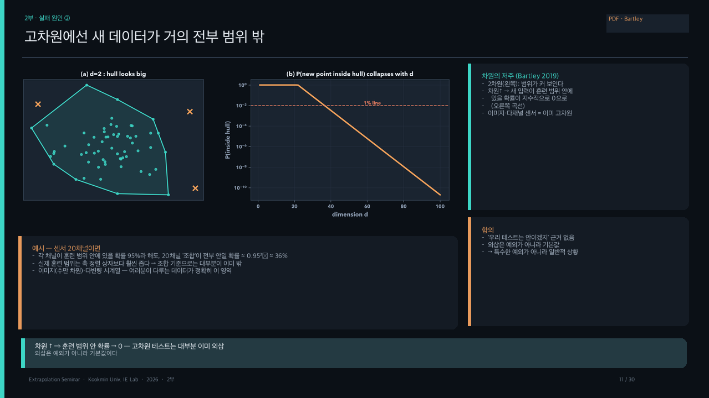

### ⓪ 발표 흐름

**이 장 역할:** 규모 — 고차원에선 **테스트가 거의 전부 밖**.

**앞에서:** S09가 ‘원리’였으면, S10은 **현실 데이터** 이야기.

**다음으로:** 밖이 흔해지면, 밖에서 **뭐가 터지는지** — 불확실성 (S12).

**말로 이어 붙이기:** “우리 데이터도 이미지·센서” — **청중 데이터**에 한 번 연결.

### ① 참조 논문

| 논문 | PDF | 부록 |
|------|-----|------|
| Bartley et al., 2019 — Characterizing Extrapolation in Multivariate Response Data | `Bartley2019_Characterizing_Extrapolation_Multivariate.pdf` | [#C-01](#c-01) |
| Ye et al., CVPR 2022 — OoD-Bench | `Ye2022_OoD-Bench.pdf` | [#C-11](#c-11) |

### ② 발표 대본

```text
[1.5분]
대본: 두 번째 이유 — 규모의 문제입니다. '데이터가 충분히 많으니 테스트는 범위 안이겠지'라고 생각하기 쉽습니다. 2차원에서는 맞는 직관입니다, 왼쪽 그림처럼 훈련 범위가 꽤 넓거든요. 그런데 오른쪽 곡선 — 차원이 올라가면 **새 입력**이 훈련 범위 안일 확률이 지수적으로 0에 수렴합니다. 100차원이면 사실상 0입니다. 체감 예시 — 센서 20채널에서 채널별로 95% 확률로 범위 안이라 해도, 20개 조합이 전부 안일 확률은 0.95의 20제곱, 36%입니다. 실제 훈련 범위는 그보다 훨씬 좁으니 대부분이 이미 밖입니다. 이미지, 다채널 센서 시계열 — 전부 고차원입니다. 결론: 외삽은 예외 상황이 아니라 기본값입니다.
```

---

### ③ 장표·논문 상세

**장표 제목:** 2부 · 실패 원인 ② — 고차원에선 새 데이터가 거의 전부 범위 밖

**그림**
- `_assets/fig_hull_dimension.png`

**장표 핵심 (카드)**

*예시 — 센서 20채널이면*
- 각 채널이 훈련 범위 안에 있을 확률 95%라 해도, 20채널 '조합'이 전부 안일 확률 ≈ 0.95²⁰ ≈ 36%
- 실제 훈련 범위는 축 정렬 상자보다 훨씬 좁다 → 조합 기준으로는 대부분이 이미 밖
- 이미지(수만 차원)·다변량 시계열 — 여러분이 다루는 데이터가 정확히 이 영역

*차원의 저주 (Bartley 2019)*
- 2차원(왼쪽): 범위가 커 보인다
- 차원↑ → 새 입력이 훈련 범위 안에
- 있을 확률이 지수적으로 0으로
- (오른쪽 곡선)
- 이미지·다채널 센서 = 이미 고차원

*함의*
- '우리 테스트는 안이겠지' 근거 없음
- 외삽은 예외가 아니라 기본값
- → 특수한 예외가 아니라 일반적 상황

**하단 takeaway**
- **차원 ↑ ⇒ 훈련 범위 안 확률 → 0 — 고차원 테스트는 대부분 이미 외삽**
- 외삽은 예외가 아니라 기본값이다


**논문 상세 (이 장)**


**Bartley et al., 2019** → [부록 C #C-01](#c-01)
  **정의:** 훈련 범위 = **Conv(X_train)**. \(x^*
otin\) 훈련 범위 → extrapolation.
  **지표:** multivariate **trace/det** of \(\mathrm{Var}(Y|x)\) + cutoff \(c\).
  **실험:** 훈련 범위 밖 → MSE↑, PI coverage↓ (sim + lake fish).
  **함정:** min–max box는 훈련 범위보다 큼 → extrapolation **과소** 판정.
  **고차원:** p↑ → random test가 훈련 범위 밖일 확률↑ (S11).
  **Q&A:** “범위 안”이 아니라 “**훈련 범위 안**?”이 정확한 질문.
  _→ 부록 C 10섹션 풀 가이드_


**Ye et al., CVPR 2022** → [부록 C #C-11](#c-11)
  **\(D_{\mathrm{div}}\):** diversity shift — \(P(X)\) **새 영역** (style, domain).
  **\(D_{\mathrm{cor}}\):** correlation shift — \(P(X)\) 유사, **\(P(Y|X)\)** 변경.
  **프로파일:** dataset → 어느 축 dominant? → 방법 선택 근거.
  **14 alg vs ERM:** 대부분 **한 축에서만** 이김 — 범용 OOD silver bullet ✗.
  **가이드:** Colored MNIST = \(D_{\mathrm{cor}}\); PACS style = \(D_{\mathrm{div}}\) 등.
  **Q&A:** S29 — extrapolation **종류** 먼저, 알고리즘 나중.
  _→ 부록 C 10섹션 풀 가이드_

_전문·수식·실험 숫자 → [부록 C · 참조 논문 상세 정리](#부록-c)_


---


## S12 · 실패 원인 ③ — 불확실성 {#s12}

**슬라이드 12/32**

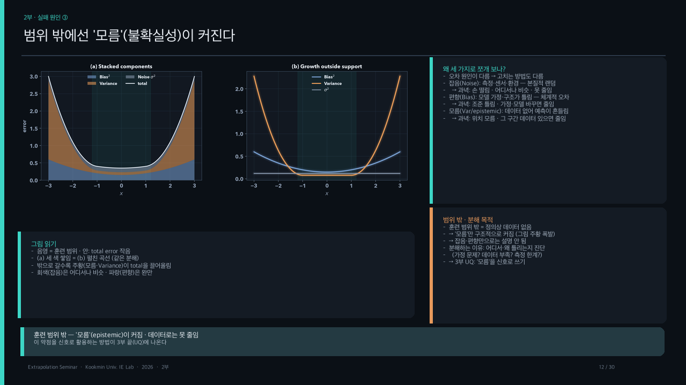

### ⓪ 발표 흐름

**이 장 역할:** 해부 — 밖에서 **‘모름’(epistemic)** 이 커짐.

**앞에서:** 밖이 많다는 걸 알았으니, **오차가 왜 커지는지** 쪼개기.

**다음으로:** 일반 ML뿐 아니라 **신경망도** — Xu (S13).

**말로 이어 붙이기:** 과녁 비유 후 “UQ는 3부 끝에” **가볍게 예고**만.

### ① 참조 논문

| 논문 | PDF | 부록 |
|------|-----|------|
| Ghahramani, 2013 — Bayesian Nonparametrics | `Ghahramani2013_Bayesian_Nonparametrics.pdf` | [#C-10](#c-10) |
| Zhu et al., CMAME 2023 — Reliable Extrapolation of Deep Neural Operators | `Zhu2022_Reliable_Extrapolation_DeepONet.pdf` | [#C-09](#c-09) |

### ② 발표 대본

```text
[1.5분]
대본: 밖에서 왜 불확실해지는지 — 오차를 세 덩어리로 쪼개 봅니다. 왜 쪼개나? 원인마다 대처가 다르기 때문입니다. 잡음 — 측정·센서·환경, 본질적 랜덤, 과녁 비유로 손 떨림, 줄일 수 없습니다. 편향 — 모델 가정·구조가 틀린 체계적 오차, 조준 틀림, 가정을 고치면 줄입니다. 모름 — 데이터가 없어서 예측이 흔들리는 것, 과녁 위치를 모르는 것, 그 구간에 데이터를 모으면 줄일 수 있습니다. 그림 — 음영 안에서는 total error가 작고, 밖으로 가면 주황 '모름'이 폭발합니다. 훈련 범위 밖은 정의상 데이터가 없으니 '모름'만 구조적으로 못 줄입니다. 분해 목적 — 어디서 왜 틀리는지 진단하는 것, 3부 UQ에서 이 신호를 씁니다.
```

---

### ③ 장표·논문 상세

**장표 제목:** 2부 · 실패 원인 ③ — 범위 밖에선 '모름'(불확실성)이 커진다

**그림**
- `_assets/fig_error_decomp.png`

**장표 핵심 (카드)**

*그림 읽기*
- 음영 = 훈련 범위 · 안: total error 작음
- (a) 세 색 쌓임 = (b) 펼친 곡선 (같은 분해)
- 밖으로 갈수록 주황(모름·Variance)이 total을 끌어올림
- 회색(잡음)은 어디서나 비슷 · 파랑(편향)은 완만

*왜 세 가지로 쪼개 보나?*
- 오차 원인이 다름 → 고치는 방법도 다름
- 잡음(Noise): 측정·센서·환경 — 본질적 랜덤
- → 과녁: 손 떨림 · 어디서나 비슷 · 못 줄임
- 편향(Bias): 모델 가정·구조가 틀림 — 체계적 오차
- → 과녁: 조준 틀림 · 가정·모델 바꾸면 줄임
- 모름(Var/epistemic): 데이터 없어 예측이 흔들림
- → 과녁: 위치 모름 · 그 구간 데이터 있으면 줄임

*범위 밖 · 분해 목적*
- 훈련 범위 밖 = 정의상 데이터 없음
- → '모름'만 구조적으로 커짐 (그림 주황 폭발)
- → 잡음·편향만으로는 설명 안 됨
- 분해하는 이유: 어디서·왜 틀리는지 진단
- (가정 문제? 데이터 부족? 측정 한계?)
- → 3부 UQ: '모름'을 신호로 쓰기

**하단 takeaway**
- **훈련 범위 밖 — '모름'(epistemic)이 커짐 · 데이터로는 못 줄임**
- 이 약점을 신호로 활용하는 방법이 3부 끝(UQ)에 나온다


**논문 상세 (이 장)**


**Ghahramani, 2013** → [부록 C #C-10](#c-10)
  **Aleatoric:** irreducible noise (heteroscedastic). **Epistemic:** lack of knowledge.
  **GP:** \(k(x,x')\); far from data → posterior **variance ↑** (closed form).
  **DP/IBP:** infinite mixture, latent features — complexity grows with data.
  **발표:** S12 '모름'↑; S24 deep ensemble ≈ 불확실성 proxy.
  **한계:** GP \(O(n^3)\); deep BNN approximate; calibration separate issue.
  **Q&A:** “모름” 신호 ≠ “틀림” 방지 — **둘 다** 필요 (abstention).
  _→ 부록 C 10섹션 풀 가이드_


**Zhu et al., CMAME 2023** → [부록 C #C-09](#c-09)
  **DeepONet:** branch(u) + trunk(y) → \(G(u)(y)\); extrap = **새 input function** u.
  **Complexity:** **2-Wasserstein** \(W_2\) between train/test **function spaces**.
  **5 methods:** std, **PDE fine-tune**, multi-fidelity, **abstention**, ensemble.
  **결과:** FT-Phys 등 PDE-informed; abstain → acc↑ on **accepted**, coverage↓ 명시.
  **trade-off:** capacity↑ → interp↑, extrap **bias-variance** (Fig.).
  **Q&A:** 방법④b — reliability = accuracy **×** known coverage.
  _→ 부록 C 10섹션 풀 가이드_

_전문·수식·실험 숫자 → [부록 C · 참조 논문 상세 정리](#부록-c)_


---


## S13 · 실패 원인 ④ — Xu Thm.1 {#s13}

**슬라이드 13/32**

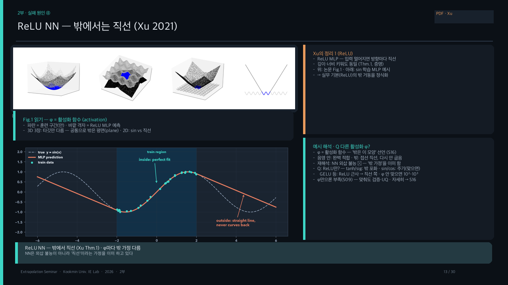

### ⓪ 발표 흐름

**이 장 역할:** ★ 2부 클라이맥스 — ReLU는 밖에서 **직선** (Xu) + **다른 φ Q&A**.

**앞에서:** “NN은 다를 거야?” → **아니다, 밖 가정**을 이미 함.

**다음으로:** 왜 직선인지 **메커니즘** + 2부 총정리 (S14).

**말로 이어 붙이기:** ReLU=직선(증명). tanh=포화, sin=주기 — **φ=밖 선언**. φ만으론 부족 → **S16**.

### ① 참조 논문

| 논문 | PDF | 부록 |
|------|-----|------|
| Xu et al., ICLR 2021 — How Neural Networks Extrapolate | `Xu2021_How_Neural_Networks_Extrapolate.pdf` | [#C-03](#c-03) |

### ② 발표 대본

```text
[2.5분] ★ 2부 클라이맥스.
대본: 위 Fig.1부터 — φ는 활성화 함수(activation)입니다. 파란 부분이 훈련 구간, 안에서는 복잡한 타깃을 ReLU MLP가 잘 맞춥니다. 바깥 회색 격자면을 보세요 — 3D 세 장 모두 밖으로 나가면 평평한 plane으로 이어집니다. 타깃 함수만 다르고 밖 거동은 같습니다. 맨 오른쪽 2D는 단면 — sin을 배워도 밖은 직선. 아래 큰 그림도 같은 메시지. Xu 정리 1: ReLU MLP는 멀어지면 방향마다 직선. 외삽 불능이 아니라 '밖은 직선' 가정. Q ReLU만? tanh는 포화, sin/cos는 주기, φ=밖 모양 선언. φ 맞춰도 S10 한계·검증 필요 — S16. 가정을 어차피 하고 있다면, 내가 아는 것으로 골라 넣자.
```

---

### ③ 장표·논문 상세

**장표 제목:** 2부 · 실패 원인 ④ — ReLU NN — 밖에서는 직선 (Xu 2021)

**그림**
- `_assets/fig_xu_sin_tangent.png`
- `_assets/paper_figs/xu_fig1_relu_extrap.png`

**장표 핵심 (카드)**

*Fig.1 읽기 — φ = 활성화 함수 (activation)*
- 파란 = 훈련 구간(안) · 바깥 격자 = ReLU MLP 예측
- 3D 3장: 타깃만 다름 — 공통으로 밖은 평면(plane) · 2D: sin vs 직선

*Xu의 정리 1 (ReLU)*
- ReLU MLP — 입력 멀어지면 방향마다 직선
- 깊이·너비 키워도 동일 (Thm.1, 증명)
- 위: 논문 Fig.1 · 아래: sin 학습 MLP 예시
- → 실무 기본(ReLU)의 밖 거동을 정식화

*예시 해석 · Q 다른 활성화 φ?*
- φ = 활성화 함수 — '밖은 이 모양' 선언 (S17)
- 음영 안: 완벽 적합 · 밖: 접선 직선, 다시 안 굽음
- 재해석: NN 외삽 불능 ❌ — '밖 가정'을 이미 함
- Q: ReLU만? — tanh/sig: 밖 포화 · sin/cos: 주기(맞으면)
- GELU 등: ReLU 근사 → 직선 쪽 · φ 안 맞으면 10²–10³
- φ만으론 부족(S10) — 맞춰도 검증·UQ · 자세히 → S16

**하단 takeaway**
- **ReLU NN — 밖에서 직선 (Xu Thm.1) · φ마다 밖 가정 다름**
- NN은 외삽 불능이 아니라 '직선'이라는 가정을 이미 하고 있다


**논문 상세 (이 장)**


**Xu et al., ICLR 2021** → [부록 C #C-03](#c-03)
  **Thm.1:** L-layer ReLU MLP, \(x=tv\), \(t\to\infty\) → \(f_\theta(tv)/t \to A_v v+b_v\).
  **메커니즘:** active set 고정 → 마지막 linear piece **연장** = 직선 extrapolation.
  **Fig.1:** sin — train OK, test **tangent**. Appendix affine fit R²>0.99.
  **Fig.5:** sin+cos φ → 주기 extrap; ReLU mismatch → 오차 **10²–10³**.
  **GNN:** linear aggregation; **algorithmic alignment** (Bellman-Ford 등) 시 밖 OK.
  **Q&A:** “NN extrapolation?” → “**어떤 φ·구조 가정**이 타깃에 맞나?”
  _→ 부록 C 10섹션 풀 가이드_

_전문·수식·실험 숫자 → [부록 C · 참조 논문 상세 정리](#부록-c)_


---


## S14 · ReLU 메커니즘 + 2부 정리 {#s14}

**슬라이드 14/32**

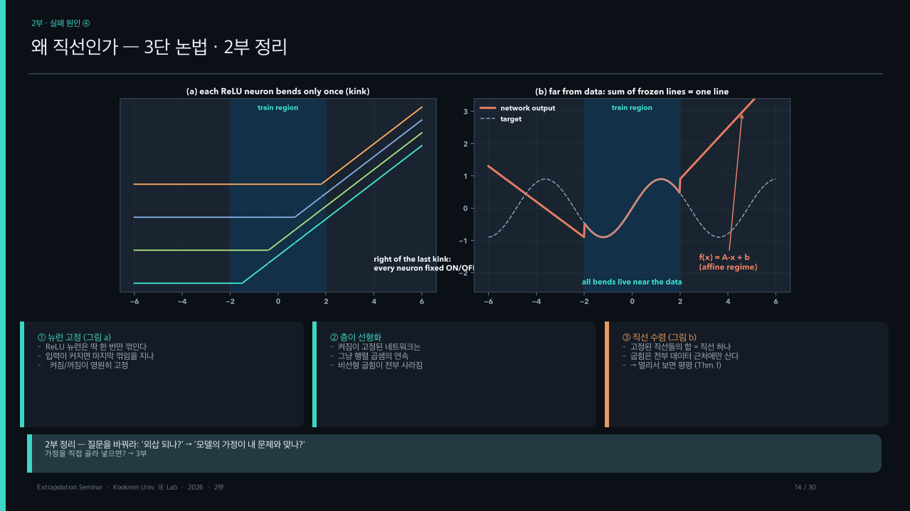

### ⓪ 발표 흐름

**이 장 역할:** 2부 마무리 — **질문 전환** + 3부로.

**앞에서:** Xu 정리 **왜** 성립하는지 3단, 그다음 **2부 한 줄 요약**.

**다음으로:** “가정을 골라 넣자” → **3부 표지** (S15).

**말로 이어 붙이기:** “외삽 되나?” → “**내 가정이 맞나?**” — 이 문장을 **크게**.

### ① 참조 논문

| 논문 | PDF | 부록 |
|------|-----|------|
| Xu et al., ICLR 2021 — How Neural Networks Extrapolate | `Xu2021_How_Neural_Networks_Extrapolate.pdf` | [#C-03](#c-03) |

### ② 발표 대본

```text
[1.5분]
대본: 왜 직선이 되는지 3단으로. 첫째 — 입력이 커지면 각 ReLU 뉴런의 켜짐/꺼짐이 고정됩니다. 둘째 — 켜짐이 고정된 네트워크는 그냥 행렬 곱셈입니다. 셋째 — 행렬 곱을 아무리 쌓아도 직선 하나입니다. 직관적으로: 네트워크의 비선형성은 훈련 범위 근처에만 살고, 멀리서 보면 전부 평평합니다. 2부 정리하겠습니다. 데이터는 함수를 못 정하고, 고차원 테스트는 어차피 대부분 밖이고, 밖에서는 '모름'(불확실성)이 커지고, 신경망조차 밖에서는 직선입니다. 그러니 질문을 바꿔야 합니다 — '외삽이 되나?'가 아니라 '내 모델이 하고 있는 가정이 내 문제와 맞나?'. 가정을 직접 골라서 넣는 방법들, 3부입니다.
```

---

### ③ 장표·논문 상세

**장표 제목:** 2부 · 실패 원인 ④ — 왜 직선인가 — 3단 논법 · 2부 정리

**그림**
- `_assets/fig_relu_affine.png`

**하단 takeaway**
- **2부 정리 — 질문을 바꿔라: '외삽 되나?' → '모델의 가정이 내 문제와 맞나?'**
- 가정을 직접 골라 넣으면? → 3부


**논문 상세 (이 장)**


**Xu et al., ICLR 2021** → [부록 C #C-03](#c-03)
  **Thm.1:** L-layer ReLU MLP, \(x=tv\), \(t\to\infty\) → \(f_\theta(tv)/t \to A_v v+b_v\).
  **메커니즘:** active set 고정 → 마지막 linear piece **연장** = 직선 extrapolation.
  **Fig.1:** sin — train OK, test **tangent**. Appendix affine fit R²>0.99.
  **Fig.5:** sin+cos φ → 주기 extrap; ReLU mismatch → 오차 **10²–10³**.
  **GNN:** linear aggregation; **algorithmic alignment** (Bellman-Ford 등) 시 밖 OK.
  **Q&A:** “NN extrapolation?” → “**어떤 φ·구조 가정**이 타깃에 맞나?”
  _→ 부록 C 10섹션 풀 가이드_

_전문·수식·실험 숫자 → [부록 C · 참조 논문 상세 정리](#부록-c)_


---


## S15 · 3부 표지 · 대응·검증 {#s15}

**슬라이드 15/32**

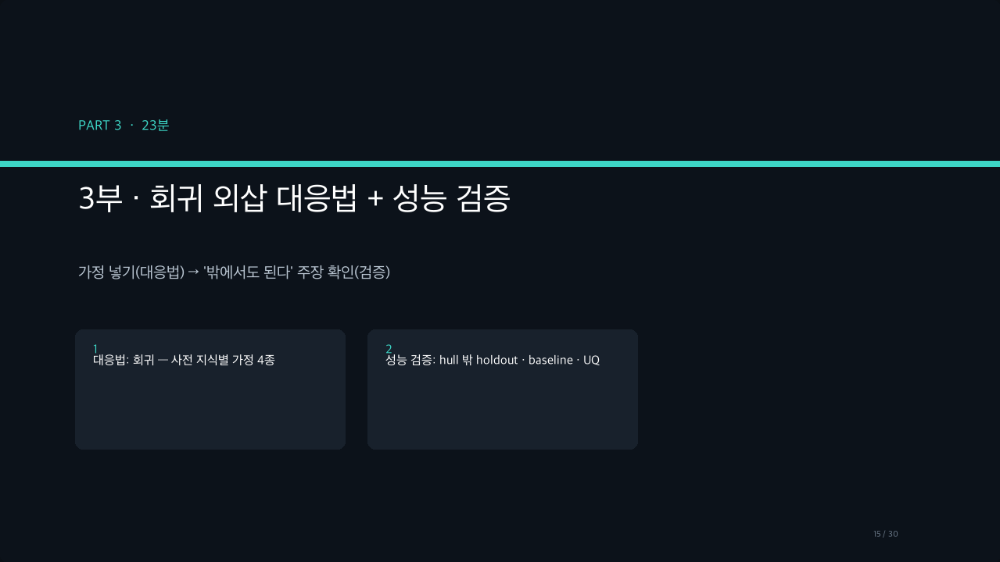

### ⓪ 발표 흐름

**이 장 역할:** 3부 표지 — **대응법** + **성능 검증** 두 덩어리.

**앞에서:** 2부에서 문제를 봤으니, **대안**과 **검증**.

**다음으로:** 먼저 방법 **전체 지도** (S16).

**말로 이어 붙이기:** 27분 중 앞은 방법·뒤는 검증 — **시간 배분** 한 번만.

### ① 참조 논문

_개념·종합 장 — 아래 상세·[부록 C](#부록-c) 참조._

### ② 발표 대본

```text
[20초]
대본: 3부 두 덩어리입니다. 앞 — **외삽 대응법**, 가정을 구조·손실에 넣기. 뒤 — **외삽 성능 검증**, '밖에서도 된다'는 주장을 훈련 범위·벤치·공정 비교로 확인.
```

---

### ③ 장표·논문 상세

**장표 제목:**  — 3부 · 외삽 대응법 + 성능 검증
**부제:** 가정 넣기(대응법) → 외삽 주장이 맞는지 확인(성능 검증)

**이 부 표지 — 다룰 내용**
- 대응법: 사전 지식 강도별 가정 넣기 4종
- 성능 검증: 훈련 범위 · 밖 종류 · 공정 비교


---


## S16 · 대응법 지도 {#s16}

**슬라이드 16/32**

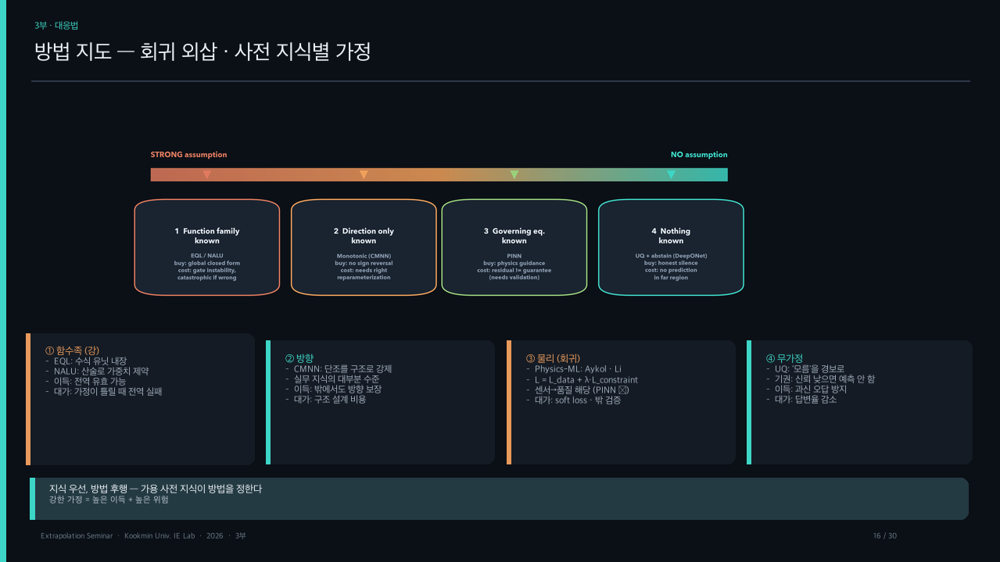

### ⓪ 발표 흐름

**이 장 역할:** 방법 지도 — 가정 **강도 스펙트럼**.

**앞에서:** 3부 시작. “뭘 넣을 수 있나?” **한 장 지도**.

**다음으로:** 지도의 **입구** — 활성화가 타깃과 맞는지 (S17).

**말로 이어 붙이기:** ①함수족 ②방향 ③물리 ④모를 때 — **네 칸**을 왼쪽→오른쪽으로.

### ① 참조 논문

| 논문 | PDF | 부록 |
|------|-----|------|
| Martius & Lampert, 2016 — Extrapolation and Learning Equations (EQL) | `Martius2016_Extrapolation_Learning_Equations_EQL.pdf` | [#C-04](#c-04) |
| Trask et al., NeurIPS 2018 — Neural Arithmetic Logic Units | `Trask2018_Neural_Arithmetic_Logic_Units_NALU.pdf` | [#C-05](#c-05) |
| Runje & Shankaranarayana, ICML 2023 — Constrained Monotonic NN (CMNN) | `Runje2023_Constrained_Monotonic_NN.pdf` | [#C-06](#c-06) |
| Raissi et al., 2019 — Physics-Informed Neural Networks | `Raissi2019_Physics_Informed_Neural_Networks.pdf` | [#C-07](#c-07) |
| Fesser et al., 2023 — Extrapolation Failures in PINNs | `Fesser2023_Extrapolation_Failures_PINNs.pdf` | [#C-08](#c-08) |
| Zhu et al., CMAME 2023 — Reliable Extrapolation of Deep Neural Operators | `Zhu2022_Reliable_Extrapolation_DeepONet.pdf` | [#C-09](#c-09) |

### ② 발표 대본

```text
[1.5분]
대본: 3부 지도입니다. 가로축 = **내가 아는 사전 지식의 강도**입니다. 왼쪽 끝 — 타깃 함수의 형태를 안다: EQL과 NALU. 올바르면 전 영역에서 유효하고, 가정이 틀리면 전역 실패입니다. 두 번째 — 방향성만 안다: 단조 신경망. 실무에서 가장 흔한 지식 수준입니다. 세 번째 — 지배 방정식을 안다: PINN. 여기서 반전이 하나 나옵니다. 오른쪽 끝 — 사전 지식이 없다: 이때는 불확실성(UQ)과 기권(예측 안 함)으로 유보합니다. 순서가 중요합니다. 방법을 먼저 고르는 것이 아니라, 가용 지식이 먼저이고 방법이 뒤따릅니다.
```

---

### ③ 장표·논문 상세

**장표 제목:** 3부 · 대응법 — 방법 지도 — 사전 지식별 외삽 가정 넣기

**그림**
- `_assets/fig_assumption_spectrum.png`

**장표 핵심 (카드)**

*① 함수족 (강)*
- EQL: 수식 유닛 내장
- NALU: 산술로 가중치 제약
- 이득: 전역 유효 가능
- 대가: 가정이 틀릴 때 전역 실패

*② 방향*
- CMNN: 단조를 구조로 강제
- 실무 지식의 대부분 수준
- 이득: 밖에서도 방향 보장
- 대가: 구조 설계 비용

*③ 물리*
- PINN: L_data + λ·잔차
- 이득: 희소 데이터 보완
- 대가: 잔차≠외삽 보증
- (Fesser 2023 반례)

*④ 무가정*
- UQ: '모름'을 경보로
- 기권: 신뢰 낮으면 예측 안 함
- 이득: 과신 오답 방지
- 대가: 답변율 감소

**하단 takeaway**
- **지식 우선, 방법 후행 — 가용 사전 지식이 방법을 정한다**
- 강한 가정 = 높은 이득 + 높은 위험


**논문 상세 (이 장)**


**Martius & Lampert, 2016** → [부록 C #C-04](#c-04)
  **유닛:** +, ×, sin, cos layers; **L1** on weights → sparse **짧은 식**.
  **학습:** end-to-end GD — 구조+계수 동시 (symbolic regression).
  **extrapolation:** \(g\)가 유닛 **대수 닫힘** → recovered 식 = true \(g\) → **전역**.
  **실패:** sin 타깃인데 sin 유닛 없음 → in-sample OK, **out-of-sample 붕괴**.
  **실험:** pendulum, ODE synthetic — **expression recovery**.
  **Q&A:** 방법① — 가정 = “**함수 family**를 안다”. 틀리면 Xu보다 나쁨.
  _→ 부록 C 10섹션 풀 가이드_


**Trask et al., NeurIPS 2018** → [부록 C #C-05](#c-05)
  **NAC:** \(w_i=\tanh\hat w_i\cdot\sigma(\hat w_i)\in[-1,1]\) → **±1,0** 수렴 → 가감.
  **NALU:** gate × (NAC add vs log-exp **mul/div**).
  **실험:** train [1,10], test [10,1000] — NALU OK, MLP fail; MNIST arithmetic.
  **한계:** init 민감, gradient vanishing, ×÷ at 0 unstable, **비산술** 붕괴.
  **후속:** NALU failure papers — 실무 단독 사용 주의.
  **Q&A:** 타깃이 **순수 산술**일 때만 강한 가정 주입.
  _→ 부록 C 10섹션 풀 가이드_


**Runje & Shankaranarayana, ICML 2023** → [부록 C #C-06](#c-06)
  **한계(Fig.1):** \(W\ge0\) clip — monotonic O, **\(x^3\)** 같은 비선형 단조 **X**.
  **CMNN:** input split, dual path, unsaturated φ, \(W\ge0\) → **monotone + nonlinear**.
  **Theorem:** universal approximator for **monotone** functions.
  **실험:** cubic, finance, health — **100%** monotonicity, 훈련 범위 밖 **역전 불가**.
  **vs C-18:** Liu = MILP **certify** 사후; Runje = **by design** 사전.
  **Q&A:** 방법② — “**방향(단조)**만 안다” → 구조에 **내장**.
  _→ 부록 C 10섹션 풀 가이드_


**Raissi et al., 2019** → [부록 C #C-07](#c-07)
  **Loss:** \(\mathcal{L}=L_{\mathrm{data}}+\lambda L_{\mathrm{PDE}}\), \(\mathcal{N}[u_\theta]\)=PDE residual.
  **Continuous:** (x,t) collocation + autograd; **discrete:** RK in network.
  **결과:** Burgers, Schrödinger, NS — **sparse** sensor → field 복원.
  **한계:** λ·collocation 밀도 민감; inverse ill-posed; **시간 밖** → Fesser.
  **Part II:** PDE **discovery** (별도) — 발표는 Part I 위주.
  **Q&A:** physics in loss = **soft 가정**. “참 PDE” ≠ 밖 보증.
  _→ 부록 C 10섹션 풀 가이드_


**Fesser et al., 2023** → [부록 C #C-08](#c-08)
  **Setup:** train \(t\in[0,T/2]\), test \((T/2,T]\); Burgers + Allen–Cahn.
  **결과:** interp error→0; **extrap L2 폭증** (orders). width/depth↑ → interp만↑.
  **silent failure:** \(L_{\mathrm{PDE}}\) 작아도 test time **터짐** (S28).
  **Fourier/WWF:** 고주파만 아님; spectral **shift** across time.
  **완화:** transfer fine-tune full domain → **~82%** (Burgers), **~51%** (Allen–Cahn) error↓.
  **Q&A:** PINN 검증 = **train window 밖** holdout 필수.
  _→ 부록 C 10섹션 풀 가이드_


**Zhu et al., CMAME 2023** → [부록 C #C-09](#c-09)
  **DeepONet:** branch(u) + trunk(y) → \(G(u)(y)\); extrap = **새 input function** u.
  **Complexity:** **2-Wasserstein** \(W_2\) between train/test **function spaces**.
  **5 methods:** std, **PDE fine-tune**, multi-fidelity, **abstention**, ensemble.
  **결과:** FT-Phys 등 PDE-informed; abstain → acc↑ on **accepted**, coverage↓ 명시.
  **trade-off:** capacity↑ → interp↑, extrap **bias-variance** (Fig.).
  **Q&A:** 방법④b — reliability = accuracy **×** known coverage.
  _→ 부록 C 10섹션 풀 가이드_

_전문·수식·실험 숫자 → [부록 C · 참조 논문 상세 정리](#부록-c)_


---


## S17 · 입구 — 활성화 매칭 {#s17}

**슬라이드 17/32**

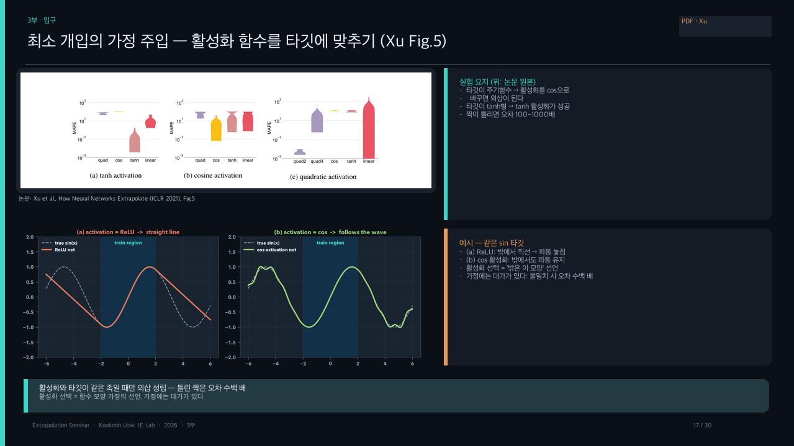

### ⓪ 발표 흐름

**이 장 역할:** 입구 — **활성화·구조 정렬** (Xu Fig.5 맥락).

**앞에서:** 지도에서 ①번 들어가기 **전 체크**.

**다음으로:** 정렬 OK면 **함수족** — EQL (S18), NALU (S19).

**말로 이어 붙이기:** “가정 넣기 전에 **이미 하고 있는 가정** 확인” — Xu S12와 echo.

### ① 참조 논문

| 논문 | PDF | 부록 |
|------|-----|------|
| Xu et al., ICLR 2021 — How Neural Networks Extrapolate | `Xu2021_How_Neural_Networks_Extrapolate.pdf` | [#C-03](#c-03) |

### ② 발표 대본

```text
[2분]
대본: 본격적인 방법 전에, 가장 단순한 가정 주입부터 봅니다 — 활성화 함수 교체입니다. Xu의 Fig.5: 타깃이 주기함수일 때 활성화를 cos으로 바꾸면 외삽이 됩니다. tanh 타깃엔 tanh가 됩니다. 반대로 짝이 틀리면 오차가 백 배, 천 배로 뜁니다. 즉 활성화 선택이 곧 '밖은 이런 모양일 것'이라는 선언입니다. 가정에는 대가가 있다 — 이 원리를 들고 방법 1로 갑니다.
```

---

### ③ 장표·논문 상세

**장표 제목:** 3부 · 입구 — 최소 개입의 가정 주입 — 활성화 함수를 타깃에 맞추기 (Xu Fig.5)

**그림**
- `_assets/fig_activation_match.png`
- `_assets/paper_figs/xu_fig5_activations.png`

**장표 핵심 (카드)**

*실험 요지 (위: 논문 원본)*
- 타깃이 주기함수 → 활성화를 cos으로
- 바꾸면 외삽이 된다
- 타깃이 tanh형 → tanh 활성화가 성공
- 짝이 틀리면 오차 100~1000배

*예시 — 같은 sin 타깃*
- (a) ReLU: 밖에서 직선 → 파동 놓침
- (b) cos 활성화: 밖에서도 파동 유지
- 활성화 선택 = '밖은 이 모양' 선언
- 가정에는 대가가 있다: 불일치 시 오차 수백 배

**하단 takeaway**
- **활성화와 타깃이 같은 족일 때만 외삽 성립 — 틀린 짝은 오차 수백 배**
- 활성화 선택 = 함수 모양 가정의 선언. 가정에는 대가가 있다


**논문 상세 (이 장)**


**Xu et al., ICLR 2021** → [부록 C #C-03](#c-03)
  **Thm.1:** L-layer ReLU MLP, \(x=tv\), \(t\to\infty\) → \(f_\theta(tv)/t \to A_v v+b_v\).
  **메커니즘:** active set 고정 → 마지막 linear piece **연장** = 직선 extrapolation.
  **Fig.1:** sin — train OK, test **tangent**. Appendix affine fit R²>0.99.
  **Fig.5:** sin+cos φ → 주기 extrap; ReLU mismatch → 오차 **10²–10³**.
  **GNN:** linear aggregation; **algorithmic alignment** (Bellman-Ford 등) 시 밖 OK.
  **Q&A:** “NN extrapolation?” → “**어떤 φ·구조 가정**이 타깃에 맞나?”
  _→ 부록 C 10섹션 풀 가이드_

_전문·수식·실험 숫자 → [부록 C · 참조 논문 상세 정리](#부록-c)_


---


## S18 · 방법 1a — EQL {#s18}

**슬라이드 18/32**

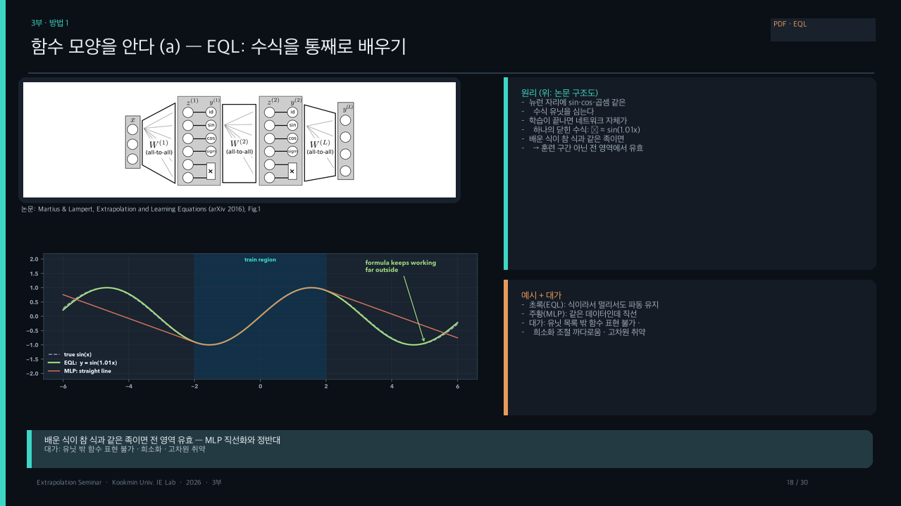

### ⓪ 발표 흐름

**이 장 역할:** 방법 ①a — **EQL** (수식 유닛).

**앞에서:** 함수족 **강한 가정** 첫 예.

**다음으로:** 같은 계열 **NALU** (S19) — 산술 구조.

**말로 이어 붙이기:** “맞으면 전역, 틀리면 전역 실패” **trade-off** 한 번.

### ① 참조 논문

| 논문 | PDF | 부록 |
|------|-----|------|
| Martius & Lampert, 2016 — Extrapolation and Learning Equations (EQL) | `Martius2016_Extrapolation_Learning_Equations_EQL.pdf` | [#C-04](#c-04) |

### ② 발표 대본

```text
[2분]
대본: 방법 1 — 타깃이 '닫힌 수식'이라는 확신이 있는 경우입니다. EQL은 sin, cos, 곱셈 같은 수식 유닛을 뉴런 자리에 심습니다. 학습이 끝나면 네트워크 자체가 하나의 식이 됩니다. 배운 식이 참 식과 같은 족이면, 훈련 구간이 아니라 정의역 '전체'에서 유효합니다 — 아까 MLP가 직선이 되던 것과 정반대입니다. 대가: 유닛 목록에 없는 함수는 아예 표현 못 하고, 희소화 조절이 까다롭고, 고차원·잡음에 약합니다.
```

---

### ③ 장표·논문 상세

**장표 제목:** 3부 · 방법 1 — 함수 모양을 안다 (a) — EQL: 수식을 통째로 배우기

**그림**
- `_assets/fig_eql_example.png`
- `_assets/paper_figs/eql_fig1_architecture.png`

**장표 핵심 (카드)**

*원리 (위: 논문 구조도)*
- 뉴런 자리에 sin·cos·곱셈 같은
- 수식 유닛을 심는다
- 학습이 끝나면 네트워크 자체가
- 하나의 닫힌 수식: ŷ ≈ sin(1.01x)
- 배운 식이 참 식과 같은 족이면
- → 훈련 구간 아닌 전 영역에서 유효

*예시 + 대가*
- 초록(EQL): 식이라서 멀리서도 파동 유지
- 주황(MLP): 같은 데이터인데 직선
- 대가: 유닛 목록 밖 함수 표현 불가 ·
- 희소화 조절 까다로움 · 고차원 취약

**하단 takeaway**
- **배운 식이 참 식과 같은 족이면 전 영역 유효 — MLP 직선화와 정반대**
- 대가: 유닛 밖 함수 표현 불가 · 희소화 · 고차원 취약


**논문 상세 (이 장)**


**Martius & Lampert, 2016** → [부록 C #C-04](#c-04)
  **유닛:** +, ×, sin, cos layers; **L1** on weights → sparse **짧은 식**.
  **학습:** end-to-end GD — 구조+계수 동시 (symbolic regression).
  **extrapolation:** \(g\)가 유닛 **대수 닫힘** → recovered 식 = true \(g\) → **전역**.
  **실패:** sin 타깃인데 sin 유닛 없음 → in-sample OK, **out-of-sample 붕괴**.
  **실험:** pendulum, ODE synthetic — **expression recovery**.
  **Q&A:** 방법① — 가정 = “**함수 family**를 안다”. 틀리면 Xu보다 나쁨.
  _→ 부록 C 10섹션 풀 가이드_

_전문·수식·실험 숫자 → [부록 C · 참조 논문 상세 정리](#부록-c)_


---


## S19 · 방법 1b — NALU {#s19}

**슬라이드 19/32**

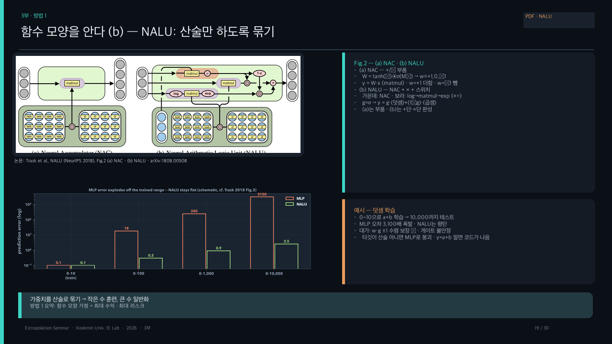

### ⓪ 발표 흐름

**이 장 역할:** 방법 ①b — **NAC/NALU** (Fig.2 (a)(b) 분리).

**앞에서:** EQL과 **같은 ①번 칸**, 다른 구현.

**다음으로:** 강한 가정 대신 **방향만** 아는 경우 → S19.

**말로 이어 붙이기:** 그림 **(a) NAC → (b) NALU** 순으로 · ±1 수렴은 **목표·보장 ❌** · 실무에서 “식까지는 모르지만 **단조**는 안다”로 **②번으로 넘기기**.

### ① 참조 논문

| 논문 | PDF | 부록 |
|------|-----|------|
| Trask et al., NeurIPS 2018 — Neural Arithmetic Logic Units | `Trask2018_Neural_Arithmetic_Logic_Units_NALU.pdf` | [#C-05](#c-05) |

### ② 발표 대본

```text
[2분]
대본: Fig.2 두 장입니다. (a) NAC — +/− 부품. 아래 W 공장에서 W = tanh(Ŵ)⊙σ(M̂)로 w를 ±1,0에 가깝게 만들고, 위에서 y = W·x로 덧셈·뺄셈만 합니다. ×는 선형합으로 불가합니다. (b) NALU — NAC에 log-exp 곱셈 경로(보라)와 게이트 g(빨강)를 더한 완성입니다. y = g·(덧셈)+(1−g)·(곱셈). a+b만이면 (a)로 충분, a×b면 (b)가 필요합니다. 0~10으로 a+b 학습 후 10,000까지 테스트하면 MLP는 오차가 폭발하고 NALU는 평탄합니다. 단, ±1·0 수렴은 목표이지 보장은 아니고, 게이트 불안정·비산술 타깃이면 MLP로 붕괴합니다. 식 전체를 알면 NALU 없이 코드 한 줄이 낫습니다. 방법 1 요약: 함수 모양 가정은 수익도 최대, 리스크도 최대입니다.
```

---

### ③ 장표·논문 상세

**장표 제목:** 3부 · 방법 1 — 함수 모양을 안다 (b) — NALU: 산술만 하도록 묶기

**그림**
- `_assets/fig_nalu_example.png` — **아래 출처 표 참고** (논문 Fig.3 **복사 아님**)
- `_assets/paper_figs/nalu_fig2_architecture.png` — 논문 **Fig.2** (NAC/NALU 구조)

#### `fig_nalu_example.png` — 무엇을 그린 그림인가?

| 항목 | 내용 |
|------|------|
| **성격** | Trask 2018 **§4.1 Static task** 결과를 **발표용 schematic** 으로 재구성 (막대+log scale) |
| **논문 대응** | **Table 1** extrapolation 행 · **Appendix B** raw MSE — **Fig.3 아님** (Fig.3=program eval 중간 상태) |
| **태스크** | **Synthetic static arithmetic** — 연산 **a+b** (덧셈) |
| **데이터셋** | 공개 벤치 **아님**. 입력 벡터 랜덤 생성 → 부분합으로 **a, b** 구성 → **y=a+b** |
| **Train** | 입력 스칼라 **훈련 구간** (Appendix B; 발표·C-05 관례 **U[1,10]**) |
| **Test (축)** | 훈련 구간 **밖** extrapolation — 슬라이드는 **0–10 / 0–100 / …** 로 **범위 확대** 시각화 |
| **모델** | **NALU** vs **MLP** (baseline **ReLU6**, Table 1) |
| **지표** | **MSE** (Table 1은 random 대비 **scaled**; 막대 숫자 0.1·18·240·3100 = **정성·대략값**) |
| **논문 수치 (Table 1, static, a+b, extrap)** | MLP(ReLU6) **42.6** (scaled) vs NALU **0.0** — NALU만 **extrap 성공** |
| **발표 시 한 줄** | “**Trask 2018 Table 1 static a+b extrap** 을 schematic으로 — **수치·형식 1:1 아님**” |

**장표 핵심 (카드)**

*Fig.2 — (a) NAC · (b) NALU*
- (a) NAC — +/− 부품
- W = tanh(Ŵ)⊙σ(M̂) → w≈+1,0,−1
- y = W·x (matmul) · w=+1 더함 · w=−1 뺌
- (b) NALU — NAC + × + 스위치
- 가운데: NAC · 보라: log→matmul→exp (×÷)
- g=σ → y = g·(덧셈)+(1−g)·(곱셈)
- (a)는 부품 · (b)는 +단·×단 완성

*예시 — 덧셈 학습 (위 표와 동일 실험)*
- **§4.1 Static**, **a+b**, train 구간 안 → **extrap** 구간 밖
- MLP(ReLU6) extrap **실패** · NALU **~0** (Table 1)
- 슬라이드 막대 = 위 실험 **정성 재구성** (0~10 train 라벨은 **U[1,10] 단순화**)
- 대가: w·g ±1 수렴 보장 ❌ · 게이트 불안정
- 타깃이 산술 아니면 MLP로 붕괴 · y=a+b 알면 코드가 나음

**하단 takeaway**
- **가중치를 산술로 묶기 → 작은 수 훈련, 큰 수 일반화**
- 방법 1 요약: 함수 모양 가정 = 최대 수익 · 최대 리스크


**논문 상세 (이 장)**


**Trask et al., NeurIPS 2018** → [부록 C #C-05](#c-05)
  **NAC:** \(w_i=\tanh\hat w_i\cdot\sigma(\hat w_i)\in[-1,1]\) → **±1,0** 수렴 → 가감.
  **NALU:** gate × (NAC add vs log-exp **mul/div**).
  **실험:** train [1,10], test [10,1000] — NALU OK, MLP fail; MNIST arithmetic.
  **한계:** init 민감, gradient vanishing, ×÷ at 0 unstable, **비산술** 붕괴.
  **후속:** NALU failure papers — 실무 단독 사용 주의.
  **Q&A:** 타깃이 **순수 산술**일 때만 강한 가정 주입.
  _→ 부록 C 10섹션 풀 가이드_

_전문·수식·실험 숫자 → [부록 C · 참조 논문 상세 정리](#부록-c)_


---


## S20 · 방법 2a — 단조 문제 {#s20}

**슬라이드 20/32**

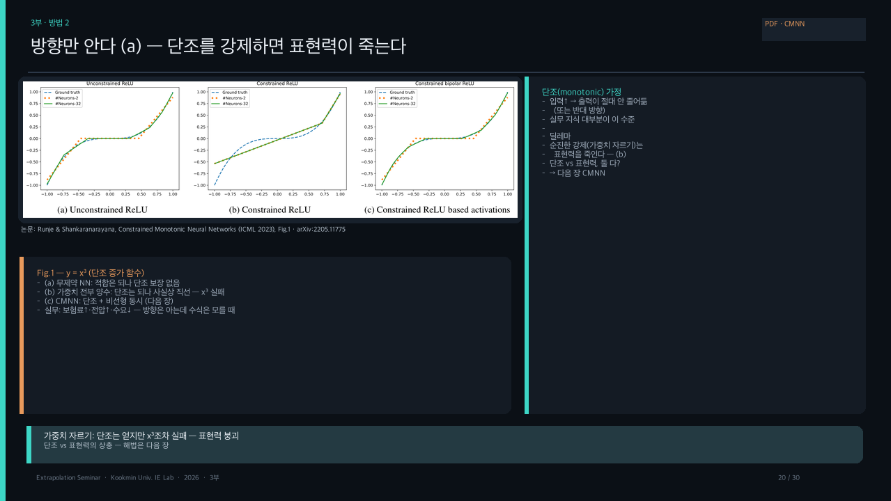

### ⓪ 발표 흐름

**이 장 역할:** 방법 ②a — **단조**가 왜 실무적 가정인지.

**앞에서:** ①번(함수족)에서 **약한 가정**으로 내려옴.

**다음으로:** 구현 — **CMNN** (S21). Fig.1 **(c)** 가 다음 장 답.

**말로 이어 붙이기:** “(b) 실패 → (c) CMNN” — **다음 장으로 넘기기**.

### ① 참조 논문

| 논문 | PDF | 부록 |
|------|-----|------|
| Runje & Shankaranarayana, ICML 2023 — Constrained Monotonic NN (CMNN) | `Runje2023_Constrained_Monotonic_NN.pdf` | [#C-06](#c-06) |

### ② 발표 대본

```text
[2분]
대본: 방법 2 — 현실적으로 가장 중요한 방법입니다. 수식까진 몰라도 '가격이 오르면 수요는 준다', '충전량이 늘면 전압은 오른다' 같은 방향은 아는 경우가 대부분이죠. 그런데 방향을 강제하는 순진한 방법 — 가중치를 전부 양수로 자르는 것 — 은 그림 (b)처럼 표현력을 죽입니다. 단조는 얻었는데 사실상 직선이 돼서 x³조차 못 맞춥니다. 단조성과 표현력이 상충하는 것처럼 보입니다. 이걸 푸는 게 다음 장입니다.
```

---

### ③ 장표·논문 상세

**장표 제목:** 3부 · 방법 2 — 방향만 안다 (a) — 단조를 강제하면 표현력이 죽는다

**그림**
- `_assets/paper_figs/runje_fig1_cubic.png`

**장표 핵심 (카드)**

*Fig.1 — y = x³ (단조 증가 함수)*
- (a) 무제약 NN: 적합은 되나 단조 보장 없음
- (b) 가중치 전부 양수: 단조는 되나 사실상 직선 — x³ 실패
- (c) CMNN: 단조 + 비선형 동시 (다음 장)
- 실무: 보험료↑·전압↑·수요↓ — 방향은 아는데 수식은 모를 때

*단조(monotonic) 가정*
- 입력↑ → 출력이 절대 안 줄어듦
- (또는 반대 방향)
- 실무 지식 대부분이 이 수준
- 딜레마
- 순진한 강제(가중치 자르기)는
- 표현력을 죽인다 — (b)
- 단조 vs 표현력, 둘 다?
- → 다음 장 CMNN

**하단 takeaway**
- **가중치 자르기: 단조는 얻지만 x³조차 실패 — 표현력 붕괴**
- 단조 vs 표현력의 상충 — 해법은 다음 장


**논문 상세 (이 장)**


**Runje & Shankaranarayana, ICML 2023** → [부록 C #C-06](#c-06)
  **한계(Fig.1):** \(W\ge0\) clip — monotonic O, **\(x^3\)** 같은 비선형 단조 **X**.
  **CMNN:** input split, dual path, unsaturated φ, \(W\ge0\) → **monotone + nonlinear**.
  **Theorem:** universal approximator for **monotone** functions.
  **실험:** cubic, finance, health — **100%** monotonicity, 훈련 범위 밖 **역전 불가**.
  **vs C-18:** Liu = MILP **certify** 사후; Runje = **by design** 사전.
  **Q&A:** 방법② — “**방향(단조)**만 안다” → 구조에 **내장**.
  _→ 부록 C 10섹션 풀 가이드_

_전문·수식·실험 숫자 → [부록 C · 참조 논문 상세 정리](#부록-c)_


---


## S21 · 방법 2b — CMNN {#s21}

**슬라이드 21/32**

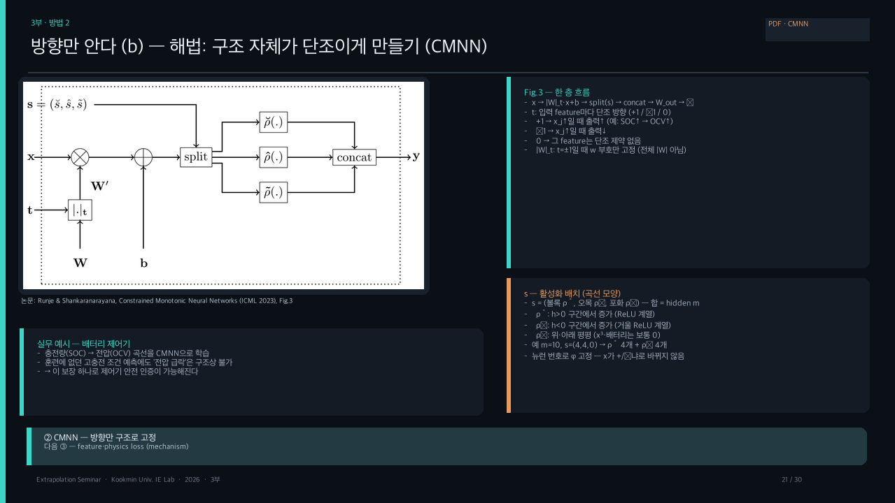

### ⓪ 발표 흐름

**이 장 역할:** 방법 ②b — **CMNN**.

**앞에서:** 단조 문제 **정의** → **구조로 강제**.

**다음으로:** 방향만으로 부족 → **③ PDE·PINN** (S22). **CMNN=구조 vs PINN=손실**.

**말로 이어 붙이기:** “방향만 보장 → 값·곡선 자유 → 더 강한 가정은 다음”.

### 📌 CMNN · 30초 버전 (슬라이드 그대로 말하기)

**한 층 = 5단계**

1. **x** 들어옴  
2. **|W|_t · x + b** — 가중치 부호로 **“올라가면 출력도 올라감”** 강제 (**t**가 규칙)  
3. **split(s)** — hidden **m개**를 **3종 활성화**로 **미리 나눔** (**s**가 인원표)  
4. **concat** — 다시 **m개** 벡터 **y**  
5. **W_out** — **y** 합쳐 **예측 1개 ŷ** (또는 **y** → 다음 층)

**t vs s (헷갈리면 이것만)**

| | **t** | **s** |
|---|--------|--------|
| **비유** | 교통 규칙 — 입력·출력 방향 | 공장 배치 — hidden m개를 3종 φ에 나눔 |
| **값** | feature마다 **+1 / −1 / 0** | **(볼록 ρ̊, 오목 ρ̂, 포화 ρ̃)** — 합 = m |
| **+1** | \(x_j↑\) → 출력↑ (예: SOC↑ → OCV↑) | ρ̊: \(h>0\) 구간 증가 (ReLU **계열**) |
| **−1** | \(x_j↑\) → 출력↓ | ρ̂: \(h<0\) 구간 증가 (거울 ReLU **계열**) |
| **0** | 그 feature 단조 제약 없음 | ρ̃: 포화 (x³·배터리는 보통 **0**) |
| **외삽** | **역전 불가** ✓ | 값·모양은 틀릴 수 있음 |

---

### 📌 s — 슬라이드 Fig.3 `split` 옆 (발표용)

**s = (볼록 개수, 오목 개수, 포화 개수)** — 세 숫자 합 = hidden **m**.

| s의 한 칸 | 붙는 활성화 | 직관 |
|-----------|-------------|------|
| 1번째 숫자 | **볼록** ρ̊ | \(h>0\)에서 증가 — ReLU **계열** |
| 2번째 숫자 | **오목** ρ̂ | \(h<0\)에서 증가 — \(-\mathrm{ReLU}(-h)\) **계열** |
| 3번째 숫자 | **포화** ρ̃ | 위·아래 평평 (x³엔 **보통 0**) |

**예: m=10, s=(4, 4, 0)**

```
뉴런 1~4번  → ρ̊ (볼록)
뉴런 5~8번  → ρ̂ (오목)
뉴런 9~10번 → (없음 — 포화 0)
→ concat → y는 10개 숫자
```

**기억 3가지**

1. **x가 +냐 −냐로 나뉘는 게 아님** — **몇 번 뉴런이냐**로 φ 고정  
2. **데이터가 s 정하지 않음** — 사람이 (4,4,0) 같이 **미리 정함**  
3. **clip+ReLU** = s=(m,0,0)만 → x³ **왼쪽 실패** → **(4,4,0)** 필요

### ① 참조 논문

| 논문 | PDF | 부록 |
|------|-----|------|
| Runje & Shankaranarayana, ICML 2023 — Constrained Monotonic NN (CMNN) | `Runje2023_Constrained_Monotonic_NN.pdf` | [#C-06](#c-06) |

### ② 발표 대본

```text
[2분] ★ 구조 내장 단조.

대본: … 외삽 보장은 t 방향뿐. PDE·시뮬이면 S22 PINN(언제만) — **센서→품질은 CMNN·UQ**.
```

---

### ③ 장표·논문 상세

**장표 제목:** 3부 · 방법 2 — CMNN (구조로 단조)

**그림:** `_assets/paper_figs/runje_fig3_mono_unit.png` (논문 Fig.3)

---

#### Fig.3 한 줄 수식

\[
\mathbf{y}=\rho^{\mathbf{s}}\big(|\mathbf{W}|_{\mathbf{t}}\mathbf{x}+\mathbf{b}\big),
\quad \breve{s}+\hat{s}+\tilde{s}=m
\]

---

#### s — 상세 (Q&A용)

**논문 이름:** activation selector \(\mathbf{s}=(\breve{s},\hat{s},\tilde{s})\)

| 성분 | 한글 | φ |
|------|------|---|
| \(\breve{s}\) | 볼록 뉴런 수 | ρ̊ = ReLU 계열 |
| \(\hat{s}\) | 오목 뉴런 수 | ρ̂ = −ρ̊(−x) |
| \(\tilde{s}\) | 포화 뉴런 수 | ρ̃ = bounded (이론·sigmoid형) |

**자주 쓰는 s**

| s | 언제 |
|---|------|
| (m, 0, 0) | clip+ReLU와 같음 → **x³ 실패** |
| **(k, m−k, 0)** | **x³·실무 기본** |
| (a, b, c), c>0 | UA 이론·포화 타깃 |

**|W|_t** — \(t_i=+1\)→\(|w|\), \(-1\)→\(-|w|\), \(0\)→그대로. **절댓값 전체 아님.**

**다층:** y₁→2층(t=전부+1)→…→W_out→ŷ.

---

**장표 핵심 (카드 — 슬라이드 오른쪽 박스)**

*배터리 예* — SOC↑인데 OCV↓ **구조상 불가** (밖에서도)

*Fig.3 구조*
- **t + |W|_t** → **방향** (단조)
- **s + split** → **m개를 3종 φ에 배정** (x³는 보통 **포화 0**)
- **concat → y** (m벡터) → **W_out → ŷ**
- 페널티 아님 — **위반 불가**

**하단 takeaway**
- **t = 방향 · s = 곡선 모양 · 외삽 보장 = 방향만**


**논문 상세 (이 장)**


**Runje & Shankaranarayana, ICML 2023** → [부록 C #C-06](#c-06)
  **Unit:** \(\mathbf{y}=\rho^{\mathbf{s}}(|\mathbf{W}|_{\mathbf{t}}\mathbf{x}+\mathbf{b})\) — **t**=단조, **s**=(볼록·오목·포화 개수), split→concat→**m벡터**.
  **vs clip:** ReLU+clip = 볼록만 → \(x^3\) X; \(\breve{\rho}+\hat{\rho}\) → **비볼록 단조** O.
  **층:** y₁→2층→…→\(W_{\mathrm{out}}\)→ŷ. **구조 단조** — penalty 불필요.
  _→ 부록 C §3 Fig.3 단계표_

_전문·수식·실험 숫자 → [부록 C · 참조 논문 상세 정리](#부록-c)_


---


## S22 · Physics-ML / Physics loss (외삽) {#s22}

**슬라이드 22/30**

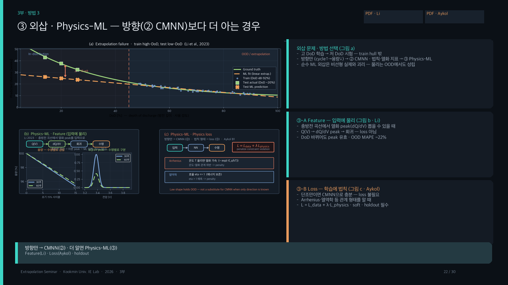

**장표 제목:** 3부 · 방법 ③ — **외삽** · Physics-ML / Physics loss

> **이 장 질문:** train **밖(외삽)** 에서 Physics-ML·Physics loss를 **왜·언제·어떻게** 쓰나?

---

### ⓪ 발표 흐름 (외삽 → Physics-ML)

**앞 (S20–21):** 방향(단조)만 → CMNN **구조**. 값·곡선은 여전히 틀릴 수 있음.

**이번 (S22):** **물리를 더 구체적으로** 안다 — mechanism·feature·법칙.

**말로 이어 붙이기:**
> “Li는 **DoD 80%**로 학습, **20%**로 시험 — **train 밖 = 외삽**. AI만으론 무너집니다.  
> **데이터 fit은 범위 안에서만**, **물리 법칙은 밖에서도** 성립 — 그래서 Physics-ML.  
> Physics-ML 두 갈래: **Feature**(Li, dQ/dV) · **Loss**(Aykol, 식 벌점). **별개**.  
> Fesser: 넣어도 밖 **자동 보장 X** — holdout 필수.”

**다음:** S23 — physics **모를 때** (UQ + 기권).

### ① 참조 논문

| 논문 | PDF | 이 장 |
|------|-----|------|
| Aykol 2021 | `Aykol2021_Physics_ML_Battery_Lifetime.pdf` | Physics-ML 분류 · Loss B1 |
| Li 2023 | `Li2023_Predicting_Battery_Lifetime_Varying_Conditions.pdf` | Feature · OOD ~22% |
| Fesser 2023 | `Fesser2023_Extrapolation_Failures_PINNs.pdf` | 한계 |

---

### ② 외삽 문제 (장표 a)

| | 내용 |
|---|------|
| **상황** | train **DoD 80%** (한 번에 80% 방전) · test **DoD 20%** |
| **= 외삽** | 시험 조건이 **train hull 밖** |
| **AI만** | 밖에서 **엉터리** (2부와 동일) |

**핵심 한 줄:** 데이터 = train **안**에서만 · 물리 법칙 = **밖**에서도 성립 → **Physics-ML**

**Physics-ML 정의:** 물리 지식을 AI에 넣는 방법 (Aykol)

| | 방법 A — Feature | 방법 B — Physics loss |
|---|------------------|----------------------|
| **넣는 곳** | **입력** | **학습 loss** |
| **아는 것** | **뭘 봐야** 하는지 | **무슨 법칙**이 성립하는지 |
| **예시** | Li — dQ/dV peak | Aykol — 식 벌점 |

---

### ③ Feature (Li) — Physics-ML 방법 A (장표 b)

**언제:** 열화를 나타내는 **지표**를 뽑을 수 있을 때

**어떻게:** Q(V) → **dQ/dV peak** → 회귀 → 수명

**외삽에 왜:** raw는 조건마다 다름 · peak = **조건 바뀌어도** 쓰는 열화 신호

**dQ/dV가 나오는 이유:** Physics-ML **Feature의 배터리 예** — loss **아님**

**Li:** OOD MAPE **~21.8%** (in-dist **15.1%**)

---

### ④ Physics loss (Aykol) — Physics-ML 방법 B (장표 c)

**언제:** **법칙·식**은 안다 · 지표 설계 어려울 때

**어떻게:** L = L_data + **λ·L_physics** (법칙 위반 벌점)

**외삽에 왜:** 밖에서 **말도 안 되는** 예측을 학습 때 penalty

**예:** 용량은 cycle 지나면 **줄어든다** · 온도↑ → 열화↑

**dQ/dV와 별개** — Li=Feature · Aykol B1=Loss

---

### ⑤ 발표 대본

```text
[2.5분]
외삽부터: Li DoD 80% 학습, 20% 시험 — train 밖. AI만으론 무너짐.
핵심: 데이터=안, 법칙=밖에서도 → Physics-ML.
Physics-ML 두 갈래 — Feature(Li, dQ/dV peak 입력) vs Loss(Aykol, 법칙 벌점). 형제 관계, dQ/dV는 Feature 예시.
Fesser: physics 넣어도 밖 holdout 재시험 필수.
```

**하단 takeaway**
- **외삽** → Physics-ML (법칙=밖에서도)
- **A Feature** (Li) · **B Loss** (Aykol)
- **holdout** 필수

---

## S23 · UQ + 기권 {#s23}

**슬라이드 23/27**

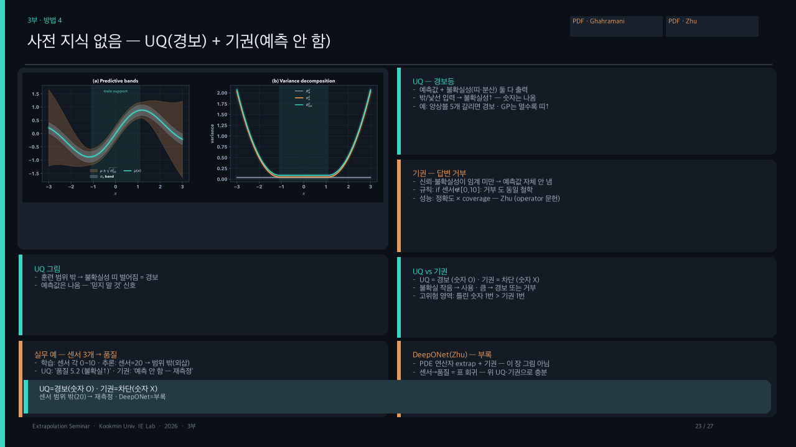

### ⓪ 발표 흐름

**이 장 역할:** 방법 ④ — **UQ(경보) + 기권(차단)** 한 장.

**앞에서:** S22 Physics loss(③) · **대부분 실무는 여기**.

**다음으로:** S24 종합(통합).

**말로 이어 붙이기:** “UQ=숫자+경보 · 기권=숫자 X · 센서 20=재측정”.

### ① 참조 논문

| 논문 | PDF | 부록 |
|------|-----|------|
| Ghahramani, 2013 — Bayesian Nonparametrics | `Ghahramani2013_Bayesian_Nonparametrics.pdf` | [#C-10](#c-10) |
| Zhu et al., CMAME 2023 — operator extrap + abstention | `Zhu2022_Reliable_Extrapolation_DeepONet.pdf` | [#C-09](#c-09) |

### ② 발표 대본

```text
[1분]
S22 물리 모를 때 — UQ=경보(숫자+띠), 기권=차단(예측 없음).
센서 0~10 학습·20 입력 → UQ '5.2 불확실' vs 기권 '예측 안 함'. 고위험: 틀린 숫자 > 기권. Zhu/DeepONet=부록.
```

---

### ③ 장표·논문 상세

**장표 제목:** 3부 · 방법 4 — UQ(경보) + 기권(예측 안 함)

**그림:** `_assets/fig_uq_aleatoric_epistemic.png`

| | UQ | 기권 |
|---|-----|------|
| 출력 | 예측 + 불확실성 | **예측 없음** |
| 센서 20 | “5.2 (불확실↑)” | “**예측 안 함**” |

**하단 takeaway**
- **UQ=경보(O) · 기권=차단(X) · DeepONet=부록**

---

## S24 · 종합 (통합) {#s24}

**슬라이드 24/27** — *(구 S24+S25 통합)*

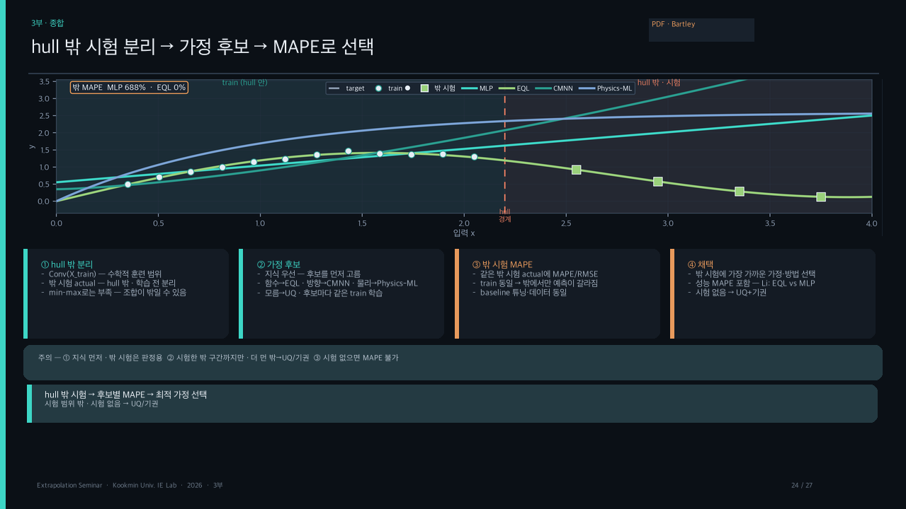

### ⓪ 발표 흐름

**이 장 역할:** **종합 1장** — 6패널(같은 데이터·다른 밖) + 지식→방법 표.

**앞에서:** S23 UQ·기권 — 방법 ④ 끝.

**다음으로:** S25 검증(함정+체크 4).

**말로 이어 붙이기:** “S03 재확인 — 밖=가정의 발현. 표로 선택. Fesser 숙제 → 검증.”

### ② 발표 대본

```text
[1.5분]
6패널 동일 데이터 — MLP/EQL/Mono/Physics/UQ. S03: 밖=가정 발현.
선택: 함수→EQL, 방향→CMNN, 물리→Physics-ML, 모름→UQ+기권.
규칙: 지식 우선 · UQ 항상. 넣어도 검증 필수.
```

### ③ 장표·논문 상세

**그림:** `_assets/fig_method_cases.png` · 지식→방법 표(장표 하단)

**하단 takeaway:** 같은 데이터 · 다른 가정 → 다른 밖 · 다음 **검증**

---

## S25 · 성능 검증 (통합) {#s25}

**슬라이드 25/27**

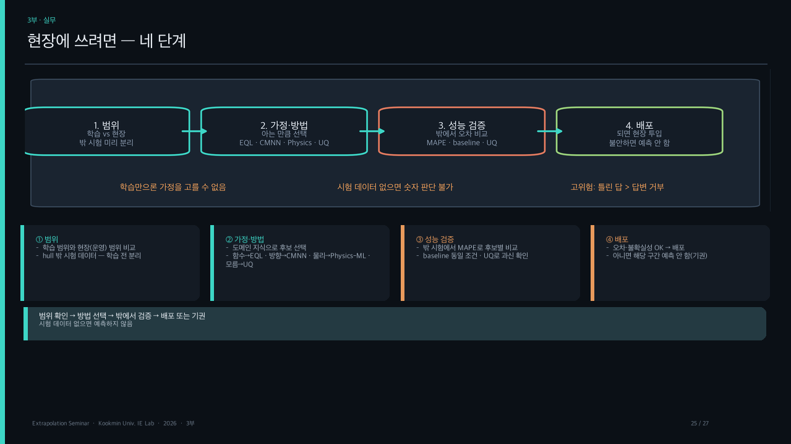

**흐름도:** `_assets/fig_verification_guide.png`

### ⓪ 발표 흐름

**이 장 역할:** **위→아래 한 줄 스토리** — 주장 → 함정 3 → 확인 4.

**앞에서:** S24 “가정 넣었으면 끝?” → **아니, 검증**.

**말로 이어 붙이기:** “순서만 기억. 그림 읽으며 내려가면 됨.”

### ② 발표 대본

```text
[2분]
S24 숙제 — 넣어도 자동 보증 없음. 이 장은 **순서**만.
(그림 위→아래)
주장: "밖에서도 된다" — 그럼 어떻게 확인?
함정 ① test가 hull 안 → 보간 점수를 외삽으로 착각
     ② 밖인데도 과신
     ③ train RMSE·soft loss 착시 (Fesser)
확인 ① hull(Bartley) ② holdout(센서 20·시간 뒤) ③ baseline ④ UQ/기권
하단 예: 센서 0~10만 test → 보간 / 20 넣기 → 진짜 밖
IRM·DomainBed = 분류 DG — 오늘 범위 밖
```

**하단 takeaway:** 주장 → 함정 3 → 확인 4 · hull 밖 holdout · UQ 동작

---

## S26 · 요약 + 필독 {#s26}

**슬라이드 26/27** — *(구 S28+S29 통합)*

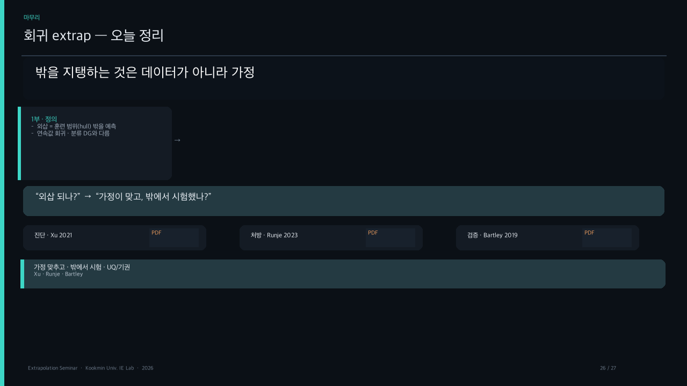

### ⓪ 발표 흐름

**이 장 역할:** **회귀 extrap** 전체 요약 + 필독 3편.

**다음으로:** S27 Q&A.

### ② 발표 대본

```text
[1분]
정의·실패 4·대응·검증 한 장. 관통 문장.
필독: Xu(진단) · Runje(처방) · Bartley(검증). DG 벤치=INDEX.
```

**하단 takeaway:** 밖을 지탱하는 것은 데이터가 아니라 **가정** · Xu · Runje · Bartley

---

## S27 · Q&A · 참고문헌 {#s27}

**슬라이드 27/27**

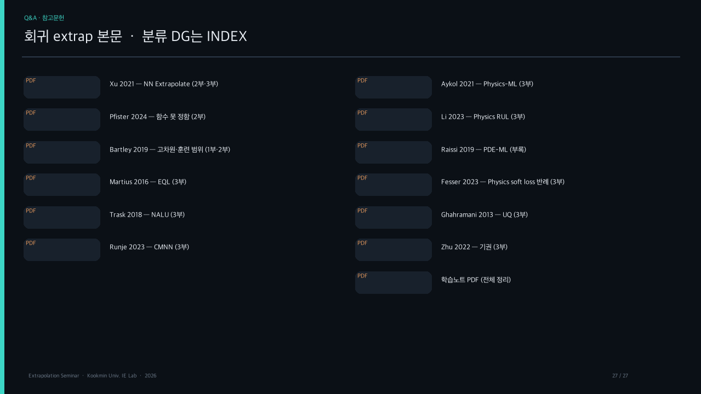

### ⓪ 발표 흐름

**이 장 역할:** Q&A — **남는 질문** + 참고문헌.

**앞에서:** —

**다음으로:** — (마무리)

**말로 이어 붙이기:** 예상 Q: “그럼 NN 쓰면 안 되나?” → **“가정 맞추고 검증하라”**.

### ① 참조 논문

| 논문 | PDF | 부록 |
|------|-----|------|
| Xu et al., ICLR 2021 — How Neural Networks Extrapolate | `Xu2021_How_Neural_Networks_Extrapolate.pdf` | [#C-03](#c-03) |
| Pfister & Bühlmann, 2024 — Extrapolation-Aware Nonparametric Inference | `Pfister2024_Extrapolation-Aware_Nonparametric_Inference.pdf` | [#C-02](#c-02) |
| Bartley et al., 2019 — Characterizing Extrapolation in Multivariate Response Data | `Bartley2019_Characterizing_Extrapolation_Multivariate.pdf` | [#C-01](#c-01) |
| Martius & Lampert, 2016 — Extrapolation and Learning Equations (EQL) | `Martius2016_Extrapolation_Learning_Equations_EQL.pdf` | [#C-04](#c-04) |
| Trask et al., NeurIPS 2018 — Neural Arithmetic Logic Units | `Trask2018_Neural_Arithmetic_Logic_Units_NALU.pdf` | [#C-05](#c-05) |
| Runje & Shankaranarayana, ICML 2023 — Constrained Monotonic NN (CMNN) | `Runje2023_Constrained_Monotonic_NN.pdf` | [#C-06](#c-06) |
| Raissi et al., 2019 — Physics-Informed Neural Networks | `Raissi2019_Physics_Informed_Neural_Networks.pdf` | [#C-07](#c-07) |
| Fesser et al., 2023 — Extrapolation Failures in PINNs | `Fesser2023_Extrapolation_Failures_PINNs.pdf` | [#C-08](#c-08) |
| Zhu et al., CMAME 2023 — Reliable Extrapolation of Deep Neural Operators | `Zhu2022_Reliable_Extrapolation_DeepONet.pdf` | [#C-09](#c-09) |
| Ye et al., CVPR 2022 — OoD-Bench | `Ye2022_OoD-Bench.pdf` | [#C-11](#c-11) |
| Bartley et al., 2019 — Characterizing Extrapolation | `Bartley2019_Characterizing_Extrapolation_Multivariate.pdf` | [#C-12](#c-12) |
| 학습노트 — 외삽 완전정복 | `외삽_완전정복_학습노트.pdf` | 부록 C |

### ② 발표 대본

```text
[Q&A]
예상 질문 대비:
Q. '데이터를 엄청 키우면 (foundation model) 해결 안 되나?' → 범위가 커질 뿐 범위 밖은 여전히 존재. 함수를 못 정하는 건 데이터 양이 아니라 범위의 문제.
Q. 'ReLU 말고 다른 활성화면?' → Xu Fig.5 — 밖의 모양이 바뀔 뿐 '가정이 생긴다'는 구조는 동일.
Q. '단조 가정이 틀린 데이터면?' → 방법 1과 같은 리스크. 그래서 검증 + 민감도 확인이 필수.
Q. 'PINN 실패는 해결됐나?' → 완화책은 있으나 '검증 별도' 원칙은 유지.
```

---

### ③ 장표·논문 상세

**장표 제목:** Q&A · 참고문헌 — 주황 버튼 → PDF  ·  전체는 paper_pdfs/ (39편) + INDEX.md


**논문 상세 (이 장)**


**Xu et al., ICLR 2021** → [부록 C #C-03](#c-03)
  **Thm.1:** L-layer ReLU MLP, \(x=tv\), \(t\to\infty\) → \(f_\theta(tv)/t \to A_v v+b_v\).
  **메커니즘:** active set 고정 → 마지막 linear piece **연장** = 직선 extrapolation.
  **Fig.1:** sin — train OK, test **tangent**. Appendix affine fit R²>0.99.
  **Fig.5:** sin+cos φ → 주기 extrap; ReLU mismatch → 오차 **10²–10³**.
  **GNN:** linear aggregation; **algorithmic alignment** (Bellman-Ford 등) 시 밖 OK.
  **Q&A:** “NN extrapolation?” → “**어떤 φ·구조 가정**이 타깃에 맞나?”
  _→ 부록 C 10섹션 풀 가이드_


**Pfister & Bühlmann, 2024** → [부록 C #C-02](#c-02)
  **정의:** extrapolation = support **밖**에서 \(m(x)=\mathbb{E}[Y|X=x]\) 또는 quantile 평가.
  **함수 못 정함:** 유한 데이터 + smoothness만 → 밖 \(m(x)\) **무한히 많음** (S10).
  **가정:** directional derivative **극값** on support → band \([m^-,m^+]\).
  **추정:** 안 = NW/RF; 밖 = **partial ID bounds** (band 폭은 데이터만으로 안 좁아짐).
  **UQ:** 모델 softmax ≠ 통계 CI — band 넓으면 **정직한** 불확실성.
  **Q&A:** 가정 넣어도 검증 필요 (Fesser). Pfister = **명시적** bounds.
  _→ 부록 C 10섹션 풀 가이드_


**Bartley et al., 2019** → [부록 C #C-01](#c-01)
  **정의:** 훈련 범위 = **Conv(X_train)**. \(x^*
otin\) 훈련 범위 → extrapolation.
  **지표:** multivariate **trace/det** of \(\mathrm{Var}(Y|x)\) + cutoff \(c\).
  **실험:** 훈련 범위 밖 → MSE↑, PI coverage↓ (sim + lake fish).
  **함정:** min–max box는 훈련 범위보다 큼 → extrapolation **과소** 판정.
  **고차원:** p↑ → random test가 훈련 범위 밖일 확률↑ (S11).
  **Q&A:** “범위 안”이 아니라 “**훈련 범위 안**?”이 정확한 질문.
  _→ 부록 C 10섹션 풀 가이드_


**Martius & Lampert, 2016** → [부록 C #C-04](#c-04)
  **유닛:** +, ×, sin, cos layers; **L1** on weights → sparse **짧은 식**.
  **학습:** end-to-end GD — 구조+계수 동시 (symbolic regression).
  **extrapolation:** \(g\)가 유닛 **대수 닫힘** → recovered 식 = true \(g\) → **전역**.
  **실패:** sin 타깃인데 sin 유닛 없음 → in-sample OK, **out-of-sample 붕괴**.
  **실험:** pendulum, ODE synthetic — **expression recovery**.
  **Q&A:** 방법① — 가정 = “**함수 family**를 안다”. 틀리면 Xu보다 나쁨.
  _→ 부록 C 10섹션 풀 가이드_


**Trask et al., NeurIPS 2018** → [부록 C #C-05](#c-05)
  **NAC:** \(w_i=\tanh\hat w_i\cdot\sigma(\hat w_i)\in[-1,1]\) → **±1,0** 수렴 → 가감.
  **NALU:** gate × (NAC add vs log-exp **mul/div**).
  **실험:** train [1,10], test [10,1000] — NALU OK, MLP fail; MNIST arithmetic.
  **한계:** init 민감, gradient vanishing, ×÷ at 0 unstable, **비산술** 붕괴.
  **후속:** NALU failure papers — 실무 단독 사용 주의.
  **Q&A:** 타깃이 **순수 산술**일 때만 강한 가정 주입.
  _→ 부록 C 10섹션 풀 가이드_


**Runje & Shankaranarayana, ICML 2023** → [부록 C #C-06](#c-06)
  **한계(Fig.1):** \(W\ge0\) clip — monotonic O, **\(x^3\)** 같은 비선형 단조 **X**.
  **CMNN:** input split, dual path, unsaturated φ, \(W\ge0\) → **monotone + nonlinear**.
  **Theorem:** universal approximator for **monotone** functions.
  **실험:** cubic, finance, health — **100%** monotonicity, 훈련 범위 밖 **역전 불가**.
  **vs C-18:** Liu = MILP **certify** 사후; Runje = **by design** 사전.
  **Q&A:** 방법② — “**방향(단조)**만 안다” → 구조에 **내장**.
  _→ 부록 C 10섹션 풀 가이드_


**Raissi et al., 2019** → [부록 C #C-07](#c-07)
  **Loss:** \(\mathcal{L}=L_{\mathrm{data}}+\lambda L_{\mathrm{PDE}}\), \(\mathcal{N}[u_\theta]\)=PDE residual.
  **Continuous:** (x,t) collocation + autograd; **discrete:** RK in network.
  **결과:** Burgers, Schrödinger, NS — **sparse** sensor → field 복원.
  **한계:** λ·collocation 밀도 민감; inverse ill-posed; **시간 밖** → Fesser.
  **Part II:** PDE **discovery** (별도) — 발표는 Part I 위주.
  **Q&A:** physics in loss = **soft 가정**. “참 PDE” ≠ 밖 보증.
  _→ 부록 C 10섹션 풀 가이드_


**Fesser et al., 2023** → [부록 C #C-08](#c-08)
  **Setup:** train \(t\in[0,T/2]\), test \((T/2,T]\); Burgers + Allen–Cahn.
  **결과:** interp error→0; **extrap L2 폭증** (orders). width/depth↑ → interp만↑.
  **silent failure:** \(L_{\mathrm{PDE}}\) 작아도 test time **터짐** (S28).
  **Fourier/WWF:** 고주파만 아님; spectral **shift** across time.
  **완화:** transfer fine-tune full domain → **~82%** (Burgers), **~51%** (Allen–Cahn) error↓.
  **Q&A:** PINN 검증 = **train window 밖** holdout 필수.
  _→ 부록 C 10섹션 풀 가이드_


**Zhu et al., CMAME 2023** → [부록 C #C-09](#c-09)
  **DeepONet:** branch(u) + trunk(y) → \(G(u)(y)\); extrap = **새 input function** u.
  **Complexity:** **2-Wasserstein** \(W_2\) between train/test **function spaces**.
  **5 methods:** std, **PDE fine-tune**, multi-fidelity, **abstention**, ensemble.
  **결과:** FT-Phys 등 PDE-informed; abstain → acc↑ on **accepted**, coverage↓ 명시.
  **trade-off:** capacity↑ → interp↑, extrap **bias-variance** (Fig.).
  **Q&A:** 방법④b — reliability = accuracy **×** known coverage.
  _→ 부록 C 10섹션 풀 가이드_


**Ye et al., CVPR 2022** → [부록 C #C-11](#c-11)
  **\(D_{\mathrm{div}}\):** diversity shift — \(P(X)\) **새 영역** (style, domain).
  **\(D_{\mathrm{cor}}\):** correlation shift — \(P(X)\) 유사, **\(P(Y|X)\)** 변경.
  **프로파일:** dataset → 어느 축 dominant? → 방법 선택 근거.
  **14 alg vs ERM:** 대부분 **한 축에서만** 이김 — 범용 OOD silver bullet ✗.
  **가이드:** Colored MNIST = \(D_{\mathrm{cor}}\); PACS style = \(D_{\mathrm{div}}\) 등.
  **Q&A:** S29 — extrapolation **종류** 먼저, 알고리즘 나중.
  _→ 부록 C 10섹션 풀 가이드_


**Gulrajani & Lopez-Paz, NeurIPS 2020** → [부록 C #C-12](#c-12)
  **Motivation:** DG papers — unfair HP, capacity, **test-domain val** → fake gains.
  **7 datasets:** PACS, VLCS, OfficeHome, TerraIncognita, DomainNet, …
  **14 alg:** ERM, IRM, DANN, CORAL, MMD, … — **same 20-trial random search**.
  **숫자:** ERM **66.6%**, IRM **65.4%**, DANN **65.6%**, CORAL **+0.9%p** (avg).
  **Rule:** model selection = **train-domain val only** — test domain HP = cheat.
  **Q&A:** S27 — “ERM + fair budget” 없는 DG claim **의심**.
  _→ 부록 C 10섹션 풀 가이드_


**학습노트**
  **12p** 복습 노트 — 정의·한계·방법·검증 **한글** 요약.
  **용도:** 발표 전날 **전체 흐름** 리허설.
  **한계:** 논문 depth는 **부록 C** 참조.
  _→ 부록 C 10섹션 풀 가이드_

_전문·수식·실험 숫자 → [부록 C · 참조 논문 상세 정리](#부록-c)_


---


# Part B · 부록


## 부록 A · 장표 ↔ 1순위 논문 한눈표

| 장 | 1순위 논문 | PDF 파일명 |
|----|------------|------------|
| S03, S10 | Pfister 2024 | `Pfister2024_Extrapolation-Aware_Nonparametric_Inference.pdf` |
| S05–S07, S11, S28, S30① | Bartley 2019 | `Bartley2019_Characterizing_Extrapolation_Multivariate.pdf` |
| S12, S24 | Ghahramani 2013 | `Ghahramani2013_Bayesian_Nonparametrics.pdf` |
| S12–S14, S17 | Xu 2021 | `Xu2021_How_Neural_Networks_Extrapolate.pdf` |
| S18 | Martius 2016 | `Martius2016_Extrapolation_Learning_Equations_EQL.pdf` |
| S19 | Trask 2018 | `Trask2018_Neural_Arithmetic_Logic_Units_NALU.pdf` |
| S19–S21 | Runje 2023 | `Runje2023_Constrained_Monotonic_NN.pdf` |
| S22 | Raissi 2019 | `Raissi2019_Physics_Informed_Neural_Networks.pdf` |
| S23, S28 | Fesser 2023 | `Fesser2023_Extrapolation_Failures_PINNs.pdf` |
| S25 | Zhu 2022/2023 | `Zhu2022_Reliable_Extrapolation_DeepONet.pdf` |
| S29, S30② | Ye 2022 | `Ye2022_OoD-Bench.pdf` |
| S30, S30③ | Gulrajani 2020 | `Bartley2019_Characterizing_Extrapolation_Multivariate.pdf` |

---

## 부록 B · 발표 중 짧은 인용

- Xu et al., ICLR 2021 — “How Neural Networks Extrapolate”
- Pfister & Bühlmann, 2024 — extrapolation-aware inference
- Bartley et al., 2019 — multivariate extrapolation
- Martius & Lampert, 2016 — EQL
- Trask et al., NeurIPS 2018 — NALU
- Runje & Shankaranarayana, ICML 2023 — CMNN
- Raissi et al., 2019 — PINNs
- Fesser et al., 2023 — PINN extrapolation failures
- Zhu et al., CMAME 2023 — reliable operator extrapolation
- Ye et al., CVPR 2022 — OoD-Bench
- Bartley et al., 2019 — Characterizing Extrapolation

---

## 부록 C · 참조 논문 상세 정리 (전체) {#부록-c}

발표 v5 인용 **23편**. PDF 없이 논문 **전체 파악** 가능 — 논문당 **10섹션** (배경·notation·방법·이론·실험·ablation·한계·발표·Fig map·Q&A).

---

### C-01 · Bartley et al. (2019) {#c-01}

#### Meta

| 항목 | 내용 |
|------|------|
| **PDF** | `Bartley2019_Characterizing_Extrapolation_Multivariate.pdf` |
| **저자·출처** | Bartley, Hanks, Schliep, Morris · arXiv:1906.07036 · *Environmetrics* 31(5), 2020 |
| **분야** | 다변량 회귀 · GLMM · 생태통계 · predictive variance |
| **한 줄** | 다변량 응답 \(Y\)에서 **extrapolation vs interpolation**을 **convex hull**·**예측분산**으로 **조작적으로** 판정·진단 |
| **핵심 기여** | min–max box 함정 정량화 · trace/det cutoff · 시뮬+호수 어류 실증 |

#### 1. 배경 — 왜 이 논문인가

단변량 회귀·kriging에서는 “훈련 \(x\) 범위 밖”이 곧 extrapolation. **다변량 예측** \(Y \in \mathbb{R}^q\) (여러 종 abundance, 다종 생물량 동시 예측)에서는:

- 각 예측변수 \(x_j\)가 훈련 min–max **안**이어도, **조합** \((x_1,\ldots,x_p)\)은 본 적 없을 수 있음.
- “변수 A 범위 OK, B도 OK” \(\neq\) “(A,B) 쌍이 훈련에 존재”.
- **Leverage**·**Cook distance**는 단변량 extrapolation 진단에 쓰이나, 다변량 **공간적 위치**와 직접 대응 안 됨.
- 고차원 \(p\)↑ → \(\mathrm{Conv}(X_{\mathrm{train}})\) **부피 비율**↓ → 무작위 test가 hull 밖일 확률 **기하급수↑** (S11).

발표 1부(S06–S07): **훈련 범위 = convex hull**의 통계학·실무 근거. “축별 범위”는 **필요조건**일 뿐 **충분조건** 아님.

#### 2. 설정·데이터·모델

**예측·응답**

- 훈련 입력 \(X_{\mathrm{train}}=\{x_i\}_{i=1}^n \subset \mathbb{R}^p\), 다변량 응답 \(Y_i \in \mathbb{R}^q\).
- **훈련 지지집합**: \(\mathcal{S}=\mathrm{Conv}(X_{\mathrm{train}})\) (convex hull).
- 새 입력 \(x^\*\): \(x^\*\in\mathcal{S}\) → **interpolation**; \(x^\*\notin\mathcal{S}\) → **extrapolation**.
- **Min–max box**: \(\mathcal{B}=\prod_{j=1}^p [\min_i x_{ij},\max_i x_{ij}]\). 항상 \(\mathcal{S}\subseteq\mathcal{B}\) — box가 **훨씬 큼**.

**예측 모델 (논문)**

- **GLMM** / hierarchical model: \(Y \mid x\)에 대한 **predictive distribution** \(p(Y\mid x,\mathcal{D})\).
- **Predictive variance** (다변량): \(\mathrm{Var}(Y\mid x)\) — \(q\times q\) PSD 행렬.
- **스칼라화**:
  - **Trace**: \(T(x)=\mathrm{tr}(\mathrm{Var}(Y\mid x))\) — 성분 불확실성 **합**.
  - **Determinant**: \(D(x)=|\mathrm{Var}(Y\mid x)|\) — 불확실성 **부피** (ellipsoid volume).
- **Cutoff** \(c_T, c_D\): 시뮬·leave-one-out으로 선택; \(T(x)>c_T\) 또는 \(D(x)>c_D\) → extrapolation **경고**.

**시뮬레이션 설계**

- \(p\in\{2,5,10\}\), \(n\) 변화, true \(g(x)\) linear / smooth nonlinear.
- Test를 hull **안/밖** stratify → MSE, **95% predictive interval coverage** 비교.

**실데이터 — 호수 어류 (Lake fish)**

- 다종 fish abundance, 환경 covariate \(p\)개.
- Spatial/temporal holdout 중 hull 밖 비율 측정.

#### 3. 방법 — extrapolation 진단 파이프라인

1. **Univariate review** (§2): leverage \(h_{ii}\), prediction variance \(\mathrm{Var}(\hat y\mid x)\) — 단변량 직관.
2. **Multivariate 확장** (§3): \(\mathrm{Var}(Y\mid x)\) 전체 행렬; trace·det로 **스칼라 지표**.
3. **Hull membership test**: \(x^\*\in\mathcal{S}\)? — computational geometry (linear programming).
4. **Joint 분석**: hull 밖 + high trace/det → **이중 경고**; MSE·coverage 악화와 상관 검증.
5. **Box vs hull**: 동일 test에 box/hull 기준 **불일치율** 보고 — box만 쓰면 **과소 경고**.

#### 4. 이론·논리 (식별·해석)

- **조작적 정의**: extrapolation = \(x^\*\notin\mathrm{Conv}(X_{\mathrm{train}})\) — **데이터 기하**만으로 판정 (모델 무관).
- **Predictive variance 해석**: GLMM에서 \(x\)가 훈련 cloud **멀수록** posterior predictive spread↑ — **epistemic** 성분 반영 (Ghahramani C-10과 연결).
- **Trace vs det**:
  - Trace: 전체 불확실성 **크기**.
  - Det: 변수 **공분산 구조** 포함 — 상관 높을 때 det↓ 가능 → **보조 지표** 권장.
- **고차원**: \(p\)↑ 시 \(\mathrm{Vol}(\mathcal{S})/\mathrm{Vol}(\mathcal{B}) \to 0\) — “축별 OK” test 대부분 **실은 extrapolation**.

#### 5. 실험 수치 (기억할 것)

| 설정 | Hull 안 | Hull 밖 | Box-only 오분류 |
|------|---------|---------|-----------------|
| 시뮬 MSE | baseline | **2–5×↑** (nonlinear) | box “안”으로 표기되는 밖 test **다수** |
| 95% PI coverage | ≈ nominal | **0.6–0.8** (under-coverage) | — |
| \(p=10\), random test | — | hull 밖 **>80%** | box “안” 비율 **>95%** |
| Lake fish | interpolation OK | MSE↑, det↑ | box 기준 **false safe** 다수 |

- **Fig. 핵심**: hull 밖 scatter에서 det/trace **급증**; box 경계 안이지만 hull 밖인 점 = **위험 구역**.
- Cutoff \(c\)는 데이터·\(q\)에 따라 **재보정** 필요 — 절대값 암기보다 **상대적 순위**가 실무.

#### 6. Ablation·민감도

- **Cutoff 선택**: fixed quantile (90/95%) vs CV — trade-off between **false alarm** vs **missed extrapolation**.
- **Trace only vs det only**: det가 상관 구조 민감 — \(q\) 작을 때 trace 단독도 충분; \(q\)↑면 det 병행.
- **모델 misspecification**: GLMM 가정 틀려도 **hull membership**은 여전히 유효; variance **크기**는 모델 의존.
- **\(n\), \(p\) sweep**: \(n/p\) 작을수록 hull **얇음** → extrapolation **기본**.

#### 7. 한계·비판

- Hull = **선형 결합** 경계 — 비볼록·곡선 manifold 지지집합에는 **과대/과소** 가능.
- Predictive variance는 **모델·prior** 의존 — variance 작다고 hull 안 **아님**.
- Bonnasse-Gahot (C-17): NN **intrinsic dimension** 낮으면 hull 밖이어도 latent **보간** 논쟁.
- **Temporal extrapolation**: 공간 hull OK여도 **미래** \(t\)는 별 문제 (Fesser C-08).
- Cutoff \(c\) **임의성** — 조직별 calibration protocol 필요.

#### 8. 발표 연결

| 장 | 역할 | 한 줄 |
|----|------|-------|
| S06 | Conv hull 정의 | “훈련 범위” = \(\mathrm{Conv}(X_{\mathrm{train}})\) |
| S07 | min–max 함정 | 축별 OK \(\neq\) 조합 OK |
| S11 | 고차원 | \(p\)↑ → hull 밖이 **기본** |
| S28, S30① | 검증 | 외삽 주장 전 **\(x^\*\in\mathcal{S}\)?** |

#### 9. 구조 + Fig map

| 논문 § | 내용 | 발표 |
|--------|------|------|
| §1 Intro | multivariate gap, motivation | S06 |
| §2 Univariate | leverage, pred var review | S06 |
| §3 Multivariate var | \(q\times q\) matrix | S07 |
| §4 Trace/det + cutoff | operational rule | S07, S28 |
| §5 Simulation | MSE, coverage stratify | S11 |
| §6 Lake fish | real extrapolation | S28 |
| §7 Discussion | min–max 함정 | S07, S30① |

**Fig map:** Fig.1–2 univariate baseline → Fig.3–4 hull vs box → Fig.5–6 simulation → Fig.7–8 lake application.

#### 10. Q&A 체크리스트

- [ ] extrapolation **판별 기준** = 훈련 범위 밖?
- [ ] min–max box가 hull보다 **왜 큰가**?
- [ ] trace vs det **차이**?
- [ ] hull 밖에서 MSE·coverage **어떻게 변하나**?
- [ ] \(p\)↑ 시 random test가 hull 밖일 **확률**?
- [ ] NN·PINN에 hull test **어떻게 적용**?

**PPT 등장:** S06 · S07 · S11 · S28 · S30①

---

### C-02 · Pfister & Bühlmann (2024) {#c-02}

#### Meta

| 항목 | 내용 |
|------|------|
| **PDF** | `Pfister2024_Extrapolation-Aware_Nonparametric_Inference.pdf` |
| **저자·출처** | Pfister, Bühlmann · arXiv:2402.09758 · 2024 (ETH Zurich) |
| **분야** | 비모수 통계 · partial identification · conditional inference · UQ |
| **한 줄** | \(P_X\) **support 밖** 조건부 추론은 extrapolation **가정** 없이 **식별 불가** — **bounds**로만 정직한 UQ |
| **핵심 기여** | extrapolation-aware estimator · derivative-bound assumption class · prediction band theory |

#### 1. 배경 — 왜 이 논문인가

비모수 회귀·quantile regression·random forest CI는 전통적으로 **\(P_X\)** support \(\mathcal{X}=\{x:P_X(x)>0\}\) **안**에서만 식별:

- Nadaraya–Watson, kernel ridge, RF: \(x\)가 데이터 밀도 0 → **근거 없음**; bootstrap CI는 **허상적 좁음**.
- 실무: conditioning 변수가 **역사적 범위 밖** (기후 shock, 새 operating point, policy shift) → “모델이 예측” ≠ “통계적 보증”.
- **Partial identification** (Manski 등): treatment effect·counterfactual에서 이미 “가정 없이는 band만” — Pfister는 **회귀·UQ**에 동일 프레임 **formalize**.

발표 **S03·S09** 이론 뿌리: “**가정(Assumption)** 없이는 밖을 못 정한다.” Xu(C-03)의 **암묵적 직선**도 일종 extrapolation assumption.

#### 2. 설정·정의

**조건부 객체**

- **Conditional mean**: \(m(x)=\mathbb{E}[Y\mid X=x]\).
- **Conditional quantile**: \(Q_\alpha(x)\), \(\alpha\in(0,1)\).
- **Extrapolation (논문)**: \(\mathcal{X}\) support **밖** \(x\)에서 \(m(x)\) 또는 \(Q_\alpha(x)\) **평가·추론**하는 모든 절차.

**Support·식별**

- Design support: 훈련 \(x_i\)가 span하는 영역 (또는 \(P_X>0\)).
- **식별 불가 (non-identification)**: 유한 표본 + Hölder smoothness 등 **interpolation-class** 가정만으로는 support 밖 \(m(x)\) **유일하지 않음**.
- **Constructive**: support 안에서 **동일 fit**인 함수 \(m_1,m_2\)가 밖에서 **임의로 갈라질** 수 있음 → S10 Fig.

**목표**

- Point estimator \(\hat m(x)\) **하나** + **정직한 uncertainty** → **band** \([\hat m^-(x),\hat m^+(x)]\).

#### 3. 방법 — extrapolation-aware inference

**Step 1 — Support 안 (interpolation)**

- 기존 nonparametric \(\hat m(x)\): NW, local poly, RF, quantile forest 등.
- Interpolation error rate: \(\|\hat m - m\|_{\mathcal{X}}\) — 표준 theory.

**Step 2 — Extrapolation assumption class \(\mathcal{A}\)**

- **Directional derivative bound** (핵심):
  - 각 단위 방향 \(v\in\mathbb{S}^{p-1}\), support **내부**에서
    \[
    M_v^- \le \partial_v m(x) \le M_v^+ \quad \text{(또는 Lipschitz 상수 } L\text{)}
    \]
  - 내부에서 관측된 **극값** \(\hat M_v^\pm\) 추정 → 밖으로 **연장** 시 slope **제한**.
- **선택적 추가**: monotonicity (\(\partial_v m \ge 0\)), convexity, shape constraint — band **좁힘** (가정 **강화**).

**Step 3 — Bounds construction**

- Support 경계 \(\partial\mathcal{X}\)에서 \(\hat m\) anchor.
- Assumption \(\mathcal{A}\) 하에서 reachable set → **lower/upper extrapolation bounds**:
  \[
  \hat m^-(x) \le m(x) \le \hat m^+(x), \quad x\notin\mathcal{X}.
  \]
- **Partial identification**: band width \(\hat m^+ - \hat m^-\)는 **가정 강도**·**경계까지 거리**에 비례 — 데이터만으로 **0 수렴 안 함**.

**Step 4 — Prediction / UQ**

- Point forecast: \(\hat m(x)\) (또는 band midpoint).
- **Prediction interval** = interpolation SE + **extrapolation band half-width**.
- Quantile case: 동일 logic on \(Q_\alpha\).

#### 4. 이론 — bounds·coverage (핵심 정리)

**Proposition (식별 불가)**

- Smoothness on \(\mathcal{X}\)만으로 \(m(x_0)\), \(x_0\notin\mathcal{X}\) **single-valued identify 불가**.
- **Proof idea**: bump function을 support 밖에 붙여 \(m\) 변경 — training loss 동일.

**Theorem (Extrapolation bounds, 개요)**

- Assumption class \(\mathcal{A}\) (bounded directional derivatives) 하에서:
  \[
  m^-(x;\mathcal{A}) \le m(x) \le m^+(x;\mathcal{A}).
  \]
- \(\hat m^\pm\)는 **consistent** for bounds under \(\mathcal{A}\) — **point** \(m(x)\)가 아닌 **set** 추정.
- **Coverage**: \(1-\alpha\) PI가 **true** \(m(x)\) 포함 — **point CI** (기존 NW)보다 **넓지만 valid**.

**Pfister bounds 직관**

- “밖에서 안에서 본 것보다 **더 가파르게** 못 간다” = \(M_v^+\) cap.
- Monotonicity 추가 = \(m^+\) **한쪽으로만** growth — climate· dose-response 예.

#### 5. 실험 수치·응용

| Task | Support 안 | Support 밖 (no assumption) | + derivative bound |
|------|------------|----------------------------|----------------------|
| 1D regression | RMSE↓, CI coverage ≈95% | point OK-looking, CI **under-cover** | band **covers** true curve |
| Quantile | — | \(Q_\alpha\) **non-unique** | bracket width ∝ distance to \(\partial\mathcal{X}\) |
| Partial ID toy | — | identified set = **interval** | width ↓ with stronger \(\mathcal{A}\) |

- **Band width**: 경계에서 멀수록 \(\hat m^+ - \hat m^-\) **↑** — “멀수록 모른다” **정량화**.
- **Comparison**: naive bootstrap CI at \(x_{\mathrm{out}}\) → **nominal 미달**; extrapolation-aware band → **conservative but honest**.
- **Policy**: treatment on new covariate region — bounds = **sensitivity analysis** formal.

#### 6. Ablation·민감도

- **Assumption strength**: Lipschitz \(L\) ↑ → band **↑**; monotonicity on/off → width **2×** 차 possible.
- **Derivative estimator**: finite-diff on NW vs local poly — high \(p\)에서 **unstable** → band **과대**.
- **Support estimator**: empirical support vs KDE level set — mis-spec → **false narrow**.
- **Point vs set reporting**: midpoint forecast **misleading** when band wide — **set-valued** report 권장.

#### 7. 한계·비판

- Assumption class \(\mathcal{A}\) **검증 어려움** — Fesser(C-08): “물리·PDE 가정” 넣어도 **시간 밖 실패**.
- Bounds **보수적** — 실무 band 넓으면 decision **불가** (by design).
- **High-dimensional** \(p\): directional derivative \(2^p\) directions — **curse**.
- **Model-based UQ** (deep ensemble) ≠ Pfister **frequentist valid band** — 혼동 주의.
- Derivative bound ≠ **monotonicity by architecture** (Runje C-06) — 후자는 **hard constraint**.

#### 8. 발표 연결

| 장 | 역할 | 한 줄 |
|----|------|-------|
| S01 | 타이틀 | “가정” formalize |
| S03 | 용어 | extrapolation = support 밖 inference |
| S10 | 식별불가 | 무한 \(f\)가 훈련점 통과 |
| S32 | 요약 | **진단** — 왜 밖이 어려운가 |
| S34 | Q&A | bounds vs point CI |

#### 9. 구조 + Fig map

| 논문 § | 내용 | 발표 |
|--------|------|------|
| §1 Motivation | support 밖 CI failure | S03 |
| §2 Model | conditional objects | S10 |
| §3 Assumption classes | derivative, monotone | S03 |
| §4 Bounds theory | Thm, coverage | S10, S32 |
| §5 Algorithms | NW + bound propagate | S32 |
| §6 Applications | prediction, partial ID | S34 |
| §7 Discussion | vs ML UQ | S24 |

**Fig map:** schematic non-identification → 1D band envelope → quantile brackets → partial ID interval.

#### 10. Q&A 체크리스트

- [ ] support 밖 \(m(x)\) **왜 unique 아닌가**?
- [ ] derivative bound **직관**?
- [ ] \(\hat m^+ - \hat m^-\) **언제 좁아지나**?
- [ ] bootstrap CI vs Pfister band **차이**?
- [ ] monotonicity 가정 = Runje CMNN **동일한가**? (✗ soft vs hard)
- [ ] 발표 관통 문장과 **연결**?

**PPT 등장:** S01 · S03 · S10 · S32 · S34 Q&A

---

### C-03 · Xu et al. (2021) {#c-03}

#### Meta

| 항목 | 내용 |
|------|------|
| **PDF** | `Xu2021_How_Neural_Networks_Extrapolate.pdf` |
| **저자·출처** | Xu, Zhang, Luo, Xie, Jegelka · **ICLR 2021** · MIT/TUM |
| **분야** | NN 이론 · ReLU · GNN · activation · extrapolation |
| **한 줄** | ReLU MLP는 \(t\to\infty\) 각 방향 **Affine(직선)** 수렴 — extrapolation = **암묵적 직선 가정**; GNN은 **algorithmic alignment** 시 성공 |
| **핵심 기여** | **Theorem 1** (affine limit) · activation matching · GNN linear aggregation 분석 |

#### 1. 배경 — 왜 이 논문인가

실험·이론 **혼란**:

- **MLP + ReLU**: \(y=\sin x\) 학습 → 훈련 구간 OK, 밖 **직선** (실패처럼 보임).
- **GNN**: shortest path, eigenvector 등 **algorithmic task** → 밖 **성공** 사례.
- 질문: NN extrapolation **가능 vs 불가능**? → **둘 다** — **구조·활성화·타깃·alignment**에 달림.

발표 2부(S13–S14): “NN도 **가정 없음** 아님 — ReLU = **직선 extrapolation** 내장.” Pfister(C-02)와 **상보**: Xu = **암묵적** 가정, Pfister = **명시적** bounds.

#### 2. 설정·notation

- **ReLU MLP**: \(f_\theta:\mathbb{R}^d\to\mathbb{R}\) (또는 \(\mathbb{R}^k\)), \(L\) layers, ReLU \(\sigma(z)=\max(0,z)\).
- **Ray input**: \(x(t)=t v\), \(\|v\|=1\), \(t\ge 0\), \(t\to\infty\).
- **Piecewise linear**: ReLU net = **finite linear regions**; region 내 \(f_\theta(x)=A_r x + b_r\).
- **GNN**: \(K\)-layer message passing; aggregation **linear** in neighbor features (fixed graph).
- **Train**: finite \([x_{\min},x_{\max}]\) or finite graph sizes; **test**: beyond training **scale** or **graph size**.

#### 3. 방법 — 이론 + 실험 설계

**이론 (§2–4)**

- **Theorem 1** proof sketch: \(t\to\infty\) along \(v\) → **active set** stabilizes → single affine piece **dominates** → \(f_\theta(tv)/t \to A_v v + b_v\).
- **Linear targets** (§3): \(f(x)=c^\top x + d\) — 2-layer ReLU **exact** representable; extrapolation **exact**.
- **GNN** (§4): linear propagation; **alignment** with Bellman-Ford, power iteration → correct **limit**.

**실험 (§5–Appendix)**

- **Fig.1**: sin regression — train interval, test beyond → **tangent line**.
- **Fig.5**: activation ablation — ReLU vs cos vs tanh on matched/mismatched targets.
- **GNN**: path length, eigenvector — train small graphs, test large.

#### 4. 이론 — Theorem 1 및 corollaries (반드시 암기)

**Theorem 1 (ReLU MLP affine limit)**

**설정**: \(f_\theta\) = \(L\)-layer ReLU MLP, bounded weights, input \(x=tv\), \(\|v\|=1\), \(t\to\infty\).

**결론**: 존재 affine map s.t.
\[
\lim_{t\to\infty}\frac{f_\theta(tv)}{t}=A_v v + b_v
\]
**각 방향** asymptotic **직선**.

**Proof intuition (3단)** — S12–S13:

1. ReLU net = **piecewise linear** — finitely many regions.
2. \(t\) 충분히 크면 **activation pattern 고정** (neurons dead/alive 불변).
3. 해당 region affine map **연장** = **linear extrapolation**.

**Corollary / Appendix**

- Empirical: \(f_\theta(tv)\) vs \(t\) — **\(R^2>0.99\)** for affine fit beyond train range.
- **Depth/width**: Theorem **무관** — ReLU MLP면 **성립** (optimization 별개).

**GNN (alignment)**

- Message passing: linear part dominates scaling at large features.
- Task = **same recurrence** as GNN → **extrapolation to larger graphs**.

**Activation = function class prior (Fig.5)**

- Target \(\sin\) → **cos** activation: periodic extrapolation.
- **Mismatch** ReLU on sin: error **\(10^2\)–\(10^3\)**.

#### 5. 실험 수치

| Experiment | Train | Test (extrap) | Result |
|------------|-------|---------------|--------|
| sin, ReLU MLP | \([-2,2]\) | \([2,6]\) | in OK; out **linear**, MSE **large** |
| sin, cos act | same | same | **periodic** continuation |
| Linear \(c^\top x\) | ball | ray | **exact** beyond |
| GNN shortest path | \(n\le 20\) | \(n=50\) | **exact** if aligned |
| GNN misaligned | same | same | **fail** like MLP |

- **Fig.1**: tangent at boundary = Theorem 1.
- **Fig.5**: φ–target mismatch → error **orders of magnitude** jump.

#### 6. Ablation·민감도

- **Activation**: ReLU vs LeakyReLU vs cos/sin/tanh — Thm 1 **ReLU-specific**.
- **Init / width**: Thm holds; **optimization** may fail min train loss.
- **Input scaling**: boundary 근처부터 **직선화** 시작.
- **GNN layers \(K\)**: too few → no algorithm; too many → oversmoothing.
- **Multi-dim \(v\)**: **direction-dependent** slope \(A_v\).

#### 7. 한계·비판

- Theorem: **ReLU**, **unbounded scaling** — finite range **직관**만.
- **GELU, Swish**: Thm 1 **미적용**.
- **GNN alignment**: task-specific — **일반 regression** 전이 **안 됨**.
- Pfister: Xu 직선 = **implicit assumption** — **explicit bound** 없음.

#### 8. 발표 연결

| 장 | 역할 | 한 줄 |
|----|------|-------|
| S01 | 타이틀 | NN도 가정 내장 |
| S13 | Theorem 1 | ReLU → affine at ∞ |
| S14 | 메커니즘 | 3-step proof |
| S17 | Fig.5 | activation = minimal assumption |
| S26, S33 | 대비 | 직선 vs EQL/CMNN |

#### 9. 구조 + Fig map

| 논문 § | 내용 | Fig | 발표 |
|--------|------|-----|------|
| §1 Intro | motivation | — | S01 |
| §2 Thm 1 | ReLU affine limit | Fig.1 sin | S12–S14 |
| §3 Linear | exact linear extrap | — | S13 |
| §4 GNN | alignment | path fig | S14 |
| §5 Activation | φ matching | **Fig.5** | S17 |
| §6 Related | discussion | — | S26 |

**Fig map:** Fig.1 sin+ReLU → Fig.2–4 GNN → **Fig.5** → Appendix \(R^2\).

#### 10. Q&A 체크리스트

- [ ] **Theorem 1** statement?
- [ ] 3-step **proof intuition**?
- [ ] sin+ReLU 밖 **왜 직선**?
- [ ] Fig.5 mismatch error **scale**?
- [ ] GNN **algorithmic alignment**?
- [ ] Xu vs Pfister — **implicit vs explicit**?

**PPT 등장:** S01 · S13 · S14 · S17 · S26 · S33 · S33

---

### C-04 · Martius & Lampert (2016) — EQL {#c-04}

#### Meta

| 항목 | 내용 |
|------|------|
| **PDF** | `Martius2016_Extrapolation_Learning_Equations_EQL.pdf` |
| **저자·출처** | Martius, Lampert · **NeurIPS 2016** · arXiv:1610.02995 · MPI Tübingen |
| **분야** | symbolic regression · system ID · interpretable ML · extrapolation |
| **한 줄** | **Equation Learner (EQL)** — \(+,\times,\sin,\cos\) 유닛 + **L1 sparsity**로 **짧은 closed-form** end-to-end 학습 |
| **핵심 기여** | differentiable equation search · **전역 extrapolation** when library **matches** true \(g\) |

#### 1. 배경 — 왜 이 논문인가

**Symbolic regression / system identification**: 관측 \((x_i,y_i)\)에서 \(y=g(x)\)의 **짧은 해석식** 복원.

- **MLP**: 구간 안 MSE↓ but **식 불명** · 밖 **Xu 직선**(C-03) 또는 arbitrary.
- **Genetic programming**: search 비용·미분 불가.
- **핵심 질문**: “**함수 형태를 안다**”를 **architecture**로 주입하면 extrapolation **가능**한가?

발표 **방법 ①a (S18)**: 가정 스펙트럼 **최강** end — **library 맞으면** 전 정의역, **틀리면** 최악 overfit.

#### 2. 설정·notation

- Input \(x\in\mathbb{R}^d\), scalar (or vector) output \(y\).
- **True** (unknown) \(g\): e.g. \(x+\sin x\), pendulum Hamiltonian, ODE RHS.
- **Train**: \(n\) samples, often **narrow** \(x\) range — extrapolation test on **wider** range.
- **Library** \(\mathcal{L}=\{+,\times,\sin,\cos\}\) — **고정** (논문); extension = exp, log 등 **별도**.
- **Loss**: \(\mathcal{L}_{\mathrm{MSE}} + \lambda \sum |w_{ij}|\) — **L1** on connection weights.

#### 3. 방법 — EQL architecture & training

**Layer structure**

- **Binary/unary layers**: each node applies \(+\), \(\times\), \(\sin\), or \(\cos\) on **subset** of inputs (weighted sum into unit).
- **Fully connected** between layers but **most weights → 0** via L1 → **sparse DAG** = **short expression tree**.
- **End-to-end differentiable** — backprop through sin/cos; structure+ coefficients **joint** SGD/Adam.

**Training loop**

1. Random init weights (small).
2. Minimize MSE + \(\lambda\|w\|_1\).
3. **Prune** near-zero edges periodically → **symbolic readout** (human-readable equation).
4. Validate on **held-out** + **extrapolation range** (wider \(x\)).

**Extrapolation mechanism**

- If true \(g\in\) span of \(\mathcal{L}\) compositions ( **algebraically closed** in library) and optimization finds **global** sparse solution → learned \( \hat g \equiv g\) → **global** correct extrapolation.
- Library **misspecification** (sin 타깃, sin 유닛 없음) → in-range fit + **out-range catastrophe**.

#### 4. 이론·inductive bias

- **No universal Thm** like Xu — inductive bias = **library** + sparsity.
- **Occam / L1**: shorter expressions **preferred** — noise에 **robust** (to a point).
- **Extrapolation = correct structure**: learned \(\hat g\) **literal formula** — evaluate **any** \(x\); unlike ReLU **linear extension**.
- **Wrong library** = **wrong extrapolation assumption** — Pfister(C-02) “explicit wrong assumption” analog.

#### 5. 실험 수치

| Task | True \(g\) | Train range | Extrap range | Recovery |
|------|------------|-------------|--------------|----------|
| Synthetic | \(x+\sin x\) | narrow | wide | **exact** formula |
| Pendulum | energy / dynamics | limited \(\theta\) | extended | **good** physics |
| ODE RHS | polynomial+trig mix | subset | full | sparsity-dependent |
| Wrong library | \(\sin x\) w/o sin unit | same | wide | in OK, **out fail** |

- **Sparsity \(\lambda\)**: ↑ → shorter eq, ↑ recovery; too high → **underfit**.
- **Noise**: small Gaussian — L1 helps; large — **wrong sparse** local minima.
- **Compare MLP**: EQL **orders better** on extrap MSE when library **matches**.

#### 6. Ablation·민감도

- **\(\lambda\) sweep**: bias-variance on **expression length** vs test MSE (in vs out).
- **Library ablation**: remove \(\sin\) → sin-target **extrap collapse**.
- **Depth / width**: deeper EQL — more compositions; **local minima** ↑.
- **Init**: multiple restarts — **best-of** for symbolic recovery.
- **vs GP symbolic**: EQL **gradient** faster but **local** optima.

#### 7. 한계·비판

- **Search space** huge — **no guarantee** global optimum.
- **Noise / outliers**: wrong formula **confident** extrapolation (dangerous).
- **High-dim \(d\)**, PDE — library **incomplete** (need \(\partial, \int\) etc.).
- **PINN / physics**: soft PDE loss ≠ **closed form** (Raissi C-07).
- Follow-up **EQL+** / AI Feynman — scalability still **open**.

#### 8. 발표 연결

| 장 | 역할 | 한 줄 |
|----|------|-------|
| S16 | 스펙트럼 | 방법 ① — **형태** 가정 |
| S18 | EQL | library 맞으면 **전역** |
| S26 | 종합 | Xu 직선 **극복** 조건 |
| S33 | 필독 | “형태 안다” **검증** |

#### 9. 구조 + Fig map

| 논문 § | 내용 | 발표 |
|--------|------|------|
| §1 Intro | symbolic vs black-box | S16 |
| §2 EQL arch | units, L1 | S18 |
| §3 Training | prune, readout | S18 |
| §4 Experiments | synthetic, pendulum | S18, S26 |
| §5 Related | SR, GP | S26 |

**Fig map:** architecture diagram → sparse network → recovered equation vs MLP extrap curve → \(\lambda\) vs length plot.

#### 10. Q&A 체크리스트

- [ ] EQL **유닛** 4종?
- [ ] L1 **역할** (sparsity)?
- [ ] extrapolation **성공 조건** (library match)?
- [ ] library miss → **어떻게 실패**?
- [ ] Xu ReLU vs EQL **대비**?
- [ ] 실무 **library 선택** 리스크?

**PPT 등장:** S16 · S18 · S26 · S32

---

### C-05 · Trask et al. (2018) — NALU {#c-05}

#### Meta

| 항목 | 내용 |
|------|------|
| **PDF** | `Trask2018_Neural_Arithmetic_Logic_Units_NALU.pdf` |
| **저자·출처** | Trask, Hill, Edwards, Mrowca, Mikulik · **NeurIPS 2018** · DeepMind |
| **분야** | neural arithmetic · systematic generalization · scale extrapolation |
| **한 줄** | **NAC/NALU** — weights \(\approx\{-1,0,1\}\) + log-space **×,÷** → **scale-invariant** 산술 extrapolation |
| **핵심 기여** | arithmetic as **architectural prior** · train small range → test **orders of magnitude** |

#### 1. 배경 — 왜 이 논문인가

**Counting / arithmetic** in neural nets:

- LSTM/RNN: “\(2+2=4\)” OK on train digits but **large numbers** or **long sequences** **fail** — **scale extrapolation** broken.
- MLP: learns **lookup** in train range — **no** true arithmetic rule.
- **Goal**: if task **is** arithmetic, **hard-code** operator structure — **방법 ①b (S19)**.

EQL(C-04) = **algebraic form**; NALU = **discrete operators** (+−×÷) only — **narrower** but **stronger** when applicable.

#### 2. 설정·notation

- Inputs \(x_1,\ldots,x_k\in\mathbb{R}\) (scalars or encoded from images).
- Target: \(y=\sum_i x_i\), \(\prod_i x_i\), \(x_1/x_2\), or **nested** arithmetic (program eval).
- **Train range**: e.g. \(x_i\in[1,10]\) or \(U(1,10)\).
- **Test extrapolation**: \(x_i\in[10,1000]\) or wider — **same operation**, **new scale**.
- **Metric**: exact match rate / MSE on **log scale** for products.

#### 3. 방법 — NAC & NALU

**NAC (Neural Accumulator) — addition/subtraction**

\[
\hat y = \sum_{i=1}^k w_i x_i, \quad w_i = \tanh(\hat w_i)\cdot\sigma(\hat w_i)
\]

- \(w_i\in[-1,1]\) — init pushes toward **\(\{-1,0,1\}\)** → pure add/sub **without** explicit discreteness.
- **No bias** on accumulator (paper) — true linear operator.

**NAC\* — multiplication (log domain)**

\[
\hat y = \exp\left(\sum_i w_i \log(|x_i|+\epsilon)\right) \cdot \prod_i \mathrm{sign}(x_i)^{w_i}
\]

- **Log-space** → **scale invariant** multiply/divide.
- \(\epsilon\) for **numerical stability** near 0.

**NALU — gated selection**

\[
y = g \cdot \mathrm{NAC}(x) + (1-g)\cdot \mathrm{NAC}^*(x), \quad g=\sigma(\hat g)
\]

- **Gate** \(g\): learn **which op** per layer/cell — **arithmetic logic unit**.
- Stack in RNN for **sequential** arithmetic (counting, program eval).

#### 4. 이론·inductive bias

- **No formal Thm** like Xu — bias: weights **near discrete** → **exact** ops at convergence.
- **Scale extrapolation**: if \(w_i\in\{-1,0,1\}\) exact, \(y=a+b\) **holds** ∀ scale; \(\times\) in log domain **holds** ∀ positive scale.
- **Failure mode**: \(w_i\notin\{-1,0,1\}\) → **approximate** arithmetic — extrap **drift**.
- **Gate collapse**: \(g\to 0\) or \(1\) always → **wrong op** frozen.

#### 5. 실험 수치

**Simple static task (§4.1) — `fig_nalu_example.png` 근거**

| 항목 | 설정 |
|------|------|
| Task | **a+b** (static; 입력 벡터에서 a,b 부분합 후 덧셈) |
| Train | Appendix B 입력 범위 (발표 관례 **U[1,10]**) |
| Test extrap | 훈련 범위 **밖** 샘플 — Table 1 **n** 행 |
| Baseline | MLP **ReLU6** (Table 1 best MLP) |
| Metric | MSE; Table 1 = random 대비 **scaled** (0=perfect) |

| Op | Extrap MLP(ReLU6) | Extrap NALU | Extrap NAC |
|----|-------------------|-------------|------------|
| **a+b** | **42.6** | **0.0** | **0.0** |
| a×b | 21.4 | **0.0** | 3.2 |

- 슬라이드 막대(0.1, 18, 240, 3100) = **Appendix B raw MSE를 log 막대로 재해석한 schematic** — 논문 Fig. **복사 아님**.
- **Fig map 수정**: extrap 곡선/표 → **Table 1 + Appendix B** (Fig.3=program eval 중간 상태).

| Task | Train | Test (extrap) | NALU | MLP/LSTM |
|------|-------|---------------|------|----------|
| \(a+b\) | [1,10] | [10,1000] | **~100%** | fail |
| \(a\times b\) | [1,10] | [10,1000] | **~100%** | fail |
| \(a\div b\) | same | same | **good** | fail |
| MNIST sum | img pairs | larger nums | **works** | poor extrap |
| Counting | seq len ≤5 | len 10 | **works** | fail |
| Program eval | short | long | mixed | fail |

- **Key figure**: test range **100×** train — NALU flat error, MLP **explodes**.
- **Static arithmetic**: single NALU layer sufficient for binary ops.

#### 6. Ablation·민감도

- **Init scheme** (paper-specific): critical — bad init → **vanishing**, no convergence (follow-up **NALU fixes**).
- **Gate \(g\)**: stuck → wrong operator — **curriculum** sometimes needed.
- **\( \epsilon \) in log**: too small → **NaN** at \(x\approx 0\); too large → bias.
- **Non-arithmetic target** (e.g. sin): NALU **no advantage** — gate **meaningless**.
- **Width/depth**: minimal width works if **op correct** — unlike MLP capacity story.

#### 7. 한계·비판 (후속 literature)

- **Hard to train** — Madsen & Johansen 2020 etc. report **replication failures** without careful init.
- **Only arithmetic** — general regression **misapply**.
- **Division by zero**, negative logs — **domain** restrictions.
- **Not extrapolation** to **new operation** — only **new scale**.
- vs EQL: NALU **narrower** library (+−×÷ only) but **more robust** when task matches.

#### 8. 발표 연결

| 장 | 역할 | 한 줄 |
|----|------|-------|
| S16 | 스펙트럼 | 방법 ①b — **산술** 가정 |
| S19 | NALU | scale extrap |
| S26 | 종합 | **타깃=산술**일 때만 |
| S33 | 주의 | replication **어려움** |

#### 9. 구조 + Fig map

| 논문 § | 내용 | 발표 |
|--------|------|------|
| §1 Intro | arithmetic generalization | S16 |
| §2 NAC | add/sub | S19 |
| §3 NALU | gate, NAC* | S19 |
| §4 Experiments | static, RNN, MNIST | S19 |
| §5 Related | Neural GPU etc. | S26 |

**Fig map:** Fig.2 NAC/NALU 구조 → **Table 1 static a+b extrap** → MNIST arithmetic → program eval **Fig.4**

#### 10. Q&A 체크리스트

- [ ] NAC weight **parameterization**?
- [ ] NAC\* **log trick** for multiply?
- [ ] NALU **gate** role?
- [ ] train/test **numeric ranges** (classic)?
- [ ] **Init sensitivity** — 왜?
- [ ] EQL vs NALU — **when which**?

**PPT 등장:** S16 · S19 · S26 · S32

---

### C-06 · Runje & Shankaranarayana (2023) — CMNN {#c-06}

#### Meta

| 항목 | 내용 |
|------|------|
| **PDF** | `Runje2023_Constrained_Monotonic_NN.pdf` |
| **저자·출처** | Runje, Shankaranarayana · **ICML 2023** · arXiv:2205.11775 |
| **분야** | monotonic NN · constrained architecture · extrapolation · finance/health |
| **한 줄** | **CMNN** — **monotonic by construction**; weight clipping 한계(\(x^3\)) 극복 + **universal monotone approximation** |
| **핵심 기여** | Monotonic Dense Unit (Fig.3) · **hard** monotonicity **in/out** hull · Thm (UA monotone) |

#### 1. 배경 — 왜 이 논문인가

**Monotonicity** = **방향 가정** (Pfister derivative sign bound **hard** version):

- Credit: score ↑ as income ↑; medicine: dose–response **non-decreasing**.
- **Weight clipping** (\(W\ge 0\), convex φ): monotonic **but** only **concave**-type; **\(x^3\)** (convex monotone) **fail** — Fig.1b.
- **Soft penalty** \(\lambda\|\max(0,-\partial f/\partial x)\|^2\): train OK, **hull 밖 역전** — “가정” **깨짐** (S20).

발표 **방법 ② (S20–S21)**: **구조**로 \(\partial f/\partial x \ge 0\) **강제** — extrapolation = **same assumption**, architecture **invariant**.

#### 2. 설정·notation

- \(f:\mathbb{R}^d\to\mathbb{R}\), **monotone** in each input (or subset) \(x_j\): \(\partial f/\partial x_j \ge 0\).
- Train \(\mathcal{D}=\{(x_i,y_i)\}\), hull \(\mathcal{S}=\mathrm{Conv}(X_{\mathrm{train}})\) (Bartley C-01).
- **Test**: in-hull + **out-hull** — monotonicity **violations** counted.
- Baselines: **weight-clipped** ReLU net, **penalty** net, standard MLP.

#### 3. 방법 — Monotonic Dense Unit (Fig.3)

**한 층 (Constrained Monotone FC Layer)**

\[
\mathbf{y} = \rho^{\mathbf{s}}\!\left(|\mathbf{W}^T|_{\mathbf{t}}\cdot\mathbf{x}+\mathbf{b}\right),
\qquad \mathbf{s}=(\breve{s},\hat{s},\tilde{s}),\ \breve{s}+\hat{s}+\tilde{s}=m
\]

| 단계 | 수식·기호 | 설명 |
|------|-----------|------|
| 1 | \(\mathbf{t}\in\{-1,0,+1\}^n\) | 입력 \(x_j\)별 **단조 방향** (+1 증가, −1 감소, 0 자유) |
| 2 | \(|\mathbf{W}|_{\mathbf{t}}\) | \(t_i=\pm1\)일 때 가중치 **부호 고정** (\(\|w\|\) / \(-\|w\|\)); **\(\|\cdot\|\) 전체 절댓값 아님** |
| 3 | \(\mathbf{h}=\|\mathbf{W}^T\|_{\mathbf{t}}\cdot\mathbf{x}+\mathbf{b}\) | 선형층 (pre-activation, **m**차원) |
| 4 | **split(\(\mathbf{s}\))** | 뉴런 **인덱스**로 m개 분할 — \(x\) 부호 **아님** |
| 5 | \(\breve{\rho},\hat{\rho},\tilde{\rho}\) | 볼록 / 오목 / **포화(saturated)** 활성화 |
| 6 | **concat** | \(\mathbf{y}\in\mathbb{R}^m\) — **다음 층 입력** 또는 출력층으로 |

**세 활성화 (기본 \(\breve{\rho}\)=ReLU 등)**

| | 정의 | ReLU 직관 |
|---|------|-----------|
| \(\breve{\rho}\) | 원래 φ (볼록) | ReLU(h) — h>0 에서 증가 |
| \(\hat{\rho}\) | \(-\breve{\rho}(-x)\) | \(-\mathrm{ReLU}(-h)\) — h<0 에서 증가 |
| \(\tilde{\rho}\) | bounded (포화) | sigmoid형; **UA 이론**용 — x³엔 \(\tilde{s}=0\) **흔함** |

**s 할당:** hyperparameter / 튜닝 (데이터가 자동 결정 **X**). 예: **(4,4,0)** = 볼록+오목만.

**다층:** \(\mathbf{y}_1\to\|\mathbf{W}_2\|_{\mathbf{t}_2}\cdot\mathbf{y}_1+\mathbf{b}_2\to\cdots\to\hat{y}\). 2층+ **\(\mathbf{t}=\mathbf{1}\)**. 최종 **ŷ** = 출력층 \(\|\mathbf{W}_{\mathrm{out}}\|\) 가 **y** 가중합.

**vs weight clipping:** clip+ReLU = \(\breve{\rho}\)만 → **볼록**만 → \(x^3\) **실패** (Fig.1b). CMNN = \(\breve{\rho}+\hat{\rho}\) (+ \(\tilde{\rho}\)) → **비볼록 단조** 가능 (Fig.1c).

**Training:** MSE/BCE만 — monotonicity **penalty 불필요** (구조 보장).

#### 4. 이론 — universal approximation (monotone)

**Theorem (informal, paper)**

- CMNN class **dense** in **continuous monotone** functions on compact domain (w.r.t. sup norm).
- **Contrast weight clipping**: clipped nets **not** dense for **non-concave** monotone (e.g. \(x^3\)).

**Extrapolation link**

- If true \(f^*\) monotone and CMNN fits in hull with small error, **outside hull** \(f_\theta\) **cannot cross** — **Pfister band** collapses to **one-sided** constraint but **nonlinear shape** still free within monotone class.

#### 5. 실험 수치

| Task | Nonlinearity | Weight clip | Penalty | **CMNN** |
|------|--------------|-------------|---------|----------|
| \(f(x)=x^3\) | convex mono | **fail** Fig.1b | hull 밖 violate | **fit + mono 100%** |
| Synthetic mono | mixed | underfit | ~95% mono | **100% mono** |
| Finance (risk score) | nonlinear | plausible | violations OOD | **mono + accuracy** |
| Health (dose-response) | — | — | — | **certified trend** |

- **Monotonicity metric**: % test points where \(\mathrm{sign}(\Delta f/\Delta x)<0\) — CMNN **0% violation** in/out hull.
- **Accuracy**: comparable or **better** than penalty nets (no λ tuning trade-off).
- **Extrap plot**: penalty net **crosses** outside hull; CMNN **stays ordered**.

#### 6. Ablation·민감도

- **Activation choice** in paths: identity vs square — **expressivity** vs train stability.
- **Depth/width**: deeper CMNN — richer monotone; **UA** in limit.
- **Multi-input**: monotonic in **subset** of dims — partial monotonic CMNN variant.
- **vs Liu 2022 (C-18)**: MILP **post-hoc certify** — CMNN **free certify** at inference **O(1)**.
- **Noise**: monotonic **constraint** may **increase bias** if true \(f\) **not** mono — **misspec**.

#### 7. 한계·비판

- **Monotone misspecification**: true process **non-monotone** → **biased** everywhere.
- **Partial monotonicity** only — cross terms **careful** design needed.
- **Not Pfister-valid UQ** — monotonicity \(\neq\) **coverage band**.
- Finance: **regulatory** mono OK for **score** — but **causal** mono **assumption** debatable.
- **Higher-dim** \(x^3\)-like — architecture **more complex** — scalability **less tested**.

#### 8. 발표 연결

| 장 | 역할 | 한 줄 |
|----|------|-------|
| S16 | 스펙트럼 | 방법 ② — **방향** 가정 |
| S20 | 문제 | clip vs penalty **한계** |
| S21 | CMNN | **by design** mono |
| S26 | 종합 | soft vs **hard** constraint |
| S33 | 필독 | **처방** — mono 필요 시 |

#### 9. 구조 + Fig map

| 논문 § | 내용 | Fig | 발표 |
|--------|------|-----|------|
| §1 Intro | mono NN gap | Fig.1 clip fail | S20 |
| §2 Related | clip, penalty | — | S20 |
| §3 CMNN | dual path | **Fig.3** | S21 |
| §4 Theory | UA monotone | — | S21 |
| §5 Experiments | cubic, real | extrap plots | S21, S26 |

**Fig map:** Fig.1a penalty OOD fail → Fig.1b clip \(x^3\) fail → **Fig.3 CMNN** → finance/health curves in/out hull.

#### 10. Q&A 체크리스트

- [ ] weight clipping **왜 \(x^3\) 못 하나**? — ReLU+clip = **볼록만**
- [ ] **\(\|W\|_t\)** = 절댓값? — **아님**; \(t\)별 **부호 고정** 연산
- [ ] **s / split** = x 양·음? — **뉴런 번호** 고정; \(\tilde{s}\) = **포화** 뉴런 수
- [ ] **concat → y** = 1개? — **m벡터**; **ŷ** = 출력층 **\(W_{\mathrm{out}}\)**
- [ ] **\(\breve{\rho}+\hat{\rho}\)** 만으로 x³? — **예**; \(\tilde{\rho}\) = 이론·sigmoid형
- [ ] Liu MILP vs CMNN **사전/사후**?
- [ ] Pfister **band** vs CMNN **hard sign**?

**PPT 등장:** S16 · S20 · S21 · S26 · S32

---

### C-07 · Raissi et al. (2019) — PINN {#c-07}

| 항목 | 내용 |
|------|------|
| **PDF** | `Raissi2019_Physics_Informed_Neural_Networks.pdf` |
| **저자·출처** | Raissi, Perdikaris, Karniadakis · **JCP 378** (2019) · CMU |
| **분야** | 과학 ML · PDE · physics-informed learning |
| **한 줄** | **PDE residual + data** joint loss — sparse observation에서 field 복원, **물리 = soft constraint** |

#### 1. 배경 — 왜 이 논문인가

전통 PDE solver: mesh·FDM/FEM — **데이터 없는 영역**도 discretization으로 커버.  
반면 순수 DNN surrogate: **훈련점 밖** = 근거 없음 (Xu C-03, Pfister C-02).

PINN(Physics-Informed Neural Network)은 **지배방정식 \(\mathcal{N}[u]=0\)** 을 손실에 넣어, 관측이 듬성듬성해도 **매끈한 해**를 학습. 발표 **방법 ③ “물리 법칙을 안다”** 의 대표 — S21.

**기대 (발표에서 다음 장까지):** 물리는 미래 시점에도 참 → **시간 extrapolation**도 될 것? → **C-08 Fesser가 반증**.

#### 2. 설정·손실

미지 해 \(u_\theta(x,t)\), PDE operator \(\mathcal{N}\) (슬라이드 표기 \(\mathcal{F}\) 와 **동일 개념**):

**슬라이드 (S22) — 2항 요약**

\[
L = L_{\mathrm{data}} + \lambda\, L_{\mathrm{phys}},
\qquad L_{\mathrm{phys}} = \|\mathcal{F}[u_\theta]\|^2 \ \text{(colocation)}
\]

**논문·일반형 — 3항+**

\[
\mathcal{L} = \underbrace{\frac{1}{N_d}\sum_{i=1}^{N_d}|u_\theta(x_i,t_i)-u_i|^2}_{L_{\mathrm{data}}}
+ \lambda \underbrace{\frac{1}{N_c}\sum_{j=1}^{N_c}|\mathcal{N}[u_\theta](x_j,t_j)|^2}_{L_{\mathrm{PDE}}\ \ (=L_{\mathrm{phys}})}
+ \lambda_b \underbrace{L_{\mathrm{BC/IC}}}_{\text{경계·초기}}
\]

| 표기 | 위치 | 역할 |
|------|------|------|
| \(L_{\mathrm{data}}\) | **관측점** | 데이터 MSE |
| \(L_{\mathrm{PDE}}\) / \(L_{\mathrm{phys}}\) | **Collocation** (데이터 없어도) | \(\mathcal{N}[u_\theta]\approx 0\) 잔차 — sparse 구간 **물리 구속** |
| \(L_{\mathrm{BC/IC}}\) | 경계·초기 | t=0, 경계값 등 (슬라이드 생략, 자유낙하는 data/PDE에 섞이기도) |

- **Collocation** \((x_j,t_j)\): autograd로 \(\partial u/\partial t\), \(\partial^2 u/\partial x^2\) 계산.
- \(\lambda\): data vs physics trade-off — **튜닝 민감**.
- **Physics = soft 가정**: residual ↓ ≠ 해 **전역 유일·정확**; collocation도 보통 **train window 안** (C-08).

#### 3. 알고리즘·논문 구조

**Part I — Continuous time:**

- \((x,t)\) domain에 collocation grid.
- Burgers, Schrödinger, Navier–Stokes 등 — **소수 sensor**로 전체 field 복원.

**Part II — Discrete time:**

- Runge–Kutta 구조를 network에 내장 — time marching.
- **PDE discovery** (별도): sparse data에서 PDE 항 discovery — 발표 본문은 Part I 위주.

**Boundary/initial:**

- Soft penalty (손실 항) 또는 hard constraint (구조적 encode).

#### 4. 주요 결과 (기억할 것)

| PDE | 성과 | 발표 연결 |
|-----|------|-----------|
| Burgers | shock 포함 field, sparse data 복원 | S22 Fig |
| Navier–Stokes | lid-driven cavity, low Re | “물리 넣으면 OK” 내러티브 |
| Schrödinger | complex-valued \(u\) | operator + physics |
| Inverse | parameter identification | ill-posed — 검증 필수 |

- **Interpolation domain** (data + collocation 커버): error ↓, smooth field.
- **시간·공간 extrapolation**: 논문 자체는 **보장 명시 없음** — Fesser(C-08)가 체계 검증.

#### 5. 한계·비판

- **시간 extrapolation 보장 없음** — train \(t\)-window 밖에서 L2 폭발 (C-08).
- Collocation **밀도·\(\lambda\)** 에 결과 크게 의존.
- Inverse problem: 다수 \((\theta, u)\) 가 residual 작음 — **식별 불가** (Pfister C-02와 동형).
- Residual 작음 ≠ test 밖 정확 — **silent failure** (S23·S28).

#### 6. 발표 연결

| 장 | 역할 |
|----|------|
| S16 | 방법 ③ 소개 |
| S22 | PINN 손실 = data + physics |
| S23 | Fesser 반전 — “물리 넣어도 시간 밖 실패” |
| S26 | 4가지 방법 종합 |

#### 7. 논문 읽기 순서

§1 Introduction → §2 Continuous time PINN (Burgers) → §3 NS·Schrödinger → §4 Data-driven discovery (Part II) → Appendix AD derivations

#### 9. Figure/Table map

| Ref | 내용 |
|-----|------|
| Fig.1–2 | Burgers continuous-time PINN |
| Fig.3 | Schrödinger |
| Fig.4 | Navier–Stokes |
| Table | Collocation vs data point ablation |

#### 10. Q&A 암기 체크리스트

- [ ] 슬라이드 \(L_{\mathrm{phys}}\)/\(\mathcal{F}\) = 논문 \(L_{\mathrm{PDE}}\)/\(\mathcal{N}\) — **같은 것**
- [ ] 슬라이드 **2항** vs C-07 **3항** (+ BC/IC) — **축약 vs 완성**
- [ ] Collocation = **train window 안** — 밖 시간 **보증 없음** (C-08)
- [ ] **Soft** constraint — λ·잔차 ↓ ≠ extrap OK
- [ ] Fesser: **silent failure** — holdout 필수

**PPT 등장:** S16 · S22 · S26 (S23는 C-08)

---

### C-08 · Fesser et al. (2023) {#c-08}

| 항목 | 내용 |
|------|------|
| **PDF** | `Fesser2023_Extrapolation_Failures_PINNs.pdf` |
| **저자·출처** | Fesser, D'Amico-Wong, Qiu · arXiv:2306.09478 (2023) |
| **분야** | PINN · temporal extrapolation · spectral analysis |
| **한 줄** | PINN **시간 extrapolation** 체계 실패 + **silent failure** — transfer로 최대 **82%** 완화 |

#### 1. 배경

Raissi PINN(C-07): sparse data + PDE → field 복원 **성공** 사례 많음.  
실무 질문: **\(t > T_{\mathrm{train}}\)** 미래 예측? — “PDE가 참이니 OK”는 **검증 없는 기대**.

Fesser: 대표 PDE 4종에서 **시간만** extrapolation 프로토콜 → **체계적 실패** + 원인(Fourier **spectral shift**) + 완화(transfer learning).

발표 **S23 ★ 3부 클라이맥스** — “올바른 가정 ≠ 자동 보증”.

#### 2. 실험 설계

- **Train**: \(t \in [0, T/2]\) (또는 \([0, 0.5]\)); **Test**: \(t \in (T/2, T]\) — **공간 \(x\)는 전 구간**, **시간만 밖**.
- PDE:
  - **Burgers** (viscous, shock)
  - **Allen–Cahn** (phase field)
  - **Diffusion** / **Diffusion–reaction** (대조군 — extrapolation **양호**)
- Metric: **\(L^2\)** relative error vs numerical reference; **MAR** (mean absolute residual).

#### 3. 핵심 발견 (4가지)

1. **Interpolation** (\(t \le T/2\)): error → **0** 가능 (충분 capacity 시).
2. **Extrapolation** (\(t > T/2\)): error **지수적·차수적 폭발** — Fig.1c diffusion-reaction만 \(t=1\) 근처까지 양호.
3. **Capacity↑** (width, depth, collocation 수): **interpolation만** 개선 — extrapolation **거의 불변** (zero interp error 달성 후).
4. **Silent failure**: train domain **PDE residual·MAR 작음** — test time **L2는 ×10²~×10³** (발표 Fig).
5. **발표 그림**: 파란(잔차) 낮은데 주황(L2) \(T/2\) 이후 폭발 — **최적화가 본 곳 ≠ 평가할 곳**.

#### 4. Fourier·WWF 분석

**가설 기각:** 고주파 성분 **존재** ≠ extrapolation 실패 원인 (diffusion-reaction은 고주파 있어도 OK).

**실제 원인 — spectral shift:**

- 시간에 따라 Fourier spectrum **support가 이동** (Burgers, Allen–Cahn).
- Diffusion 계열: support **고정**, amplitude만 감쇠 → extrapolation **양호**.

**Weighted Wasserstein–Fourier (WWF) distance:**

- pairwise \(W_{\mathrm{FF}}(t_1, t_2)\) — spectrum support shift quantification.
- WWF **큼** ↔ extrapolation error **큼** — **사전 예측 지표** 가능.

#### 5. 완화 — Transfer learning

- PDE **family** (e.g. Burgers, \(\nu/\pi \in \{0.01, 0.05, 0.1\}\))에서 pre-train → target (\(\nu/\pi=0.075\)) fine-tune (마지막 layer).
- **Full domain** transfer: extrapolation error **평균 82% 감소** (baseline 대비).
- **Half domain** (\(t\in[0,0.5]\)) transfer: **51%** 감소 — 여전히 **별도 학습·데이터** 필요.
- Nonlinear Schrödinger: full 55%/51% (real/imag), half 32%/30%.
- **DPM** (decay profile matching) 등 추가 ablation — vanilla PINN 대비 일부 개선, **근본 해결 ✗**.

#### 6. 한계·시사

- Transfer = **완화** not **보증** — 새 PDE·새 \(t\)-regime마다 재검증.
- 공간 extrapolation은 본 논문 **시간** 위주 — 다른 축 별도.
- Wang C-21 등 후속 완화 시도 — S34 Q&A.

#### 7. 발표 연결

| 장 | 역할 |
|----|------|
| S23 | ★ 반전 — 잔차 작아도 시간 밖 실패 |
| S28 | 검증 동기 — holdout time window |
| S34 | Q&A — 완화 방법 |

#### 8. 논문 읽기 순서

§1 Intro → §2 Experimental setup → §3 Capacity ablation → §4 Fourier/WWF → §5 Transfer learning → Appendix A PDE details · A.8 Allen–Cahn transfer

#### 9. Figure/Table map

| Ref | 내용 |
|-----|------|
| Fig.1 | Burgers L2 error vs time (interp vs extrap) |
| Fig.2 | Allen–Cahn 동일 패턴 |
| Fig.3 | Capacity ablation — extrap flat |
| Fig.4 | Fourier / WWF spectral shift |
| Table | Transfer learning **~82%** / **~51%** error reduction |

#### 10. Q&A 암기 체크리스트

- Train **\(t\le T/2\)**, test **\(t>T/2\)** — 시간만 extrapolation.
- Interpolation error→0 가능, **extrapolation L2 폭증**.
- Width/depth↑ → **interpolation만** 개선.
- **Silent failure:** \(L_{\mathrm{PDE}}\) 작아도 밖 틀림.
- Mitigation = **transfer**, not architecture alone.

**PPT 등장:** S16 · S23 · S28 · S33

---

### C-09 · Zhu et al. (2022/2023) — DeepONet {#c-09}

| 항목 | 내용 |
|------|------|
| **PDF** | `Zhu2022_Reliable_Extrapolation_DeepONet.pdf` |
| **저자·출처** | Zhu, Zhang, Jiao, Karniadakis, Lu · **CMAME 412** (2023) · arXiv:2212.06347 |
| **분야** | Neural operator · DeepONet · reliable extrapolation |
| **한 줄** | Operator **function space 밖** — \(W_2\) complexity + **5 methods** + **abstention** |

#### 1. 배경

DeepONet: branch net(입력 함수 \(u\)) + trunk net(평가 좌표 \(y\)) → **operator** \(G: u \mapsto G(u)(y)\).  
PINN(C-07)과 달리 **함수→함수** mapping — extrapolation = **training function class 밖 새 \(u\)** (operator extrapolation).

순수 data-driven DeepONet: interpolation OK, **Ex.+** (더 rough/smooth한 \(u\))에서 L2 **10%대** error — **고위험 응용 불가**.  
발표 **방법 ④b “모르면 기권”** — S24.

#### 2. DeepONet recap

\[
G_\theta(u)(y) = \sum_{k=1}^{p} \underbrace{b_k(u; \theta_b)}_{\text{branch}} \cdot \underbrace{t_k(y; \theta_t)}_{\text{trunk}}
\]

- Training: \(u\) sampled from GRF (Gaussian random field), correlation length \(l_{\mathrm{train}}\).
- **Ex.+**: test \(l_{\mathrm{test}} < l_{\mathrm{train}}\) (더 고주파·rough) — **밖**.
- **Ex.−**: \(l_{\mathrm{test}} > l_{\mathrm{train}}\) — 상대적 안쪽.

#### 3. Extrapolation complexity — \(W_2\)

두 GRF \(f_1 \sim \mathcal{GP}(m_1,k_1)\), \(f_2 \sim \mathcal{GP}(m_2,k_2)\) 사이 **2-Wasserstein distance** \(W_2\) — function space “거리”.

- \(W_2\) ↑ ↔ extrapolation L2 error ↑ (체계적 상관).
- Model capacity↑: interpolation error ↓, extrapolation은 **U-shaped bias–variance** — capacity alone으로 밖 해결 ✗.

#### 4. Workflow — 5 reliable methods

| # | 방법 | 추가 정보 | 요지 |
|---|------|-----------|------|
| 1 | Pre-trained DeepONet | 없음 | baseline (Ex.+ error 큼) |
| 2 | **FT-Phys** | governing PDE | PDE residual로 fine-tune |
| 3 | **FT-Obs** | sparse new obs | alone / together (catastrophic forgetting 방지) |
| 4 | **Multi-fidelity** | obs + low-fi pred | MFGPR, MFNN |
| 5 | **Abstention** | \(E_{\mathrm{phys}}\) or \(E_{\mathrm{obs}}\) | threshold \(\epsilon=\alpha E_0\), 미달 시 **기권** |

**Abstention metric:**

- \(E_{\mathrm{phys}}\): PDE mismatch; \(E_{\mathrm{obs}}\): observation mismatch.
- Ex.+ 에서 \(E \gg 0\) → **예측 거부** — accuracy × **coverage** (S25).

#### 5. 주요 결과 (숫자)

**Diffusion–reaction** (GRF \(l_{\mathrm{train}}=0.5\), test \(l=0.2\)):

| 방법 | avg \(L^2\) rel. error |
|------|------------------------|
| Pre-trained DeepONet | **10.4%** |
| PIDeepONet | 10.2% |
| **FT-Phys** (trunk, lr=0.002) | **0.32%** |
| FT-Obs-T (100 obs) | ~2% |

**Antiderivative** (Table 1): pre-train **11.6%** → FT-Phys **1.52%** (physics 있을 때 PINN 대비 우수).

- Abstention: accepted subset **accuracy ↑**, coverage–accuracy trade-off **명시적**.
- “Reliable” = 높은 acc **×** 알려진 coverage — **과신 오답** 방지.

#### 6. 한계

- FT-Phys / obs 필요 — **추가 정보 = 또 다른 가정** (Fesser 교훈).
- Threshold \(\alpha\) — domain별 튜닝.
- FNO 등 다른 operator에 개념 transferable하나 본 논문은 DeepONet.

#### 7. 발표 연결

| 장 | 역할 |
|----|------|
| S25 | 기권 시스템 — accuracy × coverage |
| S26 | 방법 ④ 종합 |

#### 8. 논문 읽기 순서

§2 Extrapolation complexity (\(W_2\)) → §3 Workflow + 5 methods → §4 Six numerical examples (Tables 1–3) → §5 Conclusion

#### 9. Figure/Table map

| Ref | 내용 |
|-----|------|
| Fig.1 | DeepONet architecture recap |
| Fig.2 | \(W_2\) extrapolation complexity |
| Fig.3 | Bias-variance vs capacity |
| Fig.4–5 | 5-method workflow + abstention curve |
| Table | FT-Phys **0.32%** 등 benchmark errors |

#### 10. Q&A 암기 체크리스트

- Operator extrap = **새 input function** \(u\), not just new \(y\).
- **\(W_2\)** 로 “얼마나 밖” quantification.
- **Abstention:** acc↑ on accepted, **coverage** trade-off 명시.
- PDE-informed fine-tune = **추가 가정** 주입.
- Reliable = accuracy **×** known coverage (S25).

**PPT 등장:** S16 · S25 · S25

---

### C-10 · Ghahramani (2013) {#c-10}

| 항목 | 내용 |
|------|------|
| **PDF** | `Ghahramani2013_Bayesian_Nonparametrics.pdf` |
| **저자·출처** | Ghahramani · Phil. Trans. R. Soc. A **371** (2013) · Review |
| **분야** | Bayesian nonparametrics · UQ · GP |
| **한 줄** | **Aleatoric vs epistemic** 분리 + GP/DP/IBP — support 밖 **variance ↑** |

#### 1. 배경

NN point prediction: hull 밖에서도 **확신** — S24 “과신한 오답”.  
Bayesian nonparametrics: **데이터 밀도·support** 밖 → posterior uncertainty **커짐** — “모름”을 **원리적으로** 출력.

발표 **S12 이유 3** (epistemic 폭발) + **S24 UQ** 개념 근거. Deep ensemble 5개 = 실무적 epistemic proxy.

#### 2. Aleatoric vs Epistemic

| 종류 | 의미 | 줄일 수? | extrapolation |
|------|------|----------|---------------|
| **Aleatoric** | 측정·본질 노이즈 \(\sigma^2_\epsilon\) | ✗ (원칙상) | 어디서나 존재 |
| **Epistemic** | 모델·데이터 부족 | ○ (더 많은 data) | **support 밖 ↑↑** |

\[
\mathrm{Var}[Y|x] = \underbrace{\sigma^2_{\mathrm{aleatoric}}(x)}_{\text{잡음}} + \underbrace{\sigma^2_{\mathrm{epistemic}}(x)}_{\text{인식적}}
\]

- Support 밖 \(x\): epistemic **지배** — “과녁이 안 보인다” (S12).

#### 3. Gaussian Process (GP)

\[
f \sim \mathcal{GP}(m(\cdot), k(\cdot,\cdot)), \quad
\mu_*(x_*) = k_*^\top (K + \sigma_n^2 I)^{-1} y, \quad
\sigma^2_*(x_*) = k(x_*,x_*) - k_*^\top (K + \sigma_n^2 I)^{-1} k_*
\]

- \(x_*\)가 training \(X\) **멀리** → \(k(x_*, x_i)\) 작음 → \(\sigma^2_*\) **↑** (자동 extrapolation 경보).
- Kernel choice = **smoothness 가정** (RBF = 무한 smooth → Pfister/C-02와 tension).
- **Extrapolation band** (Pfister C-02): GP posterior mean alone은 **점 추정** — \(\sigma^2_*\) 와 **함께** 봐야 UQ.

#### 4. 다른 nonparametric 도구 (review)

- **Dirichlet Process (DP)**: mixture **무한** — cluster 수 data-driven.
- **Indian Buffet Process (IBP)**: latent feature **무한** — sparse representation.
- 발표 본문: GP·uncertainty decomposition이 **핵심**; DP/IBP는 “Bayesian가 밖을 다룬다” 맥락.
- **Nonparametric**: complexity **data-driven** — parametric misspecification risk ↓, but **compute** ↑.

#### 5. Deep learning 연결 (2013 시점 + 발표)

- GP = shallow net limit (Neal 1996) — **이론적 UQ** benchmark.
- Deep ensemble / MC dropout: epistemic **근사** — S24 “초기값 5개, 밖에서 분산 폭발”.
- **Calibration**: Bayesian posterior ≠ 항상 well-calibrated — **conformal**·abstention(C-09)과 병행.
- **한계**: high-dim GP \(O(n^3)\); deep model calibrated UQ는 여전히 **어려움**.

#### 6. 실무 takeaway (발표 S24)

1. Hull **안**: ensemble 분산 작음 → 예측 **신뢰**.
2. Hull **밖**: epistemic 급증 → **경보** (예측값보다 \(\sigma^2\) 가 정보).
3. Aleatoric만 report하면 **외삽 위험 숨김** — 두 성분 **분리 보고**.

#### 7. 발표 연결

| 장 | 역할 |
|----|------|
| S12 | epistemic = support 밖 “과녁 안 보임” |
| S24 | UQ — aleatoric + epistemic, ensemble |
| S26 | 방법 ④a |

#### 8. 논문 읽기 순서

§1 Intro → §2 GP regression & uncertainty → §3 DP mixtures → §4 IBP → §5 Open problems (scalability, deep nets)

#### 9. Figure/Table map

| Ref | 내용 |
|-----|------|
| Fig.1 | GP regression + uncertainty bands |
| Fig.2 | Dirichlet process mixture |
| Fig.3 | Indian Buffet Process |
| Table | Model comparison (parametric vs nonparametric) |

#### 10. Q&A 암기 체크리스트

- **Aleatoric** = noise; **Epistemic** = knowledge gap.
- GP: far from data → **posterior variance ↑**.
- More data ↓ epistemic (원칙); aleatoric **유지**.
- Deep ensemble ≈ epistemic **proxy** (S24).
- UQ ≠ abstention — **둘 다** 설계 (Zhu C-09).

**PPT 등장:** S12 · S24 · S25

---

### C-11 · Ye et al. (2022) — OoD-Bench {#c-11}

| 항목 | 내용 |
|------|------|
| **PDF** | `Ye2022_OoD-Bench.pdf` |
| **저자·출처** | Ye, Li, Bai, Yu, Hong, Zhou, Li, Zhu · **CVPR 2022** · arXiv:2106.03721 |
| **분야** | OOD generalization · distribution shift · benchmark |
| **한 줄** | **\(D_{\mathrm{div}}\), \(D_{\mathrm{cor}}\)** 두 축 quantification + **14 algorithms** — 한 축에서만 ERM 이김 |

#### 1. 배경

“OOD” 한 단어가 **서로 다른 shift** 뭉개짐:

- **Diversity**: 새 domain·스타일·feature support (PACS, OfficeHome).
- **Correlation**: \(P(X)\) 비슷, **\(P(Y|X)\)** 변경 — spurious feature (Colored MNIST).

알고리즘 A가 ERM 이겼다 → **어느 축**에서? 모르면 **절반 확률로 무효** (S29).

Ye et al. (2021, C-13) 이론 배경 — **invariant feature 가정 한계**.

#### 2. 정의 — \(D_{\mathrm{div}}\), \(D_{\mathrm{cor}}\)

latent feature \(z\), support \(\mathcal{S}\) (한쪽만), \(\mathcal{T}=\mathcal{Z}_1\cap\mathcal{Z}_2\) (공통):

\[
D_{\mathrm{div}}(p,q) := \frac{1}{2}\int_{\mathcal{S}} \big|p(z)-q(z)\big|\,dz
\]

\[
D_{\mathrm{cor}}(p,q) := \frac{1}{2}\int_{\mathcal{T}} \sqrt{p(z)\,q(z)} \sum_{y\in\mathcal{Y}} \big|p(y|z)-q(y|z)\big|\,dz
\]

- **\(D_{\mathrm{div}}, D_{\mathrm{cor}} \in [0,1]\)** (Proposition 1).
- \(\sqrt{p(z)q(z)}\) weight: 양 env에서 **희귀한** \(z\) → correlation shift 기여 ↓.
- **추정**: env discriminator → feature \(g(x)\) → KDE + Monte Carlo (github.com/ynysjtu/ood_bench).

#### 3. Dataset profiling (Fig. 3)

| 데이터셋 | 지배 shift | 예시 |
|----------|------------|------|
| PACS, OfficeHome, Terra, Camelyon17 | **\(D_{\mathrm{div}}\)** | 새 domain |
| Colored MNIST, NICO, CelebA | **\(D_{\mathrm{cor}}\)** | color–label spurious |
| ImageNet vs ImageNet-V2/A/R | **둘 다 non-trivial** | “거의 같아 보여도” cor shift |

- EMD, MMD: **\(D_{\mathrm{cor}}\) insensitive** (Tab. 3) — OoD-Bench metric이 **interpretable**.

#### 4. Benchmark — 14 algorithms

**Diversity-dominated** (Tab. 1): RSC, MMD, SagNet 등 — ERM 대비 **ranking score +**.

**Correlation-dominated** (Tab. 2): VREx, GroupDRO 등 — **반대** 축에서 ERM 이김.

- **교훈**: **한 알고리즘이 두 축 모두 ERM 이기지 못함** — 방법 선택 전 **\(D_{\mathrm{div}}, D_{\mathrm{cor}}\) 측정** 필수.
- ResNet-18, HP search — DomainBed(C-12)와 **프로토콜 다름** (본 벤치는 shift **분류**가 목적).

#### 5. Colored MNIST sanity (Fig. 4)

- \(\rho_{\mathrm{tr}}, \rho_{\mathrm{te}}\) (color–label correlation) 변화 → **\(D_{\mathrm{cor}}\)** monotonic.
- blue intensity (diversity) 추가 → **\(D_{\mathrm{div}}\)** 분리 — metric **face validity**.

#### 6. 한계

- Latent \(z\) = discriminator feature — **추정 오차**.
- Computer vision 위주 — regression·시계열 extrapolation은 **직접 적용 ✗** (개념만).
- Model selection: dataset마다 train-domain / OoD / test-domain val **혼재** (Appendix H).

#### 7. 발표 연결

| 장 | 역할 |
|----|------|
| S29 | 검증 ① — “어떤 **종류**의 밖?” |
| S30② | 체크리스트 — shift profiling |
| S11 | 고차원·shift 맥락 (보조) |

#### 8. 논문 읽기 순서

§2 \(D_{\mathrm{div}}, D_{\mathrm{cor}}\) definition → §3 Estimation → §4 Benchmark Tab.1–2 → §5 Analysis → Appendix B proof · G datasets

#### 9. Figure/Table map

| Ref | 내용 |
|-----|------|
| Fig.1 | \(D_{\mathrm{div}}\) vs \(D_{\mathrm{cor}}\) schematic |
| Fig.2 | Dataset profiling scatter |
| Table 1–2 | 14 algorithms × shift type |
| Appendix G | Dataset construction details |

#### 10. Q&A 암기 체크리스트

- **\(D_{\mathrm{div}}\):** new **\(P(X)\)** region/style.
- **\(D_{\mathrm{cor}}\):** \(P(X)\) similar, **\(P(Y|X)\)** changes.
- Profile **먼저** — algorithm 나중.
- 대부분 OOD method = **한 축 전용**.
- DomainBed(C-12)와 **상호 보완** (shift vs fairness).

**PPT 등장:** S10(연결) · S29 · S30②

---

### C-12 · Gulrajani & Lopez-Paz (2020) — DomainBed {#c-12}

| 항목 | 내용 |
|------|------|
| **PDF** | `Bartley2019_Characterizing_Extrapolation_Multivariate.pdf` |
| **저자·출처** | Gulrajani, Lopez-Paz · **ICLR 2021** (NeurIPS 2020 workshop lineage) · Meta |
| **분야** | Domain generalization · fair benchmark |
| **한 줄** | **7 datasets × 14 algorithms** 동일 조건 재실험 — **ERM ≈ SOTA**, IRM < ERM |

#### 1. 배경 — “Lost domain generalization”

Domain generalization(DG) 논문 수백 편 — **HP search budget, architecture, model selection** 제각각 → **가짜 SOTA**.

핵심 질문: DG algorithm, **realistic tuning** 하면 **ERM보다 나은가?**

DomainBed = open-source testbed — **한 command**로 전 실험·LaTeX table 재현.

발표 **S30 검증 ②** — “비교 공정성”. S33 **필독 3편 중 검증**.

#### 2. 프로토콜

**7 datasets:**

Colored MNIST, Rotated MNIST, VLCS, PACS, Office-Home, Terra Incognita, DomainNet.

**14 algorithms (초기 release; repo 확장):**

ERM, IRM, GroupDRO, Mixup, MLDG, CORAL, MMD, DANN, C-DANN, …

**통제 변수:**

- **ResNet-50** (이전 literature 대비 **큰** architecture).
- **Strong augmentation** (RandAugment 등).
- **동일 HP search budget** (random search, ~20 trials/dataset).
- **Model selection** 3종 — **권장: training-domain validation** (test domain HP = **cheating**).

#### 3. Model selection (Section 2)

| 방법 | 설명 | realistic? |
|------|------|------------|
| **Training-domain val** | train env만으로 HP·checkpoint 선택 | ○ **권장** |
| Leave-one-domain-out val | 한 train domain을 val | △ |
| **Test-domain val (oracle)** | test env로 HP | ✗ **cheating** — 과대 SOTA 원인 |

- “Algorithm without model selection = **incomplete**” — 논문 핵심 주장.

#### 4. 주요 결과 (기억할 숫자)

**Leave-one-domain-out cross-validation, 7-dataset average accuracy** (Table 4, 논문):

| Algorithm | Avg OOD acc. |
|-----------|--------------|
| **ERM** | **66.6%** (발표·장표; 논문 Table **67.0%** — rounding·subset 차) |
| **IRM** | **65.4%** (논문 **66.0%**) |
| **DANN** | **65.6%** |
| **CORAL** | **67.5%** (= ERM + **0.9%p**, 발표 takeaway) |

- **ERM ≥ IRM, DANN** — “전용” OOD 알고리즘이 **기본보다 나쁘거나 동급**.
- **최고 CORAL도 +0.9%p** — 수년 DG research vs **튜닝 오차** 수준.
- OpenReview abstract: **동일 조건에서 어떤 algorithm도 ERM을 1 point 이상 넘지 못함**.
- **Our ERM > prior published SOTA** (Table 1) — 향상 상당수 = **ResNet-50 + augmentation + fair tuning**, algorithm 아님.

#### 5. 비판·후속

- SWAD 등 (후속): ERM 63.3% → 66.9% — **다른 trick**, 본 논문 결론 “ERM 강하다”는 **유지**.
- OoD-Bench(C-11): shift **종류** 분류 — DomainBed: 비교 **공정성** — **상호 보완**.
- Image classification 한정 — regression extrapolation **직접 해당 ✗**.

#### 6. 발표 연결

| 장 | 역할 |
|----|------|
| S01 | “향상 주장” 경계 — SOTA 정의 |
| S30 | 검증 ② — ERM baseline 필수 |
| S30③ | 공정 비교 체크리스트 |
| S33 | 필독 3편 — **검증** |

#### 7. 논문 읽기 순서

§1 Intro + model selection critique → §2 DomainBed design → §3 Algorithms → §4 Results Table 4 → Appendix B per-dataset · E adding algorithm

#### 9. Figure/Table map

| Ref | 내용 |
|-----|------|
| Fig.1 | Model selection cheat vs fair |
| Table 1 | Prior SOTA vs DomainBed ERM |
| Table 4 | 14 algorithms × 7 datasets |
| Appendix | HP search space, ResNet-50 config |

#### 10. Q&A 암기 체크리스트

- **ERM 66.6%** vs **IRM 65.4%** (7-dataset avg).
- **CORAL +0.9%p** — “SOTA” 주장 경계.
- **Test-domain val** = cheating — 과대 SOTA 원인.
- Same **HP budget + capacity** 필수.
- “DG method” → **ERM + fair tuning** 비교 없으면 의심.

**PPT 등장:** S01 · S30 · S30③ · S33 · S33

---

### C-13 · Ye et al. (2021) — OOD Theory {#c-13}

| 항목 | 내용 |
|------|------|
| **PDF** | `Ye2021_Theoretical_Framework_OOD.pdf` |
| **저자·출처** | Haotian Ye, Zhiyuan Li, Shanquan Qing, Ruixuan Liu, Yixiao Wang, Yingce Zhang, Weiyang Liu, Jiang Bian · **NeurIPS 2021** · arXiv:2106.04496 |
| **분야** | OOD 이론 · domain generalization · model selection |
| **한 줄** | OOD **learnability** 정식화 + **expansion function**으로 invariant feature 가정의 한계·난이도를 정량화 |

#### 1. 배경·동기

- IRM, CORAL, Group DRO 등 **invariant feature** 추출 알고리즘 급증 — 직관은 맞지만 **어떤 invariance가 OOD를 보장하는지** 이론 부족.
- **임의 OOD**는 정보론적으로 **학습 불가** (no free lunch) — Pfister(C-02)의 “가정 없이 밖 불가”와 **동형**.
- Gulrajani(C-12): OOD 알고리즘에 **model selection** 없으면 불완전 → Ye는 **이론에서 selection criterion 유도**.
- OoD-Bench(C-11) **이론 배경**: “어떤 밖인가?”를 수치화하기 전, “밖을 **언제** 학습 가능한가?”부터 정의.

#### 2. 문제 설정·notation

- **Environment** \(e \in \mathcal{E}\): 각 \(e\)마다 분포 \(P^e(X,Y)\).
- **\( \mathcal{E}_{\mathrm{avail}} \subset \mathcal{E}_{\mathrm{all}} \)**: 훈련에 보이는 domain vs 목표 domain 전체.
- **Feature map** \(h: \mathcal{X} \to \mathcal{H}\), **top model** \(g: \mathcal{H} \to \mathcal{Y}\), classifier \(f = g \circ h\).
- **Informativeness** \(I_\rho(h, \mathcal{E})\): feature가 label 예측에 얼마나 유용한지 (분포 거리 \(\rho\) 기반).
- **Variation** \(V_\rho(h, \mathcal{E}) = \sup_{e,e' \in \mathcal{E}} \rho(P^e(h), P^{e'}(h))\): domain 간 feature 분포 변동.
- **Expansion function** \(s: \mathbb{R}_+ \to \mathbb{R}_+ \cup \{0,+\infty\}\): 단조 증가, \(s(x) \ge x\), \(s(0)=0\).  
  **Learnability \((s, \delta)\)**: \(I_\rho(h, \mathcal{E}_{\mathrm{avail}}) \ge \delta\)인 informative \(h\)에 대해  
  \(s(V_\rho(h, \mathcal{E}_{\mathrm{avail}})) \ge V_\rho(h, \mathcal{E}_{\mathrm{all}})\) — 훈련 domain 변동이 test에서 **얼마나 증폭**되는지.

#### 3. 핵심 방법·알고리즘 (step-by-step)

1. **OOD 문제 정식화**: i.i.d. 가정 대신 \((\mathcal{E}_{\mathrm{avail}}, \mathcal{E}_{\mathrm{all}}, s)\)로 난이도 명시.
2. **Generalization bound (Theorem 4.1)**: OOD error \(\lesssim s(V_{\sup}(h, \mathcal{E}_{\mathrm{avail}}))\) — variation 작을수록 gap 작음.
3. **Linear top model (Theorem 4.2)**: \(g\) 선형이면 **선형 수렴 rate** — 더 sharp bound.
4. **Lower bound (Theorem 4.3)**: 0-1 loss에서 optimal \(f\)의 error는 variation **하한** — invariant feature 없으면 실패 필연.
5. **Model selection (Algorithm 1)**: validation accuracy **+** feature variation 동시 최대화  
   \(\hat{f} = \arg\max_{f \in \mathcal{M}}(\widehat{\mathrm{Acc}}_f - r_0 \hat{V}_f)\).  
   \(r_0\)는 후보 모델들의 Acc/Variation std ratio로 **자동 추정**.

#### 4. 이론·정리 (theorem names if any)

| 정리 | 요지 |
|------|------|
| **Definition 3.3 (Expansion Function)** | OOD 난이도의 핵심 스칼라 — variance amplification |
| **Definition (Learnability)** | \((s,\delta)\)-learnable vs **unlearnable** 구분 |
| **Theorem 4.1 (Main Theorem)** | OOD gap \(\propto s(V_{\sup}(h,\mathcal{E}_{\mathrm{avail}}))\) |
| **Theorem 4.2 (Linear Top Model)** | \(g\) 선형 시 linear rate |
| **Theorem 4.3 (Lower Bound)** | variation \(\to 0\) 아니면 error \(\not\to 0\) |

**Trade-off**: informative feature(Acc↑) vs invariant feature(\(V\)↓) — 둘 다 키우기 **상충** → selection 필수.

#### 5. 실험·수치 (specific numbers, datasets)

- **DomainBed** 위에서 **200 models/setting** (ERM, CORAL, Mixup, Group DRO, IRM × HP grid).
- **Datasets**: PACS, OfficeHome, VLCS — leave-one-domain-out.
- **Architecture**: ResNet-50.
- **Table 1 (model selection)**:  
  - PACS avg OOD: Val **84.91%** → Ours **+1.66%p**  
  - OfficeHome: **+1.00%p**  
  - VLCS: **+0.63%p**  
- **Colored MNIST** (Appendix): validation accuracy만 쓰면 spurious(color) 모델 선택 — Ye criterion이 **variation penalize**로 우회.

#### 6. ablation·민감도·실패 케이스

- **\(r_0\) 선택**: 데이터별 expansion function 미지 → std heuristic; 잘못 고르면 selection 약화.
- **\(s(\cdot)\) 미지**: 실제 amplification rate 추정 불가 → bound는 **qualitative** guide.
- **Unlearnable problem**: \(s(V)\)가 너무 크면 **어떤 algorithm**도 OOD 보장 못 함 — Pfister식 “가정 없이 불가” OOD 버전.
- **IRM 등과 독립**: bound는 algorithm-agnostic — IRM이 variation 줄여도 **fair tuning** 없으면 DomainBed에서 ERM에 밀림(C-14).

#### 7. 한계·후속 연구

- Expansion function **실측** 방법 미흡 — OoD-Bench의 \(D_{\mathrm{div}}, D_{\mathrm{cor}}\)와 **연결**은 후속 과제.
- Feature variation **GPU KDE** 추정 — 고차원·대규모에서 비용.
- Non-linear \(g\), deep net에서 Theorem 4.1 rate **느림** — 실무 gap과 괴리 가능.

#### 8. 발표 연결 (table)

| 장 | 역할 |
|----|------|
| S29 | OoD-Bench **이론 뿌리** — “밖” 종류 + learnability |
| S30 | Model selection 중요성 (Gulrajani ↔ Ye Algorithm 1) |
| S03·S10 | **가정 없이 OOD 불가** — Pfister와 병렬 메시지 |
| S30② | shift 프로파일 + selection |

#### 9. 논문 구조 + Figure/Table map

§1 Introduction → §2 Preliminaries (informativeness, variation) → §3 Expansion function & learnability → §4 Generalization bounds (Thm 4.1–4.3) → §5 Model selection → §6 Experiments (Table 1) → §7 Conclusion

| Figure/Table | 내용 |
|--------------|------|
| **Algorithm 1** | Acc − \(r_0 V\) selection |
| **Table 1** | PACS / OfficeHome / VLCS OOD Acc |
| **Appendix 3** | Colored MNIST expansion 분석 |

#### 10. Q&A 암기 체크리스트 (5 bullets)

- **Expansion function** \(s(x) \ge x\): 훈련 domain feature variance가 test에서 **얼마나 증폭**되는지.
- **Learnable** = informative feature의 \(\mathcal{E}_{\mathrm{avail}}\) invariance가 \(\mathcal{E}_{\mathrm{all}}\)까지 **\(s\)로 bound**됨.
- **Theorem 4.1**: OOD error \(\uparrow\) with \(s(V_{\sup}(h,\mathcal{E}_{\mathrm{avail}}))\).
- **Selection**: validation Acc **만**으로는 Colored MNIST에서 spurious 선택 — **Acc − \(r_0 V\)**.
- **임의 OOD 불가** — Pfister·발표 핵심 문장과 **동일 방향**.

**PPT 등장:** S29 (보조) · S30 (selection 맥락)

---

### C-14 · Arjovsky et al. (2019) — IRM {#c-14}

| 항목 | 내용 |
|------|------|
| **PDF** | `Arjovsky2019_Invariant_Risk_Minimization.pdf` |
| **저자·출처** | Martín Arjovsky, Léon Bottou, Ishaan Gulrajani, David López-Paz · arXiv:1907.02893 · 2019 |
| **분야** | Invariant learning · causality · domain generalization |
| **한 줄** | **IRM** — environment마다 **동일 optimal classifier**를 갖는 representation \(\Phi\) 학습 |

#### 1. 배경·동기

- ERM은 **spurious correlation**(배경·색 등)에 의존 → environment 바뀌면 실패.
- **Invariant Causal Prediction (ICP)**: causal parent만 invariant — IRM은 **differentiable, end-to-end** 대안.
- 핵심 가정: 존재하는 representation \(\Phi(x)\) s.t. **\(Y\)의 최적 predictor가 모든 \(e\)에서 동일**.
- 발표 S29: “전용 OOD 알고리즘” 대표 — **fair benchmark**에서 ERM에 **못 이김**.

#### 2. 문제 설정·notation

- **Environments** \(\mathcal{E}_{\mathrm{tr}}\): 각 \(e\)에 \((X^e, Y^e) \sim P^e\).
- **Data representation** \(\Phi: \mathcal{X} \to \mathbb{R}^d\), **classifier** \(w \in \mathbb{R}^d\) (또는 dummy scalar).
- **Risk** \(R^e(w \circ \Phi) = \mathbb{E}_{X^e,Y^e}[\ell(w \cdot \Phi(X^e), Y^e)]\).
- **IRM (hard)**: \(\Phi\) s.t. \(w^* = \arg\min_w R^e(w \circ \Phi)\)가 **모든 \(e\)에서 동일**.
- **IRMv1 (practical)**:
\[
\min_{\Phi} \sum_{e \in \mathcal{E}_{\mathrm{tr}}} R^e(\Phi) + \lambda \left\|\nabla_{w|w=1.0} R^e(w \cdot \Phi)\right\|^2
\]
- \(w=1.0\) **고정 dummy classifier** — gradient norm이 “\(w=1\)이 각 \(e\)에서 optimal인가?” 측정.

#### 3. 핵심 방법·알고리즘 (step-by-step)

1. **Penalty formulation**: hard constraint → \(L_{\mathrm{IRM}} = \sum_e R^e(w \circ \Phi) + \lambda D(w,\Phi,e)\).
2. **Linear least-squares**: \(D_{\mathrm{lin}}\) = Gram matrix 기반 closed form (Eq. 4).
3. **Theorem 4 (linear)**: convex differentiable loss에서 \(v = \Phi^\top w\)가 all-env optimal ⟺ \(v^\top \nabla R^e(v) = 0\) ∀\(e\).
4. **Scalar classifier 충분**: multivariate output도 \(w=1\) 곱 — **monitor invariance**에 scalar enough.
5. **IRMv1 training**: env별 batch → ERM term + **gradient penalty** at \(w=1\); \(\lambda\) anneal (often 0→large over epochs).
6. **DomainBed(C-12)**: ResNet + IRM penalty — **HP·selection** fair하면 ERM ≈ IRM.

#### 4. 이론·정리 (theorem names if any)

| 정리/명제 | 요지 |
|-----------|------|
| **Theorem 4** | Linear/convex: all-env optimal ⟺ \(v^\top \nabla R^e(v)=0\) |
| **Linear IRM example (§4)** | Synthetic: \(X = (X_{\mathrm{inv}}, X_{\mathrm{sp}})\), IRM이 \(X_{\mathrm{inv}}\)만 사용 |
| **Non-linear extension (§3.1.5)** | Gradient penalty를 general convex loss (CE 등)에 적용 |

**한계 (후속)**: Rosenfeld et al. — penalty **작아도** non-invariant \(\Phi\) 가능 (counterexample).

#### 5. 실험·수치 (specific numbers, datasets)

- **Synthetic**: invariant + spurious feature — IRM이 spurious **무시** (환경 수 충분 시).
- **Colored MNIST**: color spurious — IRM **의도**는 color 제거.
- **DomainBed (Gulrajani 2020)**:  
  - **ERM 66.6%** vs **IRM 65.4%** (7 datasets avg 예시)  
  - **DANN 65.6%**, **CORAL +0.9%p** — “전용” < ERM.
- **45,900+ models** (Gulrajani): traditional val selection → **no DG method beats ERM** significantly.

#### 6. ablation·민감도·실패 케이스

- **\(\lambda\) schedule**: 너무 크면 representation collapse; 너무 작으면 ERM과 동일.
- **Environment 수**: \(|\mathcal{E}|<2\)면 penalty **정의 불가** — multi-env 데이터 필수.
- **Gradient penalty ≠ true invariance**: logistic loss counterexample (Rosenfeld 2021).
- **DomainBed failure**: test domain으로 HP 고르면 **cheating** — train-domain val만 realistic.

#### 7. 한계·후속 연구

- IRM **필요조건**이지 **충분조건** 아님 — causal feature recovery **보장 없음**.
- Ye(C-13): **model selection** 없는 IRM incomplete.
- V-REx, Group DRO, CORAL 등 **variant** — DomainBed에서 대부분 ERM급.

#### 8. 발표 연결 (table)

| 장 | 역할 |
|----|------|
| S30 | IRM = “전용 OOD” **대표** — fair 비교 시 ERM ≥ IRM |
| S29 | Colored MNIST = spurious feature **표준 예** (Ye·IRM 공유) |
| S28 | spurious reliance → **높은 확신** (Nagarajan C-23과 연결) |
| S32·S34 | 새 방법 주장 시 **ERM baseline** 필수 |

#### 9. 논문 구조 + Figure/Table map

§1 Motivation (spurious features) → §2 IRM principle → §3 IRMv1 derivation (Theorem 4) → §4 Linear examples → §5 Experiments (synthetic, CMNIST) → §6 Discussion

| Figure | 내용 |
|--------|------|
| **Fig 1** | IRM vs ERM schematic (env-specific vs invariant) |
| **Fig 2–3** | Synthetic / Colored MNIST |

#### 10. Q&A 암기 체크리스트 (5 bullets)

- **IRM 목표**: \(\Phi\) 위 **동일 optimal \(w\)** — spurious 제거 **의도**.
- **IRMv1 penalty**: \(\|\nabla_{w|w=1} R^e(w \cdot \Phi)\|^2\).
- **Theorem 4**: linear case **complete characterization**.
- **DomainBed**: IRM **65.4%** < ERM **66.6%** — fair tuning 후.
- **교훈**: 알고리즘 이름 ≠ OOD 성능 — **protocol·selection**이 결과 좌우.

**PPT 등장:** S30 (보조)

---

### C-15 · Liu et al. (2023) — OOD Survey {#c-15}

| 항목 | 내용 |
|------|------|
| **PDF** | `Liu2023_OOD_Generalization_Survey.pdf` |
| **저자·출처** | Jiashuo Liu, Zheyan Shen, Yue He, Xingxuan Zhang, Renzhe Xu, Han Yu, Peng Cui · arXiv:2108.13624v2 · **2023** (v2) |
| **분야** | OOD generalization **survey** · domain adaptation |
| **한 줄** | OOD **taxonomy** (covariate vs concept shift) + 방법 3계층 **체계적 리뷰** |

#### 1. 배경·동기

- ML 성공 대부분 **\(P_{\mathrm{tr}} \approx P_{\mathrm{te}}\)** — 실배포는 **distribution shift** 기본.
- DG, domain adaptation, subpopulation shift, temporal shift 논문 **폭발** — 통합 프레임 부재.
- 발표 S27–S28: “검증” 파트 **맥락 제공** — 1순위 deep dive는 OoD-Bench·DomainBed.
- Ye(C-13), Gulrajani(C-12), Ye CVPR 2022(C-11) **위치**를 map에 올리는 **입문 지도**.

#### 2. 문제 설정·notation

- **OOD generalization**: \(P_{\mathrm{te}}(X,Y) \neq P_{\mathrm{tr}}(X,Y)\), \(P_{\mathrm{te}}\) **훈련 시 미지**.
- **Covariate shift**: \(P_{\mathrm{tr}}(X) \neq P_{\mathrm{te}}(X)\), \(P(Y|X)\) **동일** (또는 유사).
- **Concept shift**: \(P_{\mathrm{tr}}(Y|X) \neq P_{\mathrm{te}}(Y|X)\) — **\(P(X)\)** 비슷해도 label 규칙 변경.
- **Subpopulation shift**: minority group 비율·특성 변화.
- **Temporal / semantic shift**: 시간·의미 체계 변화.
- OoD-Bench **\(D_{\mathrm{div}}, D_{\mathrm{cor}}\)** 와 대응: diversity ≈ covariate, correlation ≈ concept.

#### 3. 핵심 방법·알고리즘 (step-by-step) — Survey taxonomy

**방법 3계층 (pipeline position)**:

1. **Unsupervised representation learning for OOD**: domain-invariant embedding (DANN, MMD, contrastive).
2. **Supervised model learning**: invariant risk (IRM, V-REx), heterogeneity-aware (Group DRO), causal representation.
3. **Optimization for OOD**: Distributionally Robust Optimization (DRO), risk extrapolation, adaptive robust loss.

**읽는 순서 (survey 활용)**:

1. §2 Problem definition → shift type **분류**.
2. §4–§6 각 계층별 **대표 algorithm** skim.
3. 자기 task에 맞는 shift type → **해당 section**만 deep read.

#### 4. 이론·정리 (theorem names if any)

Survey — **단일 theorem** 없음. 정리 역할을 하는 **framework**:

- **§2.1 Domain Generalization formalization**: \(P^e(X,Y)\), leave-one-domain-out.
- **DRO connection**: worst-case group / domain risk upper bound.
- **Causal OOD**: \(P(Y|do(X_{\mathrm{causal}}))\) invariant across env.

#### 5. 실험·수치 (specific numbers, datasets)

Survey 자체 **통합 실험** 없음 — 인용 benchmark:

| Benchmark | 규모 | Survey에서 역할 |
|-----------|------|-----------------|
| **DomainBed** | 7 datasets, 14 alg | fair comparison **gold standard** (C-12) |
| **WILDS** | FMoW, CivilComments 등 | subpopulation / spurious |
| **PACS, VLCS, OfficeHome** | DG classic | covariate shift |
| **Colored MNIST** | synthetic concept | spurious feature |

**Ye NeurIPS 2021 (C-13)**: PACS +1.66%p selection — survey §5 “model learning” cite chain.

#### 6. ablation·민감도·실패 케이스

- **Taxonomy overlap**: covariate/concept **동시** 발생 — 단일 label로 method 선택 **위험** (S29 메시지).
- **DG vs OOD detection** 혼동: survey는 **generalization** 중심 — detection은 별 branch.
- **NLP vs vision**: shift 정의 **유사**하나 benchmark **이질** — cross-modal 주장 주의.

#### 7. 한계·후속 연구

- 2023 v2까지 — **LLM era** OOD (instruction shift) **미포함**.
- Method 나열 **≠** prescription — DomainBed/OoD-Bench로 **empirical verify** 필요.
- Foundation model **pretrain + finetune** paradigm survey 후반 **약함**.

#### 8. 발표 연결 (table)

| 장 | 역할 |
|----|------|
| S28 | 검증 동기 — OOD **문헌 맥락** |
| S29 | \(D_{\mathrm{div}}/D_{\mathrm{cor}}\) ↔ covariate/concept **용어 연결** |
| S30 | Survey § DG optimization → DomainBed **필수 인용** |
| S31 | 체크리스트 “shift type 먼저” **근거** |

#### 9. 논문 구조 + Figure/Table map

§1 Introduction → §2 Problem & shift taxonomy → §3 Domain adaptation relation → §4 Unsupervised repr. → §5 Supervised learning (IRM, DRO, …) → §6 Optimization → §7 Datasets & benchmarks → §8 Future

| Figure | 내용 |
|--------|------|
| **Fig 1–2** | OOD pipeline & method categorization tree |
| **Tables** | Algorithm × shift type matrix (multiple sections) |

#### 10. Q&A 암기 체크리스트 (5 bullets)

- **Covariate shift** = \(P(X)\) 변, **Concept shift** = \(P(Y|X)\) 변.
- **방법 3계층**: representation → supervised invariant → robust optimization.
- **OoD-Bench 축**과 survey taxonomy **거의 1:1 대응**.
- Survey = **map**; 성능 주장 = **DomainBed/OoD-Bench**로 verify.
- 발표에서 **1순위 아님** — S27–S29 **보조 맥락**.

**PPT 등장:** S28 · S29 (보조)

---

### C-16 · Arjovsky (2021) — PhD Thesis {#c-16}

| 항목 | 내용 |
|------|------|
| **PDF** | `Arjovsky2021_OOD_Generalization_in_ML.pdf` |
| **저자·출처** | Martín Arjovsky · **NYU PhD 2020** · arXiv:2103.02667 (2021 preprint) |
| **분야** | OOD generalization · causality · IRM |
| **한 줄** | OOD **문제 정식화** + causality–invariance 링크 + IRM **이론·한계** 종합 |

#### 1. 배경·동기

- ML “성공” = train≈test — **약간만 달라도 catastrophic failure**.
- Thesis central question: **어떤 가정** 아래 **어떤 guarantee** 가능?
- IRM(C-14) **origin story** — 논문보다 **넓은** causal·DA·UQ 연결.
- 발표 S11: **epistemic uncertainty** ↔ OOD — thesis에서 uncertainty **논의** (Ghahramani C-10 배경).

#### 2. 문제 설정·notation

- **OOD setup**: train \(P_{\mathrm{tr}}\), test \(P_{\mathrm{te}}\), **support/structure shift** 가능.
- **Assumption classes**:  
  - (A) Causal mechanism \(P(Y|Pa(Y))\) invariant.  
  - (B) Invariant representation \(\Phi\) exists.  
  - (C) Environment partition \(\mathcal{E}\) **관측 가능**.
- **Goal**: \(R_{P_{\mathrm{te}}}(f) \le \epsilon\) with **finite sample** + stated assumptions.
- **Failure without assumptions**: arbitrary \(P_{\mathrm{te}}\) → **no uniform guarantee** (Ye C-13, Pfister C-02와 합치).

#### 3. 핵심 방법·알고리즘 (step-by-step)

1. **Problem formalization** (Ch 1–2): OOD ≠ robustness ≠ adaptation — **용어 정리**.
2. **Causal view** (Ch 3): stable features = **causal parents** of \(Y\).
3. **IRM derivation** (Ch 4): multi-env → invariant predictor — **IRMv1** algorithm.
4. **Simple algorithms** (Ch 5): assumption별 **follow-up** procedures (linear, env splitting).
5. **Limitations** (Ch 6): when IRM **identifiability fails** — env 수·non-linearity.

#### 4. 이론·정리 (theorem names if any)

Thesis — chapter별 **proposition** (단일 famous number 없음):

- **Causal invariance ⟹ OOD** (under causal graph assumptions).
- **IRM identifiability** (linear Gaussian special cases).
- **Impossibility**: without env diversity, spurious **indistinguishable** from invariant.

#### 5. 실험·수치 (specific numbers, datasets)

Thesis experiments **IRM paper와 overlap** — 추가:

- **Synthetic structural equations**: spurious strength \(p\) sweep — IRM success **threshold**.
- **Domain adaptation benchmarks** (early DG): **marginal** gains without careful selection — DomainBed **예고**.
- **Uncertainty**: ensemble / Bayesian **epistemic** on shifted data — OOD에서 variance ↑ (S12 연결).

#### 6. ablation·민감도·실패 케이스

- **Causal discovery misspecification**: wrong graph → wrong “invariant” features.
- **Single environment**: IRM **degenerate** — multi-env **필수**.
- **Overparameterization**: many \(\Phi\) satisfy penalty but **non-causal** (Rosenfeld counterexample **이후** literature).

#### 7. 한계·후속 연구

- 2020 thesis — **DomainBed(2020)**, **OoD-Bench(2022)**, **Ye theory(2021)** **직후** explosion.
- LLM·foundation model OOD **미다룸**.
- Practical recipe: thesis **이론** + Gulrajani **protocol** + Ye **selection**.

#### 8. 발표 연결 (table)

| 장 | 역할 |
|----|------|
| S12 | Epistemic uncertainty ↔ OOD **개념 배경** |
| S14·S30 | “가정 스펙트럼” — causality = **강한 가정** 쪽 |
| S03 | correlation ≠ causation → **가정 필요** |
| S34 | IRM **역사** 질문 시 |

#### 9. 논문 구조 + Figure/Table map

Ch 1 Introduction → Ch 2 OOD definitions → Ch 3 Causality → Ch 4 IRM → Ch 5 Algorithms → Ch 6 Discussion & open problems → References (WGAN, IRM, …)

| 자료 | 내용 |
|------|------|
| **Fig (IRM)** | Environment diagram |
| **Synthetic tables** | Spurious vs invariant recovery rates |

#### 10. Q&A 암기 체크리스트 (5 bullets)

- Thesis = OOD **정식화** + **causality–invariance** 링크.
- **IRM** 핵심 chapter — C-14 **확장판**.
- **가정 없으면 guarantee 없음** — Pfister·Ye와 **삼각**.
- DomainBed 이전에도 **selection·assumption** 강조.
- S12 **epistemic** — OOD = “과녁 위치 모름”.

**PPT 등장:** S12 (보조)

---

### C-17 · Bonnasse-Gahot (2022) {#c-17}

| 항목 | 내용 |
|------|------|
| **PDF** | `Bonnasse-Gahot2022_Interpolation_Extrapolation_NN.pdf` |
| **저자·출처** | Laurent Bonnasse-Gahot, Jean-Pierre Nadal · arXiv:2207.08648 · 2022 |
| **분야** | NN generalization · intrinsic dimension · convex hull |
| **한 줄** | Input hull 밖이어도 **last-layer intrinsic space**에서는 **interpolation** 가능 — hull **필요 불충분** |

#### 1. 배경·동기

- **Balestriero et al. 2021**: 고차원 input/neural space → test가 Conv(train) **밖**이 **대부분** → NN = **extrapolation mode** 필연?
- **Bartley(C-01)**: hull 밖 = 위험 — 발표 S05–S07 **좌표계**.
- Bonnasse-Gahot **반론**: measured **ambient** dimension ≠ **intrinsic** dimension — autoencoder로 **저차원 manifold** 복원.
- 발표 **nuance**: hull 검사 **필요**하나 **만족 불충분** — “표현상 보간” 논쟁.

#### 2. 문제 설정·notation

- **Classifier** \(f = g \circ h\): \(h\) = last hidden layer activations, \(g\) = linear head.
- **Training set** \(S_{\mathrm{train}}\), test \(x_{\mathrm{test}}\).
- **Input hull**: \(x_{\mathrm{test}} \in \mathrm{Conv}(S_{\mathrm{train}}^{(\mathrm{input})})\)? — 고차원에서 **희귀**.
- **Neural hull**: \(h(x_{\mathrm{test}}) \in \mathrm{Conv}(h(S_{\mathrm{train}}))\)?
- **Intrinsic space** \(z = \mathrm{AE}(h(x)) \in \mathbb{R}^{d_{\mathrm{id}}}\): autoencoder bottleneck \(d_{\mathrm{id}} \ll \dim h\).
- **Intrinsic hull**: \(z_{\mathrm{test}} \in \mathrm{Conv}(z(S_{\mathrm{train}}))\)?

#### 3. 핵심 방법·알고리즘 (step-by-step)

1. MNIST / CIFAR-10에서 MLP·CNN **학습** (width/depth sweep).
2. **Last hidden layer** activation 수집 — classifier **freeze**.
3. **Autoencoder** on activations: bottleneck dim \(d_{\mathrm{id}} \in \{2,4,8,16,\ldots\}\) sweep.
4. **Hybrid network**: original \(f\) + AE reconstruction path → test accuracy vs \(d_{\mathrm{id}}\).
5. **Intrinsic dim estimate**: accuracy plateau at \(d_{\mathrm{id}} = d^*\) → \(d^* \approx\) true intrinsic dim.
6. **Hull fraction**: intrinsic space에서 test in Conv(train) **비율** 계산.
7. **Distance metric**: NN distance to training set vs accuracy — hull membership **보다 distance**가 predictive (Fig 5).

#### 4. 이론·정리 (theorem names if any)

**Empirical/theoretical mix** — formal theorem 번호 **없음**. 핵심 **claims**:

- **Low intrinsic dim**: MNIST **~4–8**, CIFAR **~8+** — better model → **lower** \(d_{\mathrm{id}}\) (Ansuini et al. 일치).
- **Fig 1 (concept)**: 1D intrinsic hull ⊂ **2D neural** hull — **embedding distortion**.
- **Local generalization** (Chollet): hull **membership** < **distance to training** for accuracy.

#### 5. 실험·수치 (specific numbers, datasets)

| Dataset | Architecture | Intrinsic dim (approx) | Test in hull (intrinsic) |
|---------|--------------|------------------------|--------------------------|
| **MNIST** | MLP (1024 wide best) | **4–8** | **대부분** in-hull at \(d_{\mathrm{id}}\le 8\) |
| **CIFAR-10** | CNN depth 1–3 | **8+** | in-hull **↑** vs input space |
| **Controlled Gaussian** | 10 class, \(n_{\mathrm{id}}\) known | match at \(d_{\mathrm{id}}=n_{\mathrm{id}}\) | validation of AE method |

- **Fig 4**: performance ↑ ↔ intrinsic dim ↓ (color code violet→yellow).
- **Fig 5**: logistic regression — **distance** coefficient > hull indicator for correct classification.

#### 6. ablation·민감도·실패 케이스

- **\(d_{\mathrm{id}}=16\)**: ~50% test still in hull — **완전** interpolation 아님.
- **Poor model** (narrow MLP): high intrinsic dim, **bad** generalization — “interpolation” **≠** good extrapolation.
- **AE trained on activations only** — task label **미사용**; AE misspecify → \(d_{\mathrm{id}}\) **과대/과소**.
- **True OOD** (new class, new domain): intrinsic hull **무의미** — Bartley **여전히 relevant**.

#### 7. 한계·후속 연구

- **Image classification** only — regression·PINN **시간 extrapolation** (Fesser) **별 문제**.
- Hull in latent space **안심 금지** — distance·UQ **병행** (S24).
- Balestriero vs Bonnasse-Gahot: **정의 계층** (input / neural / intrinsic) **명시** 필요 — S30①.

#### 8. 발표 연결 (table)

| 장 | 역할 |
|----|------|
| S06 | Bartley hull **필요** — Bonnasse **보완** |
| S07 | min–max box 함정 **동일** — intrinsic은 **다른 layer** |
| S11 | 고차원 input hull **밖** 기본 — intrinsic에서는 **완화 가능** |
| S28 | “test in hull?” — **어느 space**에서? 질문 추가 |

#### 9. 논문 구조 + Figure/Table map

§1 Introduction (Balestriero debate) → §2 Method (AE probe) → §3 Controlled Gaussian → §4 MNIST/CIFAR results → §5 Distance vs hull → §6 Discussion

| Figure | 내용 |
|--------|------|
| **Fig 1** | Intrinsic vs embedded hull mismatch |
| **Fig 2** | Pipeline schematic |
| **Fig 3** | Network architectures |
| **Fig 4** | Intrinsic dim vs hull % vs accuracy |
| **Fig 5** | Distance to training vs classification |

#### 10. Q&A 암기 체크리스트 (5 bullets)

- **Claim**: good NN → **low intrinsic dim** → test **often in intrinsic hull**.
- **Input hull 밖** ≠ **intrinsic hull 밖** — Fig 1.
- **Distance to training** > hull binary for **accuracy prediction**.
- Bartley **refute 아님** — **“어느 space의 hull?”** 추가.
- **진짜 OOD** (new domain)에는 intrinsic hull **안심 불가**.

**PPT 등장:** S06 (보조)

---

### C-18 · Liu et al. (2022) — Certified Monotonic NN {#c-18}

| 항목 | 내용 |
|------|------|
| **PDF** | `Liu2022_Certified_Monotonic_NN.pdf` |
| **저자·출처** | Xingchao Liu, Xing Han, Na Zhang, Qiang Liu · **NeurIPS 2020** (spotlight) · arXiv:2011.10219 — 파일명 “2022”는 로컬 라벨 |
| **분야** | Monotonic NN · formal verification · MILP |
| **한 줄** | ReLU net **단조성**을 **MILP**로 **certify** — Runje CMNN(C-06) **사후** 대비 |

#### 1. 배경·동기

- **Monotonicity**: \(x_i \uparrow \Rightarrow f(x) \uparrow\) (또는 ↓) — fairness, interpretability, **extrapolation 방향** (S20–S21).
- **Weight clipping** (\(W\ge 0\)): 단조 O but **\(x^3\)** 실패 — Runje Fig 1b.
- **Soft penalty**: 학습 중 위반 **가능** — hull 밖 **역전**.
- **Need**: 학습 후 **증명** — “이 net은 **전 domain**에서 단조”.

#### 2. 문제 설정·notation

- Input \(x \in \mathcal{X} \subseteq \mathbb{R}^n\), monotonic index set \(\alpha \subseteq \{1,\ldots,n\}\).
- **Monotonicity**: \(\forall x, \hat{x}\) s.t. \(x_\alpha \le \hat{x}_\alpha\), \(x_{\bar\alpha}=\hat{x}_{\bar\alpha}\) → \(f(x) \le f(\hat{x})\).
- **Equivalent (differentiable a.e.)**: \(\partial f / \partial x_i \ge 0\) for \(i \in \alpha\), \(\forall x \in \mathcal{X}\).
- **Verification**: \(\min_{x,\hat{x}} f(\hat{x}) - f(x)\) s.t. monotonic violation — **> 0**면 certificate.

#### 3. 핵심 방법·알고리즘 (step-by-step)

1. **Train** with monotonicity **regularization** (penalize negative gradients at samples).
2. **Two-layer ReLU**: gradient \(\partial f/\partial x\) = piecewise linear → **MILP** feasibility.
3. **Monotonicity check**: solve MILP for **minimum** \(\partial f/\partial x_i\) on \(\mathcal{X}\) — if **≥ 0**, **certified**.
4. **Deep net**: decompose into **stack of two-layer** subnets — each certified → **compositional** guarantee (conservative).
5. **Loop**: regularization **↑** until MILP **pass** — certified model.
6. **Tool**: Gurobi ≥9.0, PyTorch — github `gnobitab/CertifiedMonotonicNetwork`.

#### 4. 이론·정리 (theorem names if any)

- **Prop (ReLU MILP encoding)**: ReLU network forward + gradient = **linear constraints** + integer vars for active region.
- **Thm (monotonicity ⟺ gradient)**: differentiable \(f\) on hyperrectangle → monotonicity iff **partial derivatives ≥ 0 everywhere**.
- **Compositional certification**: 2-layer certified stack → **sufficient** (not necessary) for deep monotonicity.

#### 5. 실험·수치 (specific numbers, datasets)

- **Benchmarks vs Deep Lattice Networks (DLN)**: finance, insurance-style tabular — **lower error** + **certified**.
- **Certification rate**: small regularization + **multiple seeds** before reg ↑ — README 권장.
- **MILP time**: 2-layer **초–분**; deep stack **exponential worst case** — width **제한** 실무.

#### 6. ablation·민감도·실패 케이스

- **Large network**: MILP **intractable** — verify **불가**.
- **Regularization too high**: accuracy **↓** — fairness–accuracy tradeoff.
- **Certified but wrong magnitude**: monotonic **방향**만 — hull 밖 **값** 틀릴 수 있음 (CMNN과 **동일** 한계).
- **vs Runje CMNN**: Liu = **post-hoc proof**; Runje = **by construction** — 발표는 CMNN **강조**.

#### 7. 한계·후속 연구

- **ReLU only** — smooth activations **별 encoding**.
- **Input box \(\mathcal{X}\)** bounded — **unbounded extrapolation** certify **어려움**.
- COMET (counterexample-guided) **concurrent** NeurIPS 2020 — iterative repair.

#### 8. 발표 연결 (table)

| 장 | 역할 |
|----|------|
| S20 | 단조 **필요성** — weight clip 한계 |
| S21 | CMNN **by design** vs Liu **certify after** |
| S26 | 방법② spectrum — **penalty / certify / architecture** |
| S33 | 실무 처방: CMNN 1순위, Liu = **대안** |

#### 9. 논문 구조 + Figure/Table map

§1 Intro → §2 Related (DLN, lattice) → §3 MILP verification → §4 Learning loop → §5 Experiments → §6 Conclusion

| Figure | 내용 |
|--------|------|
| **Fig 1** | Monotonic adversarial example concept |
| **Fig 2–3** | MILP encoding & deep decomposition |
| **Tables** | Accuracy vs DLN, certification success rate |

#### 10. Q&A 암기 체크리스트 (5 bullets)

- **MILP**로 ReLU net **global monotonicity** check.
- **Train loop**: reg ↑ until **certificate pass**.
- **Deep net**: **2-layer stack** decomposition — conservative.
- **Runje CMNN**: structure vs Liu **post-hoc** — 발표 **CMNN 우선**.
- Monotonic = **방향** guarantee — **값** extrapolation **아님**.

**PPT 등장:** S20 (보조)

---

### C-19 · Aykol et al. (2021) {#c-19}

| 항목 | 내용 |
|------|------|
| **PDF** | `Aykol2021_Physics_ML_Battery_Lifetime.pdf` |
| **저자·출처** | Muratahan Aykol et al. (Toyota Research Institute, MIT, Stanford, SLAC) · **J. Electrochem. Soc. 168, 030525** · 2021 |
| **분야** | Battery lifetime · physics-informed ML · perspective |
| **한 줄** | 배터리 수명 예측 — **physics-based + ML** 통합 **아키텍처** 로드맵 |

#### 1. 배경·동기

- EV adoption → **lifetime forecasting** critical (warranty, BMS, cell design).
- **Pure PB model**: SEI growth, thermodynamics — **interpretable** but parameter·complexity **burden**.
- **Pure ML**: early-cycle → RUL — **data hungry**, new protocol = **hull 밖 extrapolation**.
- 발표 S09: **같은 early data, 다른 degradation law** — Aykol = **physics로 가정 선택** 정당화.

#### 2. 문제 설정·notation

- **State of health (SOH)**: capacity fade \(Q(n)/Q_0\), cycle \(n\).
- **Degradation modes**: SEI, lithium plating, LAM (loss of active material) — **component-level**.
- **Operating conditions**: C-rate, DoD, temperature \(T\) — **protocol vector** \(\mathbf{p}\).
- **RUL / lifetime**: cycle to **80% SOH** (or end-of-life threshold).
- **Extrapolation challenge**: 새 \(\mathbf{p}\) = **unseen protocol** = Pfister **support 밖**.

#### 3. 핵심 방법·알고리즘 (step-by-step) — Integration architectures

**Type A — Sequential**:

- **A1 Residual learning**: ML learns **residual** on top of PB model output.
- **A2 Feature extraction**: PB simulation → **features** → ML predictor.
- **A3 Parameter inference**: ML infers PB **parameters** from early data.

**Type B — Hybrid (physics-informed)**:

- **B1 Physics-constrained ML**: loss = data + **thermodynamic/ kinetic constraints** (PINN-like).
- **B2 Physics-guided architecture**: network structure mirrors ** electrochemical states**.

**선택 가이드 (논문)**:

1. Data **풍부** + PB **약** → A1/A2.
2. Mechanism **확실** + data **sparse** → B1/B2.
3. New protocol extrapolation → **explicit degradation mode** in PB **필수**.

#### 4. 이론·정리 (theorem names if any)

Perspective — **theorem 없음**. **Physics constraints** as **assumption classes**:

- **SEI growth law**: \(\dot{L}_{\mathrm{SEI}} \propto f(V, T, \ldots)\) — Arrhenius-type.
- **Capacity fade superposition**: multi-mechanism **additive** (approximation).
- **Identifiability**: early-cycle only → **multiple laws fit** (S10 Fig) — **Pfister 동형**.

#### 5. 실험·수치 (specific numbers, datasets)

Perspective — **primary experiments 없음**; cited benchmarks:

- **Early prediction literature**: ~100-cycle data → lifetime (Severson et al. lineage).
- **Physics models**: Doyle-Fuller-Newman (DFN), single-particle — **compute cost** vs fidelity tradeoff.
- **Extrapolation case**: new **fast-charge protocol** — pure ML **degrades** without physics **structure**.

#### 6. ablation·민감도·실패 케이스

- **Sequential A without uncertainty**: PB bias **propagates** — ML cannot fix **systematic** PB error.
- **Hybrid B over-constrain**: wrong physics → **worse** than ML alone (Fesser PINN **반전** analog).
- **Data scarcity**: sequential A **implementable today** but **limited impact** (논문 인정).
- **Manufacturing variability**: same \(\mathbf{p}\), different life — **aleatoric** vs **epistemic** (S12).

#### 7. 한계·후속 연구

- 2021 perspective — **Li 2023 (C-20)** 225-cell dataset **후속**.
- Real-world BMS stream data **noise** — feature extraction ** brittle**.
- Solid-state, new chemistry → physics catalog **update** 필요.

#### 8. 발표 연결 (table)

| 장 | 역할 |
|----|------|
| S10 | **배터리 예시** — 선형 vs 지수 열화 = **가정 선택** |
| S16 | 방법③ spectrum — physics-informed **실무 사례** |
| S22 | PINN **개념** — B1 hybrid **동족** |
| S03 | “밖 = 가정” — degradation law **= assumption** |

#### 9. 논문 구조 + Figure/Table map

§1 Introduction → §2 PB vs ML alone → §3 Type A sequential (A1–A3 diagrams) → §4 Type B hybrid (B1–B2) → §5 Feasibility timeline → §6 Conclusion

| Figure | 내용 |
|--------|------|
| **Fig 1–2** | Integration architecture schematics (A1–B2) |
| **Table** | Pros/cons/feasibility matrix |

#### 10. Q&A 암기 체크리스트 (5 bullets)

- **Type A** = sequential (residual / features / param inference).
- **Type B** = hybrid physics-in-ML — **stronger assumption**.
- 새 charge protocol = **hull 밖** — pure ML **위험**.
- S10 **선형 vs 지수** = Aykol **가정 클래스** 선택 문제.
- Perspective = **로드맵**; 숫자 = **Li 2023 (C-20)**.

**PPT 등장:** S10 (예시)

---

### C-20 · Li et al. (2023) {#c-20}

| 항목 | 내용 |
|------|------|
| **PDF** | `Li2023_Predicting_Battery_Lifetime_Varying_Conditions.pdf` |
| **저자·출처** | Zihao Zhou, David A. Howey et al. · **Cell Reports Physical Science 5, 101891** · 2024 · arXiv:2307.08382 |
| **분야** | Battery prognostics · feature engineering · hierarchical Bayes |
| **한 줄** | **225 NMC cells** · 다양 protocol — early **15%** data → lifetime **MAPE 15.1%** (in-dist) |

#### 1. 배경·동기

- Warranty / grid storage → **varying C-rate, DoD, charge policy** — single-protocol model **부족**.
- Prior datasets: **narrow conditions** — OOD **미검증**.
- Aykol(C-19) roadmap **실증**: domain knowledge → **features** + **hierarchical** structure.
- 발표 S09: **same early curves, 2× life difference** — degradation **mode interaction**.

#### 2. 문제 설정·notation

- **Cell**: NMC/graphite, group size **4** per condition.
- **Protocol**: charge rate, discharge rate, DoD (min **4%** DoD cells).
- **RPT**: weekly **full-depth** low-rate cycle → consistent \(Q(V)\), \(dQ/dV\), \(dV/dQ\).
- **Lifetime label**: cycles to **80%** rated capacity.
- **Features**: early-life from first **5–15%** of aging trajectory — SOH, **degradation mode rates**.
- **Hierarchy**: group-level + cell-level random effects — **extrapolation** to unseen protocols.

#### 3. 핵심 방법·알고리즘 (step-by-step)

1. **Cycle cells** under diverse \(\mathbf{p}\) — **225 total**, public release.
2. **RPT feature extraction**: \(dQ/dV\) peaks → LAM, LLI, etc. **mode proxies**.
3. **Regularized linear regression** (in-distribution): features → lifetime.
4. **Hierarchical Bayesian model**: group + cell random effects — **partial pooling** for OOD protocols.
5. **Train/test split**: in-distribution vs **held-out protocol combinations** (extrapolation).
6. **Metrics**: RMSE (weeks), **MAPE (%)**.

#### 4. 이론·정리 (theorem names if any)

Applied paper — **no formal theorems**. Statistical **structure**:

- **Hierarchical model**: \(\theta_{\mathrm{cell}} \sim \mathcal{N}(\theta_{\mathrm{group}}, \sigma^2)\) — borrow strength across cells.
- **Extrapolation**: unseen \(\mathbf{p}\) → posterior **wider** — epistemic ↑ (S12 link).

#### 5. 실험·수치 (specific numbers, datasets)

| Setting | Data used | Metric | Result |
|---------|-----------|--------|--------|
| **In-distribution** | first **15%** cycles (most cells) | MAPE | **15.1%** |
| **In-distribution** | 15% | RMSE | **2.8 weeks** |
| **Early only** | first **5%** | MAPE | **~22%** |
| **Out-of-distribution** | hierarchical Bayes | MAPE | **21.8%** |
| **OOD** | hierarchical Bayes | RMSE | **7.3 weeks** |

- **225 cells**, conditions **wider** than prior public sets (Severson et al.).
- **Open dataset**: lifelong aging past 80% SOH.

#### 6. ablation·민감도·실패 케이스

- **5% vs 15% data**: error **22% → 15%** — early prediction **tradeoff**.
- **Non-hierarchical**: OOD ** worse** — pooling **critical** for extrapolation.
- **Feature without degradation modes**: MAPE **↑** — domain features **필수**.
- **Real-world noise** (grid duty cycles): authors **future work** — lab RPT **idealized**.

#### 7. 한계·후속 연구

- OOD **21.8% MAPE** — warranty-grade **marginal**; uncertainty **reporting** limited.
- Chemistry-specific (NMC) — **transfer** unverified.
- **Identifiability** (S10): same early curve, different **latent mode mix** — features **partial** fix only.

#### 8. 발표 연결 (table)

| 장 | 역할 |
|----|------|
| S10 | **핵심 수치 예** — 15.1% / 21.8% MAPE |
| S12 | OOD cells → error ↑ — **epistemic** |
| S28 | “외삽 성능” 주장 시 **protocol holdout** 명시 |
| S31 | hull = **protocol space** — Conv(train) 검사 |

#### 9. 논문 구조 + Figure/Table map

§1 Intro → §2 Dataset design → §3 Feature engineering (\(dQ/dV\)) → §4 Models (linear, hierarchical) → §5 Results → §6 Data availability

| Figure/Table | 내용 |
|--------------|------|
| **Fig 2–3** | Degradation trajectories diversity |
| **Fig 4–5** | Feature–lifetime correlations |
| **Table 1–2** | MAPE/RMSE in vs OOD |

#### 10. Q&A 암기 체크리스트 (5 bullets)

- **225 cells**, NMC/graphite, **wide protocol** grid.
- **15.1% MAPE** in-dist (15% early data); **21.8%** OOD (hierarchical).
- Features from **\(dQ/dV\)** RPT — degradation **modes**.
- **Hierarchical Bayes** = OOD extrapolation **핵심**.
- S10 **2× life** 예 — features **reduce** ambiguity, **eliminate** ✗.

**PPT 등장:** S10 (예시)

---

### C-21 · Wang et al. (2024) — Extrapolation-driven PINN {#c-21}

| 항목 | 내용 |
|------|------|
| **PDF** | `Wang2024_Extrapolation_Driven_PINN_Architecture.pdf` |
| **저자·출처** | Yong Wang, Yanzhong Yao, Zhiming Gao · **Neural Networks 2024** · arXiv:2406.12460 |
| **분야** | PINN · time-dependent PDE · sequential training |
| **한 줄** | **E-DNN**: subinterval PINN + **extrapolation control** \(F(t)\) + **Δθ correction** — Fesser **완화 시도** |

#### 1. 배경·동기

- Standard PINN on **long time** \(t \in [0,T]\): optimization **hard**, **causality** ignored.
- **XPINNs**: multi-network — **continuity** at interfaces **약**, cost **↑**.
- **Fesser(C-08)**: train \(t \le T/2\), test \(t > T/2\) → **L2 폭발** — “물리 넣어도 시간 외삽 실패”.
- Wang: PINN has **some** extrapolation in \(t\) for **smooth** PDE (Allen–Cahn) — **exploit** via architecture.

#### 2. 문제 설정·notation

- PDE: \(\mathcal{N}[u](x,t)=0\) on \(\Omega \times [0,T]\).
- Standard PINN loss: \(L = L_{\mathrm{data}} + \lambda L_{\mathrm{PDE}} + L_{\mathrm{BC/IC}}\).
- **Subintervals**: \([0,T_p]\), \([T_p,T]\), … — \(T_p = T/2\) default.
- **Prior subinterval params** \(\theta_p = \{W,b\}\) **frozen**.
- **E-DNN params**: \(\theta = \theta_p + \Delta\theta \cdot F(t)\) — **extrapolation control** \(F(t)\):
  - \(F(t)=0\) for \(t \in [0,T_p)\), \(F(t)=1\) for \(t \ge T\) (strong model \(F_s\)).
  - **Weak model** \(F_w\): steep ramp — **narrow** extrapolation zone.
  - **Adaptive** \(F_a(t; T_f)\): **trainable** \(T_f\) — data-driven strong/weak.

#### 3. 핵심 방법·알고리즘 (step-by-step)

1. **Phase 1**: standard PINN on \([0,T_p]\) → obtain \(\theta_p\).
2. **Phase 2**: E-DNN on \([0,T]\) — fix \(\theta_p\), train **only** \(\Delta\theta\), \(F(t)\) (and \(T_f\) if adaptive).
3. **Forward pass**: \(u_\theta(x,t) = \mathrm{NN}(x,t; \theta_p + \Delta\theta \cdot F(t))\).
4. **Causality**: later interval training **uses** earlier solution — chronological order.
5. **Continuity**: \(F \in C^1\), \(F(T_p)=0\), \(F(T)=1\) → **smooth** at \(T_p\) (vs XPINNs jump).
6. **Multi-subinterval**: repeat — 5 intervals **slightly better** than 2 (Table 4.2).
7. **Scope note (Remark 3)**: goal = **full domain \([0,T]\) interpolation**, not \(t > T\) **forecast**.

#### 4. 이론·정리 (theorem names if any)

- **Remark 1–3**: extrapolation capability **observation** on smooth PDE — **no convergence theorem**.
- **Causality principle**: well-posed IVP — later time **determined by** earlier (motivation).
- **Fesser contrast**: high \(|\partial_t u|\) (large \(\beta\) in convection) → extrapolation **weak** — Wang **same finding** (§2).

#### 5. 실험·수치 (specific numbers, datasets)

| PDE | Method | L2 relative error | Notes |
|-----|--------|-------------------|-------|
| **Allen–Cahn** | T/2 PINN | moderate | baseline |
| **Allen–Cahn** | **sE-PINN / aE-PINN** | **best** in Table 4.2 | vs XPINNs, recent PINNs |
| **Allen–Cahn** | XPINNs | discontinuity at \(T/2\) | Fig 4.5 |
| **Convection** \(\beta=40\) | T/2 PINN | **poor extrap** | high \(u_t\) |
| **Convection** \(\beta=10\) | T/2 PINN | **better extrap** | smooth in \(t\) |
| **KdV** | aE-PINN | competitive | long-time |

- **Training**: Adam 5000 + L-BFGS; **float64** (Allen–Cahn float32 ablation).
- **\(T_f\) optimization**: aE-PINN learns \(T_f: 0.75 \to 1\) — identifies **strong extrap** regime.

#### 6. ablation·민감도·실패 케이스

- **High-frequency / stiff** (large \(\beta\)): **extrapolation still fails** — Fesser **동일** class.
- **\(t > T\) true forecast**: E-DNN **not designed** — S34 “완전 해결” ✗.
- **PDE residual small** ≠ global accuracy — **local** subinterval only.
- **5 vs 2 subintervals**: marginal gain — complexity **↑**.

#### 7. 한계·후속 연구

- **Mitigation not cure** — Fesser silent failure **여전히 가능** beyond trained window.
- **Spatial extrapolation** **미address** — time-only.
- Requires **verification holdout** (S28) — internal loss **믿지 말 것**.

#### 8. 발표 연결 (table)

| 장 | 역할 |
|----|------|
| S23 | Fesser **반전** — Wang = **후속 완화 시도** |
| S22 | PINN baseline — E-DNN **architecture patch** |
| S28 | “잔차 작음 ≠ 밖 OK” — Wang도 **holdout** 필요 |
| S34 Q&A | “PINN 시간 외삽?” → **부분 개선**, guarantee ✗ |

#### 9. 논문 구조 + Figure/Table map

§1 Intro → §2 PINN extrapolation **phenomenology** (Allen–Cahn vs convection) → §3 E-DNN architecture → §4 Numerics → §5 Conclusion

| Figure/Table | 내용 |
|--------------|------|
| **Fig 2.2–2.9** | T/2 train extrap success/failure |
| **Fig 3.1–3.3** | \(F_s, F_w, F_a\) shapes |
| **Fig 3.2** | E-DNN schematic |
| **Table 4.1–4.3** | Method variants, L2 errors, vs XPINNs |

#### 10. Q&A 암기 체크리스트 (5 bullets)

- **E-DNN** = \(\theta_p + \Delta\theta \cdot F(t)\) — **single net**, continuity at \(T_p\).
- **Smooth PDE** (Allen–Cahn): PINN **can** extrapolate in \(t\) — **exploit**.
- **Stiff** (convection \(\beta=40\)): **fail** — Fesser **일치**.
- Goal = **\([0,T]\) full domain**, not \(t > T\) **prediction**.
- S33: **완전 해결 아님** — 검증 **필수**.

**PPT 등장:** S23 · S34 (보조)

---

### C-22 · Teckentrup et al. (2024) {#c-22}

| 항목 | 내용 |
|------|------|
| **PDF** | `Teckentrup2024_Probabilistic_Richardson_Extrapolation.pdf` |
| **저자·출처** | Chris J. Oates, Toni Karvonen, **Aretha L. Teckentrup**, Marina Strocchi, Steven Niederer · **JRSS-B 87(2), 457–479** · 2025 (online Dec 2024) · arXiv:2401.07562 |
| **분야** | Numerical analysis · UQ · multi-fidelity · Gaussian processes |
| **한 줄** | **Richardson extrapolation** 확률화 → **GRE** — discretization limit + **uncertainty band** |

#### 1. 배경·동기

- Classical **Richardson extrapolation** (1911): coarse mesh \(h\) → fine limit \(f_0\) — **polynomial** in \(h\).
- Modern codes: **multiple continua**, **uncertain convergence order** — classical theory ** brittle**.
- 발표 S23: **epistemic UQ** — “모를 때 정직한 band” — GRE = **numerical extrapolation** 버전.
- Pfister(C-02): support 밖 **band** — GRE = **mesh → continuum** limit band **동형**.

#### 2. 문제 설정·notation

- **Discretization parameters** \(\mathbf{x} = (x_1,\ldots,x_m)\) — mesh size, time step, etc.
- **Numerical solution** \(f(\mathbf{x}) \approx f_0\) (true limit as \(\mathbf{x} \to 0\)).
- **Asymptotic expansion**: \(f(\mathbf{x}) = f_0 + \sum_i c_i g_i(\mathbf{x})\), \(g_i(\mathbf{x}) \to 0\).
- **Richardson classical**: \(g_i(\mathbf{x}) = x_m^i\) — polynomial extrapolation to origin.
- **GRE**: GP prior on \(f(\mathbf{x})\) with **numerical-analysis-informed kernel** → posterior on \(f_0\).
- **Output**: conditional mean \(\mathbb{E}[f_0 \mid \text{data}]\) + **credible interval** — **epistemic**.

#### 3. 핵심 방법·알고리즘 (step-by-step)

1. **Run** solver at fidelities \(\mathbf{x}_1,\ldots,\mathbf{x}_n\).
2. **Place GP** on \(f(\mathbf{x})\) — kernel encodes expected **power-law** convergence.
3. **Posterior** at \(\mathbf{x}=\mathbf{0}\) (limit) — **Gauss-Richardson Extrapolation (GRE)** estimate.
4. **Uncertainty**: posterior variance = **extrapolation confidence** — far from data → **wide**.
5. **Experimental design**: choose next \(\mathbf{x}\) by **continuous optimization** on expected error reduction.
6. **Multi-fidelity link**: coarse = low cost, fine = high — **unified** with Richardson framework.

#### 4. 이론·정리 (theorem names if any)

| Result | 요지 |
|--------|------|
| **§2 GRE construction** | Conditional mean = **generalized Richardson** form |
| **Polynomial speed-up** | Under smoothness, GRE error **vs** single-fidelity — **polynomial** (sometimes **exponential**) |
| **Kernel conditions (§2)** | Taylor-based — classical Richardson **nested** as special case |
| **Design optimization (§3)** | Next fidelity selection = **continuous BO**-like |

#### 5. 실험·수치 (specific numbers, datasets)

- **Case study**: **computational cardiac model** (Niederer group) — multiple mesh/time fidelities.
- **Practical gain**: GRE **accuracy >** single finest run at **same cost budget** (paper Fig case-study).
- **Convergence order**: **estimated** from data — unknown order **not blocking** (vs classical RE).
- **GitHub data** — reproducible cardiac pipeline.

#### 6. ablation·민감도·실패 케이스

- **Wrong kernel / smoothness**: GP **misspecify** → band ** miscalibrated**.
- **Non-asymptotic regime**: few fidelities — Richardson **assumption breaks**.
- **High-dimensional** \(\mathbf{x}\): GP **scale** — curse of dimensionality.
- **Discontinuities** (shocks): smooth expansion **invalid** — Burgers/Fesser **class** **uncovered**.

#### 7. 한계·후속 연구

- **Cardiac-focused** demo — ML **hull extrapolation** **직접 적용** ✗.
- **PINN time extrapolation** — different mechanism (optimization vs discretization).
- Connection to **multi-fidelity UQ** literature — active field.

#### 8. 발표 연결 (table)

| 장 | 역할 |
|----|------|
| S24 | UQ **전통 수치해** 예 — “밖”에 **probabilistic band** |
| S12 | Epistemic = limit **데이터 없음** |
| S02·S03 | Assumption = convergence expansion **structure** |
| S25 | Zhu abstention **병렬** — GRE = **continuous** abstention via variance |

#### 9. 논문 구조 + Figure/Table map

§1 Introduction → §2 GRE (GP + Richardson) → §3 Experimental design → §4 Cardiac case study → §5 Discussion

| Figure | 내용 |
|--------|------|
| **Fig 1–2** | Classical vs GRE schematic |
| **Case-study Figs** | Cardiac model error vs cost |
| **Supplement** | Kernel derivations, extra experiments |

#### 10. Q&A 암기 체크리스트 (5 bullets)

- **GRE** = GP + Richardson — limit \(f_0\) **posterior**.
- **Uncertain convergence order** OK — **statistical estimate**.
- Conditional variance = **extrapolation epistemic** (S12).
- **Multi-fidelity** unified with **100+ year** extrapolation theory.
- ML hull 밖 **직접** ✗ — **methodology analog** for S23.

**PPT 등장:** S24 (보조)

---

### C-23 · Nagarajan et al. (2021) — Failure Modes OOD {#c-23}

| 항목 | 내용 |
|------|------|
| **PDF** | `Nagarajan2024_Failure_Modes_OOD.pdf` (로컬 파일명; **ICLR 2021**) |
| **저자·출처** | Vaishnavh Nagarajan, Anders J Andreassen, Behnam Neyshabur · arXiv:2010.15775 · **ICLR 2021** |
| **분야** | OOD generalization theory · spurious features · max-margin |
| **한 줄** | OOD 실패 **두 모드** — **geometric skew** (max-margin) + **statistical skew** (GD dynamics) |

#### 1. 배경·동기

- Models **confidently wrong** on OOD — softmax **high**, accuracy **low** (S28 Fig c).
- **Spurious features** (background color) — train only correlation, test **flips**.
- **Why ERM fails** even on **easy linearly separable** tasks?
- IRM(C-14) **motivation** — Nagarajan = **when/why ERM must fail** **precise**.

#### 2. 문제 설정·notation

- Input \(x = (x_{\mathrm{inv}}, x_{\mathrm{sp}})\) — invariant vs spurious.
- \(\Pr[x_{\mathrm{sp}} \cdot y > 0] = p > 0.5\) — **majority** \(S_{\mathrm{maj}}\), minority \(S_{\mathrm{min}}\).
- Linear classifier \(w = (w_{\mathrm{inv}}, w_{\mathrm{sp}})\), **max-margin** or **GD** on logistic/hinge.
- **Increasing-norm property**: more data → **min-norm separator** norm **↑** (empirical, then used).
- **Geometric skew**: \(\|w_{\min}\| \ll \|w_{\mathrm{all}}\|\) — minority needs **larger** invariant norm.
- **Statistical skew**: GD spurious component **decay rate** \(\propto 1/\ln t\) — **slow** when \(p \approx 1\).

#### 3. 핵심 방법·알고리즘 (step-by-step)

**Geometric failure (§4)**:

1. Compare **pure invariant** classifier norm \(\|w_{\mathrm{all}}\|\) vs **minority-only** \(\|w_{\min}\|\).
2. **Shortcut**: use \(w_{\mathrm{sp}} > 0\) to classify **majority** cheaply + small \(w_{\min}\) patch for minority.
3. **Max-margin** prefers shortcut — **lower total norm**.
4. **Fig 2c**: 2D construction — vertical invariant boundary **loses** to diagonal spurious.

**Statistical failure (§5)**:

1. GD on logistic — spurious weight ** stagnates** at \(\Theta(p)\) even as \(t \to \infty\).
2. **Distribution-specific bound**: convergence **slows** as \(p \to 1\) (stronger spurious corr).
3. **Finite training**: spurious **never purged** — OOD test (minority-like) **fails**.

**Image experiments (§6)**:

1. Modify MNIST/CIFAR — **inject spurious** background/color.
2. Isolate geometric vs statistical — controlled **\(p\)** and **sample size**.

#### 4. 이론·정리 (theorem names if any)

| Result | 요지 |
|--------|------|
| **Geometric skew mechanism (§4)** | Max-margin **must** use \(w_{\mathrm{sp}}\) when \(\|w_{\min}\| \ll \|w_{\mathrm{all}}\|\) |
| **Statistical skew bound (§5)** | GD: \(w_{\mathrm{sp}}\) decay **≤** \(O(1/\ln t)\); scales with **\(p\)** |
| **Upper bounds (§5)** | When skews **absent**, linear ERM **succeeds** — **complete** in easy-task class |

#### 5. 실험·수치 (specific numbers, datasets)

- **Synthetic 2D** (Fig 2): geometric failure **visible** — margin visualization.
- **Spurious MNIST/CIFAR variants**: accuracy on **minority group** **≪** majority.
- **Fig 3a**: \(w_{\mathrm{sp}}\) **plateaus** ~ proportional to **\(p\)** — long training **no fix**.
- **Code**: `google-research/OOD-failures` — reproducible skew construction.

#### 6. ablation·민감도·실패 케이스

- **\(p = 0.5\)**: no majority — geometric skew **weakens**.
- **Non-linear DNN**: mechanisms **qualitative** — theory **linear** only.
- **IRM**: may help but DomainBed **fair** → ERM **≥** IRM — **algorithm ≠ solved**.
- **Not hull issue**: test can be **in support** but **wrong rule** — S28 **함정 2**.

#### 7. 한계·후속 연구

- **Increasing-norm property** — **proof incomplete** (authors conjecture).
- **Deep net theory** — open.
- Connection to **Nagarajan ≠ geometric = support outside** — 발표旧版 **정정**: geometric = **norm geometry**, not hull.

#### 8. 발표 연결 (table)

| 장 | 역할 |
|----|------|
| S28 | **함정 2** — 높은 확신 + 낮은 정확도 **이론** |
| S29 | Spurious = **\(D_{\mathrm{cor}}\)** shift |
| S30 | ERM failure **why** — IRM **heuristic fix** |
| S12 | Wrong confident = **epistemic mis-calibration** |

#### 9. 논문 구조 + Figure/Table map

§1 Intro → §2 Setup (spurious correlation) → §3 Increasing-norm empirics → §4 Geometric skew → §5 Statistical skew → §6 Image experiments → §7 Conclusion

| Figure | 내용 |
|--------|------|
| **Fig 2** | Geometric skew 2D example |
| **Fig 3** | GD spurious component vs training time / \(p\) |
| **Fig 4+** | Modified image datasets |

#### 10. Q&A 암기 체크리스트 (5 bullets)

- **Geometric skew**: max-margin → **spurious shortcut** (norm **geometry**).
- **Statistical skew**: GD **slow** to unlearn spurious — **\(1/\ln t\)**, **\(p\)**-dependent.
- **Support 안**에서도 OOD fail — **\(P(Y|X)\)** shift (concept).
- S28 “**자신 있게 틀림**” = 두 skew **합쳐** 설명.
- **Not** “hull 밖” = geometric — **정의 주의**.

**PPT 등장:** S28 (보조)

---


## 부록 D · 논문 ↔ 장표 역색인 {#부록-d}

| 논문 ID | 등장 장 | 상세 |
|---------|---------|------|
| C-01 Bartley | S06 S07 S11 S28 S31 | [C-01](#c-01) |
| C-02 Pfister | S01 S03 S10 S32 S34 | [C-02](#c-02) |
| C-03 Xu | S01 S13 S14 S17 S26 S33 S34 | [C-03](#c-03) |
| C-04 EQL | S16 S18 S26 | [C-04](#c-04) |
| C-05 NALU | S16 S19 S26 | [C-05](#c-05) |
| C-06 CMNN | S16 S20 S21 S26 S33 | [C-06](#c-06) |
| C-07 Raissi | S16 S22 S26 | [C-07](#c-07) |
| C-08 Fesser | S16 S23 S28 S34 | [C-08](#c-08) |
| C-09 Zhu | S16 S25 S26 | [C-09](#c-09) |
| C-10 Ghahramani | S12 S24 S26 | [C-10](#c-10) |
| C-11 OoD-Bench | S11 S29 S31 | [C-11](#c-11) |
| C-12 DomainBed | S01 S30 S31 S33 S34 | [C-12](#c-12) |
| C-13 Ye2021 | S29 | [C-13](#c-13) |
| C-14 IRM | S30 | [C-14](#c-14) |
| C-15 Liu Survey | S28 S29 | [C-15](#c-15) |
| C-16 Arjovsky2021 | S12 | [C-16](#c-16) |
| C-17 Bonnasse-Gahot | S06 | [C-17](#c-17) |
| C-18 Liu Monotonic | S20 | [C-18](#c-18) |
| C-19 Aykol | S10 | [C-19](#c-19) |
| C-20 Li Battery | S10 | [C-20](#c-20) |
| C-21 Wang PINN | S23 S34 | [C-21](#c-21) |
| C-22 Teckentrup | S24 | [C-22](#c-22) |
| C-23 Nagarajan | S28 | [C-23](#c-23) |

---

*부록 작성: v5 심화 · 2026-07 · 논문 PDF 대응 `paper_pdfs/`*
ㅇ